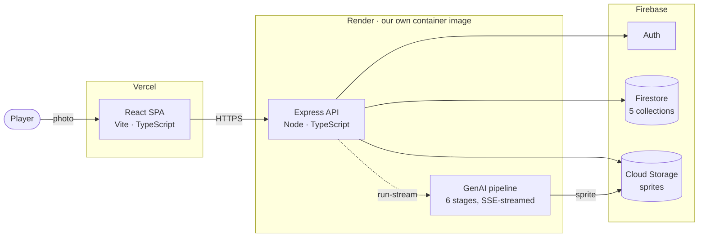
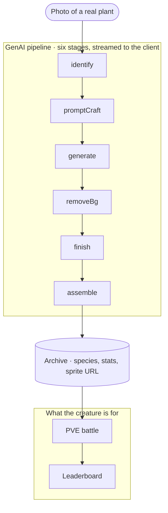

<div align="center">

<h1>
  <picture>
    <source media="(prefers-color-scheme: dark)" srcset="docs/brand/sprout-wordmark-cream.png">
    
  </picture>
</h1>

**Scan a real plant. Get a creature. Battle with it.**


*Every creature above was produced by the pipeline in this repository from a photograph of the real species.*

[](https://github.com/Kopi-O-Kosong-Beng/sprout-web-app/actions/workflows/tests.yml)
[](https://github.com/Kopi-O-Kosong-Beng/sprout-web-app/actions/workflows/docker.yml)
[](#testing)
[](package.json)
[](https://github.com/Kopi-O-Kosong-Beng/sprout-web-app/pkgs/container/sprout-web-app-server)

**[Live demo](https://sprout-web-app-jet.vercel.app)** · [Quick start](#quick-start) · [How it works](#how-it-works) · [Engineering notes](#engineering-notes) · [Cloud-native](#cloud-native-design) · [Testing](#testing) · [Docs](#documentation)

</div>

> [!NOTE]
> **The live demo's first request is slow, and that is expected.** The API runs
> on a free tier that sleeps when idle. Measured on 16 August 2026: a cold
> `/api/health` took **12.4 s**, and once warm the same endpoint answered in
> **0.073 s**. If the demo looks frozen on load, that is the instance waking, not
> a crash. Running it locally has no such delay.

---

A walk through a garden usually produces a forgotten photo rather than lasting
knowledge. Sprout attaches a game loop to botanical learning instead.
Photograph a plant, a six-stage GenAI pipeline identifies the species and
generates a pixel-art creature from it, that creature persists in your archive
with battle statistics derived from the species itself, and you can take it into
turn-based combat and onto a public leaderboard.

**16** use cases · **16** misuse cases · **1,101** tests across **4** tiers ·
**11 of 12** factors passing · **56k** lines of TypeScript · **6** team members

## Quick start

Requires **Node.js 22** and **Docker**.

```bash
git clone https://github.com/Kopi-O-Kosong-Beng/sprout-web-app.git
cd sprout-web-app
docker compose up --build
```

That is the whole setup. The stack runs the frontend, the API, and a Firestore
emulator with **no API keys and no configuration** — the four paid providers
behind the sprite pipeline are stubbed (`USE_MOCK_APIS=true`) and mail is
written to the console, so a reviewer can reach a working system without holding
an account anywhere.

- Frontend — <http://localhost:5173>
- API health — <http://localhost:3001/api/health>
- API readiness — <http://localhost:3001/api/health/ready>

Developing without Docker, seeding data, and troubleshooting are covered in
[`docs/DEVELOPMENT.md`](docs/DEVELOPMENT.md).

> [!TIP]
> **Want to sign in and complete a scan locally?** The stack above runs with no
> auth and no sprite storage on purpose, so it serves the public pages only.
> [`docker-compose.demo.yml`](docker-compose.demo.yml) adds the Auth and Storage
> emulators and a demo identity, which makes the whole scan → archive → battle
> loop playable offline — still with no keys and no accounts. See
> [`HANDOVER.md`](HANDOVER.md).
>
> ```bash
> docker compose -f docker-compose.demo.yml up --build
> ```

## What it does

| Feature | Description |
|---|---|
| **Scan → Archive** | Upload a plant photo; six stages identify it, generate a sprite, remove the background, quantise to a fixed palette, and persist the result. Re-scanning a known species updates the record instead of duplicating it. |
| **Creature archive** | Every species you have discovered, with habitat, conservation status, and battle statistics derived deterministically from the species name — the same plant yields the same creature on every machine. |
| **PVE battles** | Turn-based combat against a fixed opponent under a seeded RNG. Sessions are stored as event logs and re-simulated on every read, so a server restart cannot corrupt a battle in progress. |
| **Leaderboards** | XP and first-discovery rankings, computed as read-only projections so a ranking can never disagree with the records it summarises. |
| **Almanac** | A public reference of 200 flowering plants findable in Singapore. |
| **Accounts** | Firebase Auth with email verification, password reset, and a fail-closed operator tier for admin tooling. |
| **Contact tickets** | Query submission with independent submitter and administrator notification. |

## How it works



**The scan-to-battle loop**, which is the whole product:



Battle statistics are derived deterministically from the species name, so the
same plant yields the same creature on every machine. That is what makes the
archive worth keeping and the leaderboard worth trusting.

**A modular monolith, deliberately.** One deployable. `server/pipeline/` is the
single seam that would justify extraction: it is CPU-bound, accepts large
request bodies, holds SSE connections open, and depends on four third-party
providers. The argument, including why we did *not* split it, is in
[`md/CONTAINERIZATION.md`](md/CONTAINERIZATION.md).

**TypeScript end to end.** React + Vite on the frontend, Node + Express on the
backend, Cloud Firestore as the only datastore.

## Engineering notes

The parts of this repository worth reading, and why.

**The battle engine is deterministic and replay-verified.** Sessions are stored
as event logs and re-simulated on every read rather than as mutable state, so a
restart mid-battle loses nothing and a stored session can be audited long after
the fact. The client is a strictly presentation-only layer over it: the UI
derives turn feedback from the server's event log, never by diffing HP, which is
what makes guards, misses and heals individually attributable.
→ `server/services/battle-engine.ts`

**Untrusted images meet a discriminated gate before they meet a decoder.** The
ingest gate sorts every rejection into one of eight named reasons and never
throws. A header pass rejects on format and declared dimensions *before* the
decode that a decompression bomb would need; the decode pass then catches what a
header cannot show, such as a file truncated behind a valid header. A mutation
fuzzer attacks it and asserts every mutated input lands in one of the eight.
→ [`md/FUZZ_TESTING.md`](md/FUZZ_TESTING.md)

**The end-to-end suite was mutation-verified, not assumed.** The sign-out
journey was checked by deliberately breaking sign-out: the header assertion
stayed green while the storage and reload assertions failed, which is how we
know the spec tests the thing it claims to. Two earlier drafts that *could not
fail* are kept in comments atop `e2e/archive-to-battle.spec.ts` as a warning.

## Cloud-native design

Render always ran this service in a container. Before we wrote a Dockerfile it
built one from our source with a buildpack we never saw and could not change, so
writing our own did not introduce containers to the project — it moved ownership
of the build recipe into version control.

**Why it mattered here specifically.** `sharp` (libvips) and `bcrypt` install
per-platform prebuilt binaries, so our Windows and macOS machines and Render's
Linux hosts each ran a *different compiled artefact* under the same version
number in `package.json`. A green suite on a laptop therefore said nothing about
the binary production actually runs. Building the dependency tree once inside a
Debian-slim image, with `npm ci` against `package-lock.json`, makes the Linux
build the only build.

### Liveness and readiness answer different questions

Two endpoints, deliberately not one.

| Endpoint | Question | Behaviour |
|---|---|---|
| `GET /api/health` | Is the process alive? | 200 every time; touches nothing outside the process |
| `GET /api/health/ready` | Can this instance serve traffic *now*? | 200 or **503**, with a named line per dependency |

The Firestore line is a real `listCollections()` round trip against the
configured project, bounded by its own **2.5 s** timeout
(`DEFAULT_PROBE_TIMEOUT_MS`) so a hanging dependency cannot hang the probe.
Probes run concurrently, so the worst case is the slowest probe rather than the
sum. The storage line is a configuration check only, and the response says so
rather than implying a round trip we do not make.

This is not a claim you have to take on trust. Probing the live deployment while
the free-tier instance was asleep:

```
attempt 1  HTTP 503  in 2.68s   ← correctly refusing traffic while waking
attempt 2  HTTP 200  in 0.158s
attempt 3  HTTP 200  in 0.168s

{"status":"ready","checks":[
  {"name":"firestore","status":"ok","durationMs":95},
  {"name":"storage_bucket_configured","status":"ok","durationMs":1}]}
```

A single health endpoint would have returned 200 on attempt 1 and sent traffic
to an instance that could not yet serve it.

### Disposability was the factor we failed

Audited against the twelve factors, **eleven pass**. Concurrency (VIII) is
partial: the process is stateless so the property holds, but only one instance
runs today. Disposability (IX) was the one outright failure, and it is fixed
rather than merely described.

`server/lifecycle.ts` now stops accepting connections, drains what is in flight,
and exits 0. Three properties make it real rather than decorative:

- **Bounded.** A stuck keep-alive connection cannot hold the container open until
  SIGKILL. `DEFAULT_SHUTDOWN_TIMEOUT_MS` is **10 s**, after which it forces exit.
- **Idempotent.** Platforms re-send `SIGTERM`, and an impatient operator sends a
  second one. Repeat signals do not restart or corrupt the sequence.
- **Asserted.** Both the cold start and the clean shutdown are checked in CI on
  every build, so the property cannot rot silently.

### Limits and defaults

| Control | Value | Where |
|---|---|---|
| Scan budget | 100 pipeline runs per rolling hour, per account | `server/routes/pipeline.routes.ts` |
| Global rate limit | 1000 requests / 15 min, per IP | Express middleware |
| Image payload | ≤ 15 MB, ≥ 16 px per edge, ≤ 40,000,000 px | `server/pipeline/ingest/imageIngest.ts` |
| Accepted formats | JPEG, PNG, WebP | Same |
| Rejection reasons | 8, discriminated and never thrown | Same |
| Firestore collections | 5 | `users`, `avatar_records`, `query_tickets`, `password_history`, `counters` |
| API surface | 32 route handlers across 10 routers | `server/routes/` |

Every secret is injected at runtime rather than baked into an image, and the
emulator-versus-managed-Firestore choice is a single environment variable, which
is what keeps development and production the same shape.

Full write-up, including the known limits we did not solve, is in
[`md/CONTAINERIZATION.md`](md/CONTAINERIZATION.md); measured operational figures
are in [`docs/DELL_METRICS.md`](docs/DELL_METRICS.md).

## Testing

```bash
npm test                      # server + client
npm test -w server            # Jest (Firestore emulator) + Vitest (pipeline)
npm test -w client            # Vitest + React Testing Library
npm run test:e2e              # Playwright against the real stack
```

| Suite | Files | Tests | Tooling |
|---|---:|---:|---|
| Server integration & API | 46 | 624 | Jest + Supertest against the Firestore emulator |
| Client components & routing | 28 | 309 | Vitest + React Testing Library |
| Pipeline, ingest gate & fuzzing | 18 | 155 | Vitest |
| End-to-end journeys | 6 | 13 | Playwright (Chromium) against the real client, server, and Firestore/Auth/Storage emulators |
| **Total** | **98** | **1101** | |

Measured on 9 August 2026 at commit `b184b62` by running each suite and reading
the runner's own total, not by counting `it(` declarations. That distinction is
load-bearing: a static grep of the server suite returns about **416** where Jest
executes **624**, because parameterised cases expand at runtime. These are the
figures in the group report (Table 15), so the repository and the submission
reconcile.

Integration tests run against the Firestore **emulator** rather than mocks, so a
query Firestore would reject fails in the suite too. The end-to-end tier
substitutes nothing between the click and the database except the four paid
providers. Test code is **22,111 lines against 33,803 lines of source**, a 0.65:1
ratio.

Every use case is mapped to its sequence diagram and to the suites that verify
it in [`docs/TEST_TRACEABILITY.md`](docs/TEST_TRACEABILITY.md).

## Deployment

| Layer | Platform | Notes |
|---|---|---|
| Frontend | Vercel | Static build from `client/dist`, CDN-served |
| API | Render | Our own container image, built from [`server/Dockerfile`](server/Dockerfile) |
| Data | Firebase | Auth, Firestore, Cloud Storage |

Infrastructure is declarative — [`render.yaml`](render.yaml) and
[`vercel.json`](vercel.json) are the source of truth, and every secret is
injected at runtime rather than baked into an image. The API image is published
on every push to `main`:

```bash
docker pull ghcr.io/kopi-o-kosong-beng/sprout-web-app-server:latest
```

Hosting, environment variables and CORS are documented in
[`md/DEPLOYMENT.md`](md/DEPLOYMENT.md).

## Known limitations

Stated plainly, because a system's boundaries are part of its documentation.

- **Email delivers to one address only.** Without a purchased sending domain and
  MX configuration, our provider will not deliver reliably to arbitrary
  inboxes. The code path is complete and tested against the provider's
  interface; what is unproven is delivery. This bounds sign-up verification,
  password reset, ticket confirmation and verification resend.
- **PVP is designed, not built.** The model and diagrams exist; the feature does
  not.
- **Two operator pages have no component test.** Thirteen of fifteen client
  pages carry one. The Studio and API Test pages do not.
- **Three flows have no automated journey.** Password reset, ticket status and
  verification resend are covered at unit and integration level but by no
  Playwright journey. Password reset matters most — it is the only one of the
  three that changes a credential.
- **The operator dashboards are proven negatively.** The suite proves an
  unauthorised caller is refused at every dashboard. It does not yet prove an
  authorised operator can complete the task.

## Documentation

| Document | What it covers |
|---|---|
| [`docs/final-submission/`](docs/final-submission/) | The submitted group report, and a map from each claim it makes to the file in this repository that evidences it |
| [`docs/DEVELOPMENT.md`](docs/DEVELOPMENT.md) | Full local setup, seeding, troubleshooting |
| [`docs/COMMANDS.md`](docs/COMMANDS.md) | Every command in the repo |
| [`docs/TEST_TRACEABILITY.md`](docs/TEST_TRACEABILITY.md) | Use case → sequence diagram → test suite, hyperlinked both ways |
| [`md/CONTAINERIZATION.md`](md/CONTAINERIZATION.md) | Container design, resiliency, twelve-factor audit, known limits |
| [`md/FUZZ_TESTING.md`](md/FUZZ_TESTING.md) | The image ingest gate and its mutation fuzzer |
| [`md/DEPLOYMENT.md`](md/DEPLOYMENT.md) | Hosting, environment variables, CORS |
| [`md/DESIGN.md`](md/DESIGN.md) | Visual design system |
| [`md/requirements.md`](md/requirements.md) | Endpoint-level specification |
| [`md/checkoff.md`](md/checkoff.md) | Flow-by-flow walkthrough with file references |
| [`docs/`](docs/) | Verification evidence records and design specs |
| [`obsidian-vault/`](obsidian-vault/README.md) | **The decision record** — why each choice was made, with dated evidence |

The split is deliberate. The documents above explain *how* the system works;
[`obsidian-vault/`](obsidian-vault/README.md) explains *why* it is the way it is
— the arguments, the rejected alternatives, and the open questions.

## Repository layout

<details>
<summary>Directory tree</summary>

```
sprout-web-app/
├── client/            React + Vite frontend
├── server/            Express API
│   ├── pipeline/      GenAI sprite pipeline (six stages) + fuzz harness
│   ├── services/      Domain logic
│   ├── repositories/  Firestore access
│   └── tests/         Integration suites
├── e2e/               Playwright end-to-end journeys
├── docker/            Firestore emulator image
├── docs/              Development guides, specs, evidence records
├── md/                Feature and subsystem documentation
├── scripts/           One-off tooling and the E2E stack orchestrator
├── obsidian-vault/    Obsidian decision record (the "why")
├── render.yaml        Backend infrastructure (declarative)
├── vercel.json        Frontend hosting
└── docker-compose.yml
```

</details>

## How this repository was built

Every change reached `main` through a reviewed pull request — one feature per
request, with a named owner, branch protection, and required CI checks. Nobody
pushed to `main` directly.

New behaviour required a test that failed without it. Where a test could not be
shown to fail first, we say so: two end-to-end drafts that passed with *and*
without the fix are kept in comments atop `e2e/archive-to-battle.spec.ts`,
because the lesson was worth more than the deletion.

## Team

Built by Cohort 3, Team 2 for **50.003 Elements of Software Construction** at the
Singapore University of Technology and Design, May–August 2026.

| Member | Focus |
|---|---|
| **Andrina Morrison** | Requirements and use cases, class and sequence diagrams, report compilation, sustainability and inclusion |
| **Justin Teh** | Use case model, auth and contact surfaces, presentation |
| **Ng Li Xiang** | Class and sequence diagrams, scan and archive interfaces |
| **Nathaniel Sim** | GenAI pipeline, developer platform, robustness fuzzing, testing |
| **Omar Fayaz** | Sequence diagrams, archive and upload interfaces |
| **Chia Zhi Feng** | Backend and infrastructure, testing, deployment, release review |

Ownership above is the baseline the team agreed on 31 July 2026. Per-feature
attribution is in the pull request history — one feature per pull request.

## Copyright

© 2026 the six authors listed above. All rights reserved.

This repository is private coursework and carries no licence. It may be read by
those granted access — course staff, and anyone the authors invite — but it is
not licensed for use, modification or redistribution.

---

*An academic project. The engineering is real; the limitations above are stated
because they are too.*
