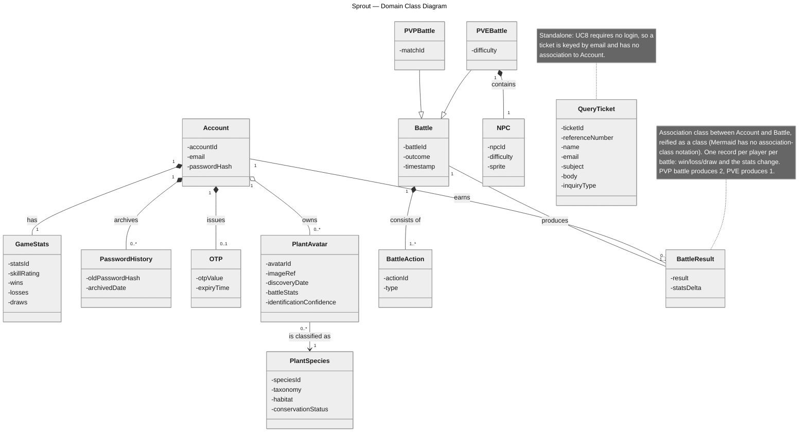
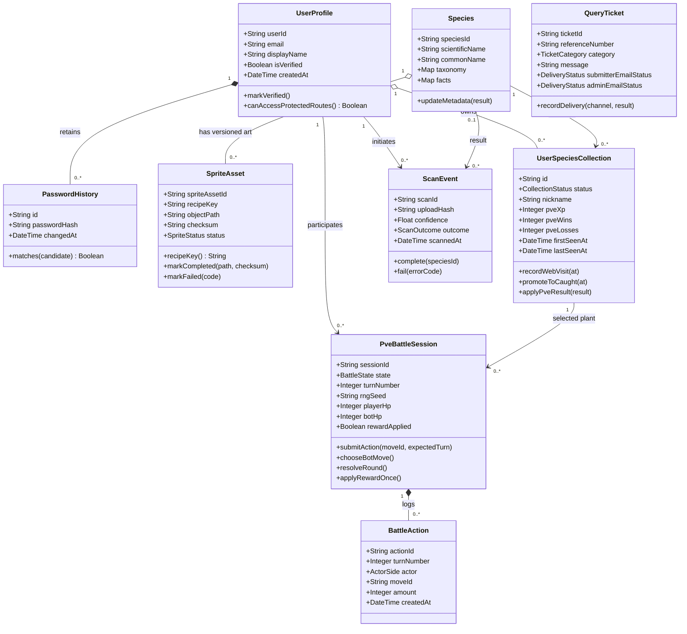

# Domain Model

> [!success] PM3 class diagram — design of record (2026-07-24)
> The diagram below is the delivered Checkoff 3 domain class diagram. Its vocabulary (`Account`, `PlantAvatar`, `PlantSpecies`, `OTP`, `Battle`, `NPC`, `BattleResult`, `QueryTicket`) is the same vocabulary used by every [[Sequence Diagram Plan|PM3 sequence diagram]] and by the official use-case descriptions, satisfying the "same nouns across all diagrams" rule.
> Source file note: in the raw dump this file is misleadingly named `Plant Identification User-2026-07-20-100719.mmd`; it contains the class diagram. Rendered PNG: `_attachments/pm3-diagrams/Sprout-class-diagram-pm3.png`. Machine-render verified 2026-07-25.

Design notes baked into the diagram:

- `BattleResult` is the reified association class between `Account` and `Battle` — one record per player per battle (PVP produces 2, PVE produces 1).
- `QueryTicket` is standalone because UC8 requires no login; it is keyed by email.
- `PVEBattle`/`PVPBattle` specialize `Battle`; only PVE composes an `NPC`.
- Attribute visibility is private (`-`) and types are omitted at this analysis level.

## Design-to-implementation mapping

The implemented runtime is Firebase/Firestore. When traceability from diagram to code is needed (report Q&A, [[Test Matrix]] rows), use:

| Design class | Implemented as |
|---|---|
| `Account` | Firebase Auth identity + Firestore user profile (`UserProfile`: userId, email, displayName, isVerified) |
| `GameStats` | PVE XP/win/loss fields on the user's collection entries (`pveXp`, `pveWins`, `pveLosses`) |
| `PasswordHistory` | Password-history records checked on reset |
| `OTP` | Hashed reset-OTP document with 15-minute expiry and attempt counter |
| `PlantAvatar` | `avatar_records` documents (Archive/PVE slice) → target model `UserSpeciesCollection` + `SpriteAsset` (canonical sprite per species) |
| `PlantSpecies` | `Species` document (stable speciesId, taxonomy, facts) |
| `Battle` / `PVEBattle` | `PveBattleSession` (state machine, turn number, RNG seed, HP) |
| `BattleAction` | `BattleAction` log entries per turn |
| `BattleResult` | One-time terminal progression applied by `applyRewardOnce()` (idempotent XP/win/loss update) |
| `NPC` | Fixed, versioned bot preset (`thornback-v1` catalog) with seeded RNG |
| `QueryTicket` | `QueryTicket` document with atomic `SPR-YYYYMMDD-NNNN` reference and per-channel delivery statuses |
| `PVPBattle`, matchmaking | **Planned** — no implementation |

## Implementation data model (as coded, supporting reference)

This is the implementation-aligned model recorded 2026-07-20 for the canonical-sprite/collection architecture. It remains the storage truth for [[Database Schema]] and the test suites; it is **not** the PM3 report class diagram.

### Implementation invariants

- `Species.speciesId` is the stable identity; scientific-name text is metadata.
- One collection row exists for each `(userId, speciesId)`.
- `VISITED` may promote to `CAUGHT`; no demotion.
- One canonical sprite exists for each versioned recipe key.
- A completed sprite has an object path and checksum.
- PVE actions require the expected turn and rewards apply once.
- Ticket notification states do not determine whether the ticket exists.

> [!warning] Historical image
> `_attachments/Sprout_DomainClassDiagram.png` (2026-07-07) is an earlier draft retained as a source artifact only. The 2026-07-24 Mermaid diagram above replaces it; do not submit the old PNG.

## Related

[[Database Schema]] · [[System Architecture]] · [[Sequence Diagram Plan]] · [[Use Case Model]]
