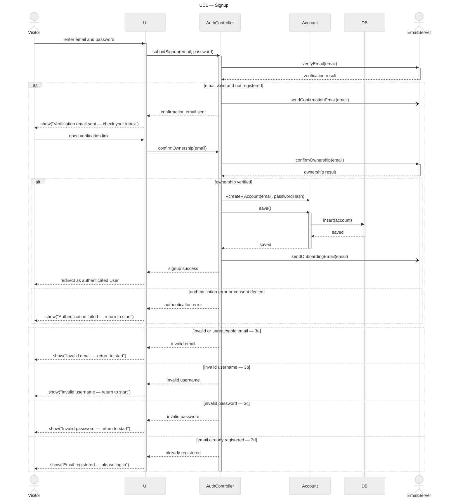
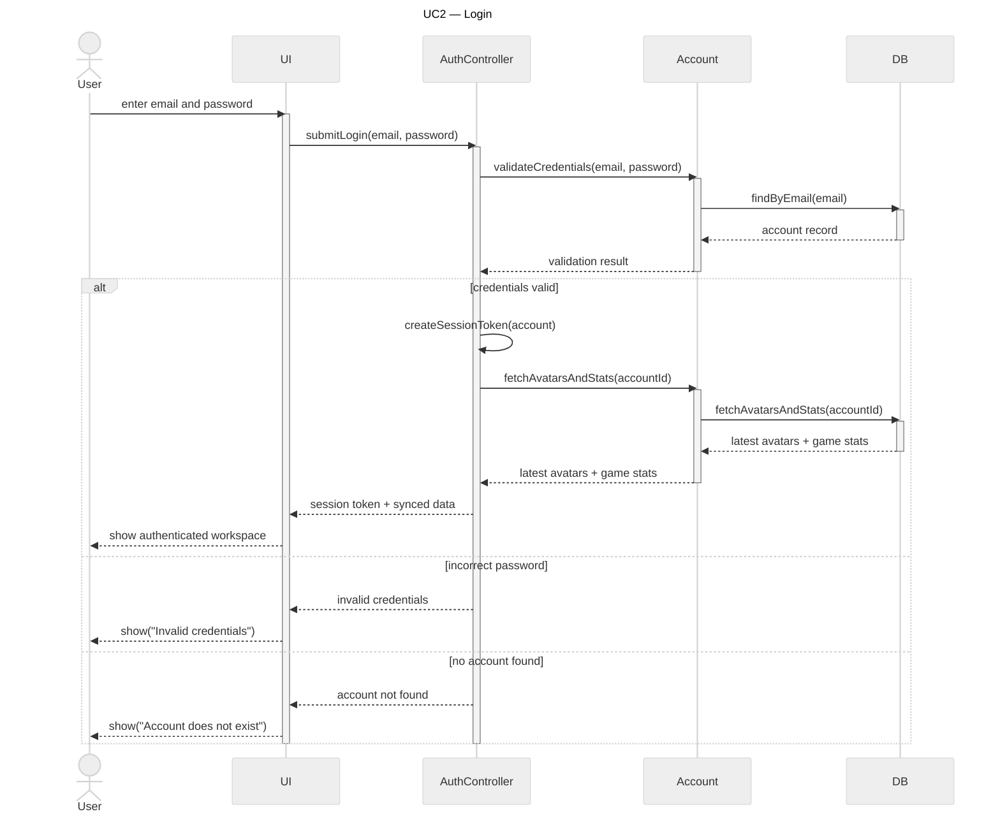
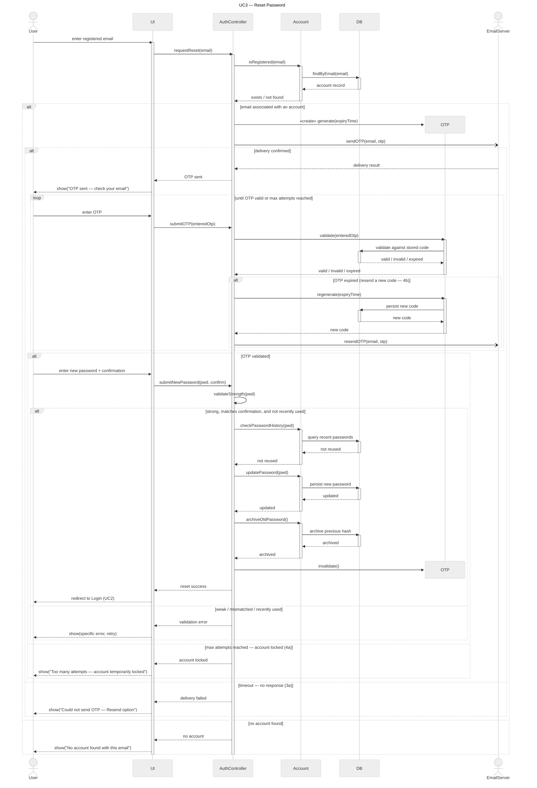
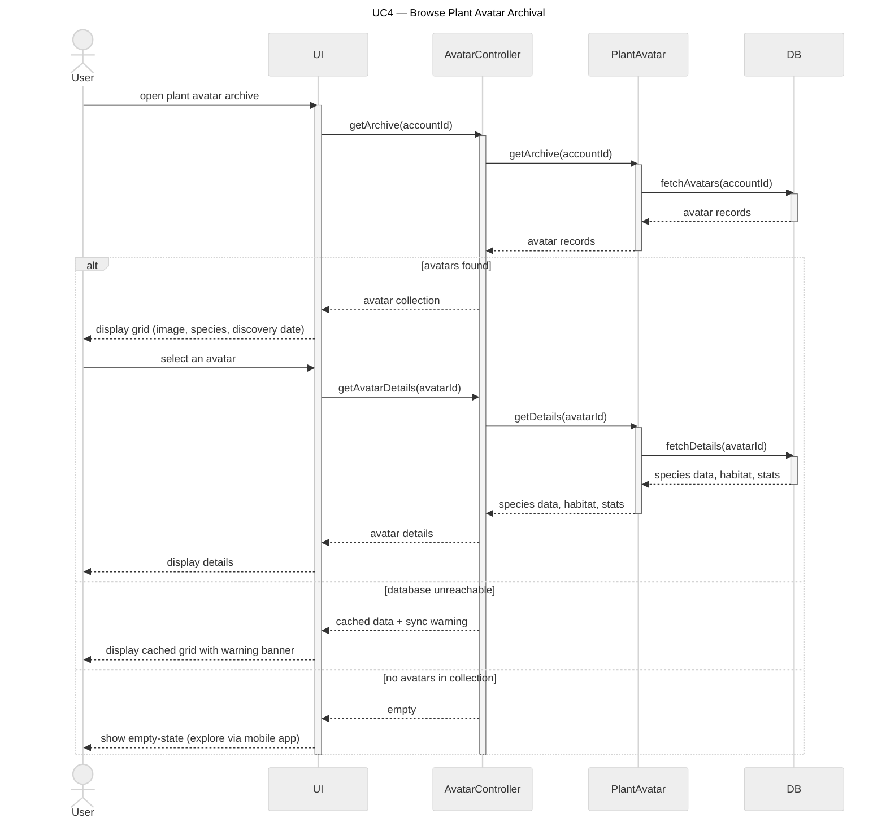
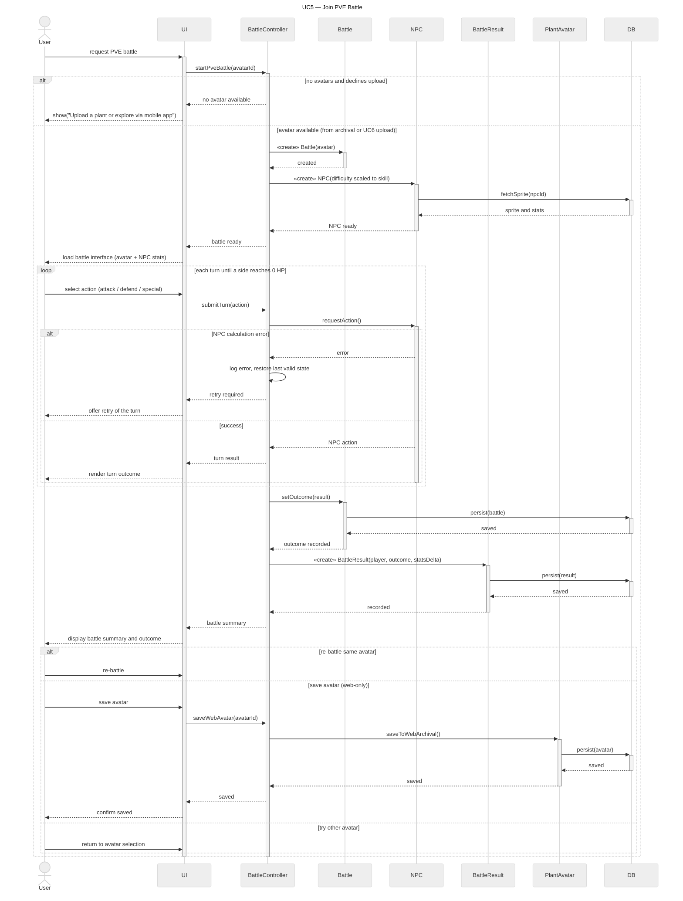
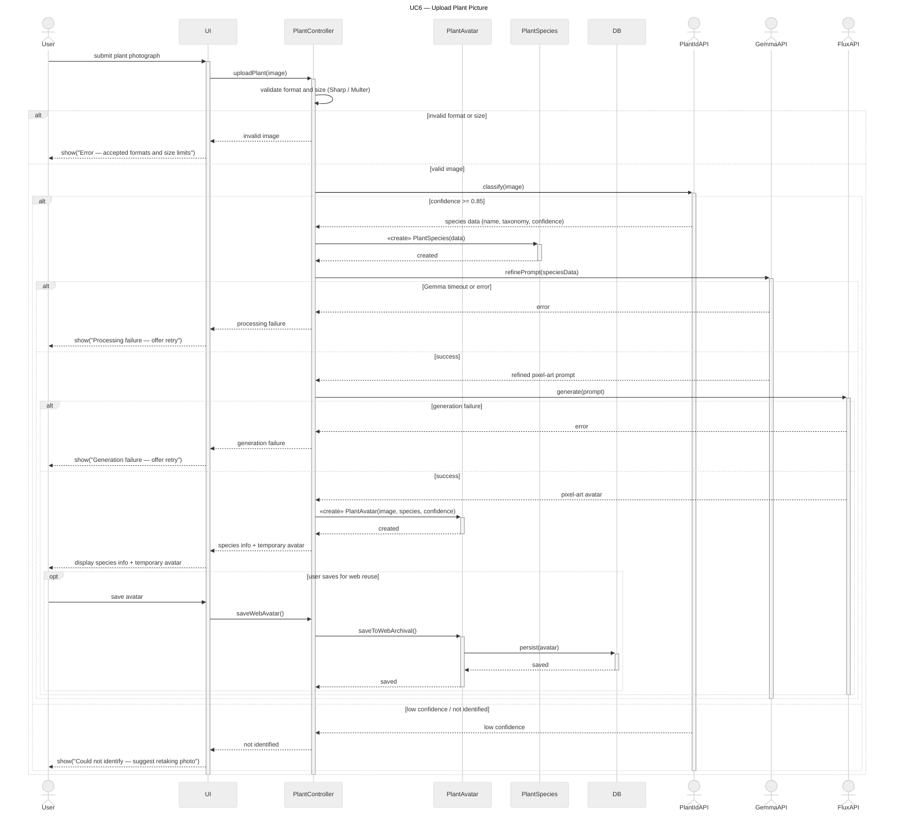
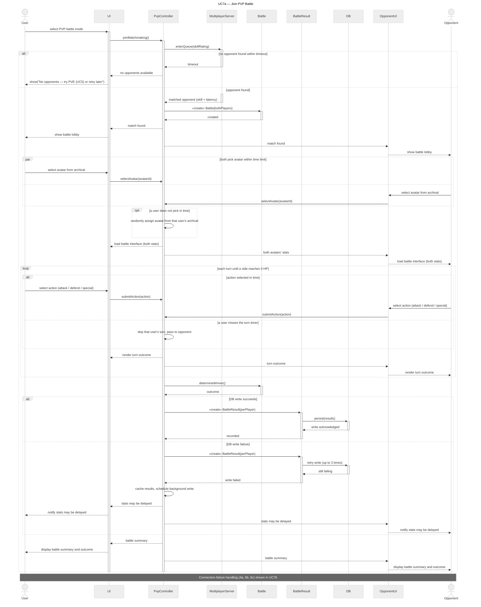
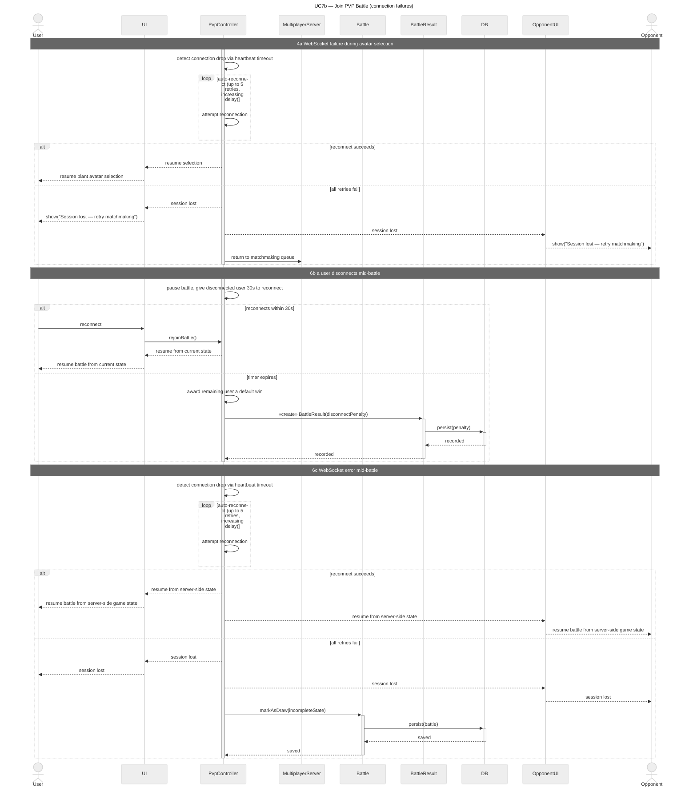
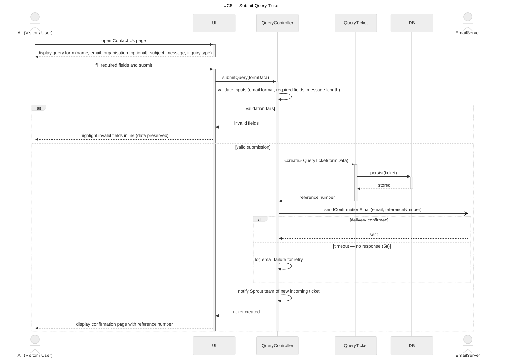

# Sequence Diagrams — Checkoff 3 Set

> [!success] Design of record (2026-07-24 set)
> The delivered PM3 sequence-diagram set — UC1–UC8, with UC7 split into UC7a (match lifecycle) and UC7b (connection failures) — plus the [[Domain Model|domain class diagram]] lives in `Raw dump/check_off 3/Latest Diagrams 27_Jully/` and is mirrored below.
> All ten files were machine-rendered **without errors** (mermaid-cli, 2026-07-25) and verified line-by-line against the official use-case description `C3T2_UseCaseDescription_1D.docx`.
> Report-ready PNGs: `_attachments/pm3-diagrams/`.

> [!warning] Supersedes the earlier "implementation-labeled" plan
> The previous version of this note required every diagram to carry Firebase/Firestore implementation vocabulary and an "As Implemented" caption. The team's delivered set instead models at the **domain/analysis level** (controllers + domain entities from the class diagram), consistent with the course's UML conventions and the official use-case descriptions. Where design-level lifelines abstract over implementation details, the mapping is recorded in [[#Design-to-implementation mapping]] so demo Q&A answers stay accurate.

## Verification summary (2026-07-25)

| Diagram | Renders | Matches UC description v1D | Notes |
|---|---|---|---|
| UC1 Signup | ✅ | ⚠️ label mismatch | Diagram branches `3b invalid username`, `3c invalid password`, `3d already registered` do not exist in v1D (which has only `3a` invalid email, `3b` already registered, `5a` consent/auth error, and no username field). **Action:** update the UC1 description for the report (add username to step 1; add 3a–3d alternative flows) or relabel the diagram. See [[Open Questions and Inconsistencies]]. |
| UC2 Login | ✅ | ✅ | Branches map to 2a incorrect password / 2b no account. |
| UC3 Reset Password | ✅ | ✅ | `3a` delivery timeout, `4a` max attempts lockout, `4b` expired-OTP resend all match; docx 5a/6b/7a are collapsed into one "weak / mismatched / recently used" else-branch. Uses `create`/`destroy` for the OTP lifeline (needs Mermaid ≥ 10.3 — renders fine). |
| UC4 Browse Archival | ✅ | ✅ | Branches map to 1a DB unreachable / 1b empty collection. |
| UC5 Join PVE | ✅ | ✅ | 2b decline-upload dead end, 5a NPC error retry, 8a web-only save, 8b try-other-avatar all present; BattleResult persistence added consistent with the class diagram. |
| UC6 Upload Plant Picture | ✅ | ✅ | 2a invalid image, 4a low confidence (≥ 0.85 gate), 7a Gemma timeout, 9a generation failure all present; optional web-archival save modeled with `opt`. |
| UC7a Join PVP | ✅ | ✅ | 2a no-opponent timeout, 4b auto-assign, 6a turn skip, 9a DB write retry/cache fallback; note points to UC7b for 4a/6b/6c. |
| UC7b PVP connection failures | ✅ | ✅ | 4a selection-phase drop → requeue; 6b mid-battle disconnect → 30 s grace → default win + penalty; 6c socket error → 5 retries → resume or record draw. |
| UC8 Submit Query Ticket | ✅ | ✅ | 3a validation failure, 5a email timeout logged-for-retry; ticket persists and reference number returns regardless of email outcome. |
| Class diagram | ✅ | — | See [[Domain Model]]. File is misleadingly named `Plant Identification User-2026-07-20-100719.mmd` in the dump but contains the domain class diagram. |

## Conventions adopted

- **Lifelines:** actor → `UI` boundary → one controller per subsystem (`AuthController`, `AvatarController`, `BattleController`, `PvpController`, `PlantController`, `QueryController`) → domain entities from the class diagram (`Account`, `OTP`, `PlantAvatar`, `PlantSpecies`, `Battle`, `NPC`, `BattleResult`, `QueryTicket`) → `DB`.
- **Actors:** only true externals are `actor` lifelines — `EmailServer`, `PlantIdAPI`, `GemmaAPI`, `FluxAPI`, plus human actors (`Visitor`, `User`, `Opponent`, `All`). The database, game engine, and `MultiplayerServer` stay internal participants, matching the [[Use Case Model]] rule that internal components are not actors.
- **Object lifecycle:** `«create»` message stereotypes; UC3 uses Mermaid `create participant` / `destroy` for the OTP.
- **Fragments:** `alt` for exclusive outcomes, `opt` for genuinely optional steps (UC6 save, UC7a auto-assign), `loop` for turn/OTP retries, `par` for simultaneous PVP picks.
- **Async:** fire-and-forget emails use the async arrow `-)` (onboarding, OTP send, confirmation emails).
- **Activation:** activation bars are balanced per branch (verified by rendering); every flow closes back to the initiating actor.
- **Numbering:** branch labels like `3a`, `4b`, `6c` reference the alternative-flow numbering of the official use-case description document, not Mermaid autonumbers.

## Design-to-implementation mapping

The diagrams are analysis-level. When the demo or Q&A needs code-level answers, use this mapping (implementation truth lives in [[System Architecture]], [[API Contract]], [[Database Schema]]):

| Diagram element | Implemented as | Delta to disclose if asked |
|---|---|---|
| `AuthController` + `Account` validation (UC1–UC3) | Firebase Auth (client SDK sign-in, ID tokens, action codes) + Express token verification + Firestore profiles | UC2 diagram shows credential validation "against the DB"; in code Firebase Auth is the authority and Sprout never sees the password. UC1 diagram creates the account only after ownership confirmation; in code the Firebase identity is created first and verified via action-code link. |
| UC3 "No account found" response | Anti-enumeration: the API returns the same generic 200 for known and unknown emails | Diagram follows the v1D description; the implemented behavior is stricter for security. Note this as a security refinement in the report. |
| `OTP` entity | Hashed OTP document with 15-min TTL and attempt counter in Firestore | Matches; "account locked (4a)" maps to the five-attempt invalidation gap being closed. |
| `PlantController` + `PlantIdAPI`/`GemmaAPI`/`FluxAPI` (UC6) | Planned upload pipeline (parallel teammate build); earlier web target named Gemini + remove.bg for generation/post-processing | Report vocabulary keeps the requirement-doc actors (plant.id, Gemma, FLUX). Do **not** claim the web pipeline is implemented — see [[UC6 Upload Plant Picture]]. |
| `BattleController`, `Battle`, `NPC`, `BattleResult` (UC5) | Server-authoritative engine + Firestore session/reward transactions (`7991254` evidence) | Implemented PVE uses expected-turn numbers, seeded RNG, idempotent rewards — richer than the diagram; diagram stays valid as an abstraction. |
| `PvpController`, `MultiplayerServer` (UC7) | **Planned final architecture** — not implemented | Label UC7a/UC7b "Planned" in the report and demo. |
| `QueryController` + `QueryTicket` (UC8) | Public Contact page → validation → Firestore ticket → atomic `SPR-YYYYMMDD-NNNN` reference → independent user/admin email attempts with stored delivery statuses | Implemented form fields are `name, email, category, message`; the diagram/description lists `organisation, subject, inquiry type`. Align the report form-field list or note the refinement. |
| `DB` | Firestore (runtime is Firebase/Firestore only) | — |
| `EmailServer` | SMTP adapter; console adapter in tests | Real-inbox delivery remains unverified — do not claim live email. |

## The diagrams

Each section shows the Mermaid source (renders in Obsidian) with its report PNG.

### UC1 — Signup

Source: `Latest Diagrams 27_Jully/UC1.mmd` · PNG: `_attachments/pm3-diagrams/UC1-signup-seq.png` · ⚠️ label issue above

### UC2 — Login

Source: `Latest Diagrams 27_Jully/UC2.mmd` · PNG: `_attachments/pm3-diagrams/UC2-login-seq.png`

### UC3 — Reset Password

Source: `Latest Diagrams 27_Jully/UC3.mmd` · PNG: `_attachments/pm3-diagrams/UC3-reset-password-seq.png`

### UC4 — Browse Plant Avatar Archival

Source: `Latest Diagrams 27_Jully/UC4.mmd` · PNG: `_attachments/pm3-diagrams/UC4-archive-seq.png`

### UC5 — Join PVE Battle

Source: `Latest Diagrams 27_Jully/UC5.mmd` · PNG: `_attachments/pm3-diagrams/UC5-pve-seq.png`

### UC6 — Upload Plant Picture

Source: `Latest Diagrams 27_Jully/UC6.mmd` · PNG: `_attachments/pm3-diagrams/UC6-upload-seq.png` · **Planned** on web — see [[UC6 Upload Plant Picture]]

### UC7a — Join PVP Battle

Source: `Latest Diagrams 27_Jully/UC7a.mmd` · PNG: `_attachments/pm3-diagrams/UC7a-pvp-seq.png` · **Planned final architecture** — not implemented

### UC7b — Join PVP Battle (connection failures)

Source: `Latest Diagrams 27_Jully/UC7b.mmd` · PNG: `_attachments/pm3-diagrams/UC7b-pvp-failures-seq.png` · **Planned final architecture** — not implemented

### UC8 — Submit Query Ticket

Source: `Latest Diagrams 27_Jully/UC8.mmd` · PNG: `_attachments/pm3-diagrams/UC8-query-ticket-seq.png`

## Superseded material

- The 2026-07-20 Router/Adapter (ECB + Express-route lifelines, `autonumber`) drafts for UC5–UC8 in `Raw dump/check_off 3/Latest Diagrams/Sprout_SequenceDiagrams_Handoff_plaintext.md` are **historical**; the 27_Jully set replaces them.
- The UC6 call-graph integration-order material formerly on this page lives in [[Testing Strategy]] (call-graph bottom-up section).

## Related

[[Use Case Model]] · [[Domain Model]] · [[System Architecture]] · [[Testing Strategy]] · [[Open Questions and Inconsistencies]] · [[Checkoff 3 Readiness and Development Plan]]
