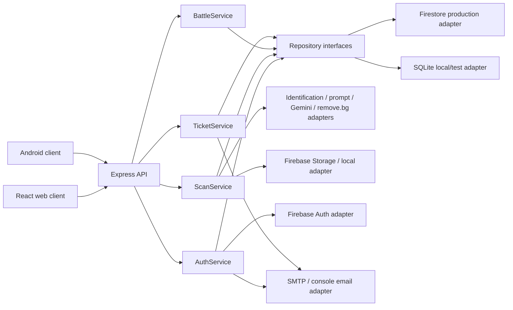

# System Architecture

## Checkoff 3 target



Web and Android are separate boundaries using one backend contract. Database and object storage are internal Sprout infrastructure. External providers are reached only through adapters.

## Standard MVC/BCE mapping

| Component | MVC role | BCE stereotype | Responsibility |
|---|---|---|---|
| React page/component | View | `<<boundary>>` | Accept user input and render state |
| Express route/controller | Controller | inbound `<<boundary>>` | Translate HTTP to an application request and return stable HTTP results |
| Application service | Model orchestration | `<<control>>` | Coordinate one use case and enforce workflow rules |
| Domain object | Model | `<<entity>>` | Hold state/invariants independent of frameworks |
| Repository | Model persistence port | `<<repository>>` | Hide Firestore/SQLite details |
| External-service adapter | Integration port | outbound `<<boundary>>` | Translate provider-specific protocols and errors |

Use these labels in class, BCE, and sequence diagrams. Do not call React `Controller`, do not draw Firebase/Firestore as domain entities, and do not allow controllers to contain provider/persistence logic.

## Backend target modules

```text
server/
  routes/          auth, avatar, upload, battle, query
  controllers/     HTTP translation only
  services/        AuthService, ScanService, BattleService, TicketService
  domain/          species, sprite asset, collection, scan, battle, ticket
  repositories/    interfaces plus Firestore/SQLite adapters
  providers/       Firebase Auth, plant ID, Gemini, remove.bg, email
  storage/         Firebase Storage and local/test adapters
  middleware/      auth, validation, upload limits, rate limits, errors
  tests/           unit, integration, contract fixtures
```

The current repository already follows parts of this structure for auth, tickets, avatars, and database adapters. Upload and battle routes/services do not yet exist at commit `8e1077d`.

## Frontend target modules

```text
client/src/
  pages/           Login, Signup, VerifyEmail, Archive, Upload, PVE, Contact
  components/      auth, upload, collection, battle, common
  services/        Firebase client and typed API client
  context/         AuthContext
  tests/           page/component behavior
```

The protected route must require both an authenticated Firebase user and verified email for gameplay. The verification page remains accessible to an authenticated unverified user.

## Cross-cutting rules

- Controllers do not expose raw provider errors.
- Services depend on interfaces, not Firebase/SQLite/provider SDKs directly.
- Production credentials remain server-side environment variables.
- Deterministic fakes replace paid/unreliable providers in automated tests and backup demo mode.
- Canonical sprite writes are idempotent by versioned recipe key.
- User-private photos and shared canonical art use separate object paths and rules.
- Every implemented sequence ends with a response to the initiating actor.

## Deployment stance

- React frontend: Vercel.
- Express backend: Render or the currently approved Node host.
- Identity and primary production records: Firebase Auth and Firestore.
- Image objects: Firebase Storage, subject to Blaze-plan availability.
- Test/local persistence: SQLite and local storage adapter.
- Deployed email: SMTP; local/tests: console/fake adapter.

## Related

[[Checkoff 3 Readiness and Development Plan]] · [[Domain Model]] · [[Database Schema]] · [[API Contract]] · [[Sequence Diagram Plan]]
