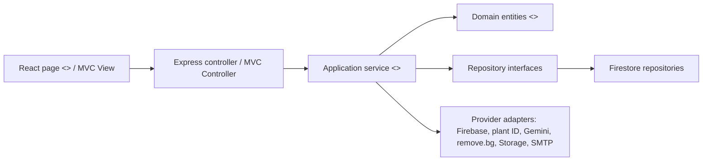

# Checkoff 3 Readiness and Development Plan

This note is the coordination hub for Sprout's Checkoff 3 application. It records the decisions made after reviewing the raw feature/storage notes, Android reference app, latest web repository, diagrams, testing course material, and the PM3 rubric.

## Grade strategy

The following is the **PLANNED TARGET** vertical slice. UC6 upload, provider,
canonical processing, and application Storage integration are not implemented
or evidenced by the current archive records:

```text
verified login -> upload -> identify -> canonical sprite reuse/generation
-> FLORENTINE24 post-processing -> object storage -> VISITED collection -> archive
```

Auth and Contact Us remain supporting historical regression evidence and were
not rerun in the focused UC4/UC5 phase. PVE now has focused server, Firestore
Emulator, HTTP, and React integration evidence at commit under test `7991254`;
the first draft evidence artifact is commit `d2cc497`, and the corrected
grading/report evidence artifact is commit `5bc87d` with the split taxonomy and
timeline. A real browser-to-backend Archive-to-PVE journey is still planned.
PVP stays planned and must be labeled honestly.

For each claim, keep the traceability chain visible:

```text
use case -> sequence diagram -> code -> test case -> demo evidence
```

## Repository truth on 2026-07-23

Latest GitHub `main` and `console-log-email-server` both point to commit `8e1077d` (`signup_login_query w/ console auth`). There is no newer remote implementation.

| Area | Current code | Checkoff 3 gap |
|---|---|---|
| Signup | Firebase user/profile, recoverable verification email, strict UID-keyed resend, in-app action-code page | Live SMTP/deployed action-code evidence remains pending |
| Login | Firebase client login/ID token; frontend and backend verified guards reject unverified and no-email tokens | Submitted legacy diagrams still need final synchronization; live authorized-domain evidence pending |
| Reset password | Generic anti-enumerating request, background email dispatch, hashed 15-minute OTP, exact cap, atomic consume, password history; automated pass on `a28e6e2` | Live SMTP/deployed inbox and graceful dispatcher drain remain pending |
| Contact Us | Persist-first ticket; independent submitter/admin attempts; durable controlled outcomes and honest frontend copy | Live SMTP recipient/admin delivery remains pending |
| Upload/archive | Owner-only Firestore `avatar_records` list/detail APIs, exact demo records, and the Archive page are implemented | UC6 upload, real identification, AI/canonical processing, Storage integration, and upload-to-archive provenance remain planned |
| PVE | Server-authoritative engine/catalog, Firestore session/reward transactions, HTTP API, Battle page, and shared-header pending-navigation guard are implemented | Real browser Back/Forward and full browser-to-backend Archive-to-PVE proof remain planned |
| Tests | At commit under test `7991254` on Node.js `v22.23.1`, six non-overlapping focused command groups passed 223 assertions across 11 files; first draft artifact `d2cc497`; corrected grading/report artifact `5bc87d` contains the split taxonomy and timeline | Broad auth/contact regression was intentionally not rerun; live Firebase/config, production Firestore, and real-browser system checks remain planned |

The untracked `GOOGLE_SMTP_VERIFICATION_PLAN.md` proposes database-only UC8. That conflicts with [[UC8 Submit Query Ticket]] and the team's outstanding item to notify the Sprout admin. The Checkoff 3 design keeps the admin notification, but makes it independent from ticket persistence and submitter confirmation.

## Decisions locked for Checkoff 3

1. **Canonical art:** one sprite per stable species ID and versioned generation recipe, not one sprite per user upload.
2. **Personal collection:** one `(userId, speciesId)` entry. Web uploads create/update `VISITED`; trusted mobile capture may promote it to `CAUGHT`; never demote.
3. **Sprite recipe:** generate -> remove background -> square crop/pad -> 56x56 -> quantize nontransparent RGB to FLORENTINE24 -> preserve alpha -> PNG/checksum/store.
4. **Storage:** canonical sprites in shared immutable Firebase Storage paths; user source photos in private per-user paths; only paths/metadata in Firestore.
5. **Concurrency:** one unique recipe key and generation lock; concurrent losers reuse the winning completed asset.
6. **Auth:** Firebase remains the verification/token authority. Sprout provides `/verify-email`, resend UI/API, verified-route gating, and backend profile synchronization.
7. **Email:** real SMTP on deployed backend; console/fake adapter for tests. Ticket persistence and each notification outcome are independent.
8. **PVE:** selected collected plant versus a fixed/versioned bot; server-authoritative alternating state machine; seeded RNG for repeatable tests.
9. **Rewards:** win +20 XP and one win; loss +5 XP and one loss; abandon no XP; one-time completion; no stat scaling or public leaderboard yet.
10. **Testing:** call-graph bottom-up backend integration as the primary strategy, top-down caller-side React integration, selected mocked boundary/outcome cases, and use-case-derived system cases. No systematic call-graph pairwise coverage is claimed.
11. **Diagrams (updated 2026-07-25):** one shared domain vocabulary across class and sequence diagrams, complete round trips to the initiating actor, and no database actor. The delivered 2026-07-24 set models at the domain/analysis level (Account, PlantAvatar, Battle, …) rather than with implementation labels; implementation traceability is recorded in the [[Sequence Diagram Plan#Design-to-implementation mapping|design-to-implementation mapping]] instead of inside the diagrams.

## Scope by evidence level

| Evidence label | Feature | Required proof |
|---|---|---|
| Focused automated | UC4 owner-only `avatar_records` archive and UC5 PVE | Jest/Vitest/RTL/Supertest evidence with Firestore Emulator at commit under test `7991254`; first draft artifact `d2cc497`; corrected grading/report artifact `5bc87d` contains the split taxonomy and timeline |
| Supporting historical regression | UC1 signup/verification, UC2 login, UC3 reset, UC8 Contact Us | Earlier automated evidence; no current broad rerun claim |
| Planned progression | UC6 upload, identification, AI/canonical sprite pipeline, Storage, and upload-to-archive provenance | Unit/integration/system tests only after the pipeline exists |
| Planned system | Real browser Archive-to-PVE, live Firebase Auth/config, and production Firestore | Playwright/manual controlled-environment evidence |
| Planned | UC7 PVP and advanced leaderboard | Final-architecture diagram and dated work plan only |

## Architecture summary



The full technical design is in `sprout-app/docs/superpowers/specs/2026-07-20-checkoff-3-backend-cloud-testing-design.md`.

## Standard diagram set

> [!success] Superseded on 2026-07-25 — set delivered
> The team delivered the PM3 diagram set on 2026-07-24 (`Raw dump/check_off 3/Latest Diagrams 27_Jully/`): domain class diagram plus UC1–UC8 sequence diagrams (UC7 split into happy-path and connection-failure diagrams). The set models at the **domain/analysis level** with one shared vocabulary, verified against `C3T2_UseCaseDescription_1D.docx` and machine-rendered without errors. The implementation-labeled requirements previously listed here were **not** adopted; the implementation traceability those labels were meant to provide now lives in the [[Sequence Diagram Plan#Design-to-implementation mapping|design-to-implementation mapping]].
>
> Still required for submission: label UC7a/UC7b (and web UC6) as **planned**, fix the UC1 alternative-flow label mismatch, and re-export the **use case diagram** (UC6 base + `«extend»` UC5) — see [[Open Questions and Inconsistencies]].

See [[Sequence Diagram Plan]], [[Domain Model]], and [[System Architecture]].

## Test plan required by the rubric

The PM3 report/video uses table-form test cases, not screenshots of test code.
Every core report table uses exactly:

| Test ID | Use case | Strategy | Tool | Expected result | Actual result | Evidence path |
|---|---|---|---|---|---|---|
| Example ID | Linked UC and scenario | Black-box/white-box technique and integration order | Framework or supporting tool | Test oracle | PASS, FAIL, or PLANNED / NOT RUN with observed qualification | Test file, evidence document, screenshot, or video timestamp |

Testing strategy statement for the report:

> Sprout follows an iterative/agile lifecycle. Checkoff 3 uses progression
> tests for the implemented UC4 archive-record and UC5 PVE increments; UC6
> upload/pipeline tests remain planned. UC1-UC3 and UC8 are supporting
> historical regression evidence. Backend integration follows the runtime call
> graph bottom-up: engine/catalog, Firestore repository/transaction,
> service/controller/route, then HTTP. React uses top-down caller-side
> component integration with real pages/router/components and mocked
> `sproutApi`. No systematic pairwise coverage is claimed; only selected
> page-to-`sproutApi` and auth-to-Firebase-verification edges are isolated.
> System tests are derived from the UC1-UC8 use-case documentation.

The rubric phrase about "coding user study or crowdsourcing" does not require a separate crowdsourcing activity in addition to framework tests. Proper Jest/Vitest tests satisfy the coding route; a user study remains useful UI evidence but is not a replacement for automated tests.

## Delivery schedule

| Date | Exit condition | Zhi Feng focus |
|---|---|---|
| 20 Jul | Requirements, storage, palette, PVE rewards, auth, and diagram vocabulary frozen | Design/KB, remote baseline, data/API/test contracts |
| 21 Jul | Auth/email regression path reliable | SMTP deployment config, Firebase verification/resend, route gating, reset timing fix |
| 22 Jul | Firestore-only archive/PVE backend increment established | active SQLite runtime removed; avatar records/demo, battle engine, repository/transactions, and API |
| 23 Jul | Focused suites pass and evidence/docs are synchronized | Commit under test `7991254`; first draft artifact `d2cc497`; corrected grading/report artifact `5bc87d` with split taxonomy and timeline; Node.js `v22.23.1`; 223 passing assertions across 11 focused files |
| 24 Jul | Planned real-browser system check | Back/Forward and full Archive-to-PVE browser/backend journey |
| 25 Jul | Planned traceability and video proof | use case -> sequence -> code -> test -> screenshot/video timestamp |
| 26 Jul | Planned PM3 evidence freeze | final review, rehearsal, backup, and disclosure of not-run live/system cases |

## Zhi Feng ownership and evidence

Zhi Feng's team role for Checkoff 3 is **backend, cloud infrastructure, and testing**.

| Deliverable | Evidence to retain |
|---|---|
| Scan orchestration and error mapping | Commit links, route/service tests, upload demo timestamp |
| Canonical sprite persistence and Firebase Storage | Storage paths/rules, adapter tests, one cache-hit and one cache-miss demo |
| FLORENTINE24 post-processing | Quantizer unit output, palette-closure assertion, 56x56 transparent PNG |
| Auth/email production readiness | Automated Node 22 evidence: `sprout-app/docs/checkoff3/auth-email-verification-evidence.md` at `a7e6043`; live SMTP/Firebase variables and redacted real-inbox demo still required |
| PVE state/rewards | Focused state-transition, seeded replay, Firestore concurrency/idempotent XP, HTTP, and React evidence at commit under test `7991254`; first draft artifact `d2cc497`; corrected grading/report artifact `5bc87d` contains the split taxonomy and timeline |
| Test strategy/report tables | Test matrix rows linked to use cases and sequences |
| Cloud/deployment | Render/Vercel/Firebase configuration record and health check |

## Immediate acceptance checklist

- [x] Firebase Storage Blaze/bucket activation and secret-safe Admin write/read/delete preflight passed on 2026-07-21; keep `STORAGE_MODE=local` until the application adapter and client-rule tests pass.
- [ ] Plant.id, Gemini, remove.bg, and SMTP live preflights are separately evidenced after credentials are supplied.
- [ ] UC1 verification email reaches a real inbox from deployed backend.
- [ ] Sprout verification page applies the Firebase action code and refreshes verified state.
- [x] Automated resend uses strict bearer auth, UID-keyed 3/15m quota, account/IP isolation, and no duplicate account (`a28e6e2`); live delivery remains in the SMTP item above.
- [ ] UC3 reset OTP reaches a real inbox; generic account response, attempt cap, atomic consume, stale isolation, concurrency, and password history pass on `a28e6e2`, but live inbox evidence is pending.
- [x] Automated UC8 persists first, independently attempts both notifications, and stores only controlled failure codes (`a28e6e2`); live delivery remains in `SYS-E02`.
- [ ] UC6 upload validation and quantizer unit tests pass; these remain planned.
- [ ] UC6 same-species concurrent requests produce one canonical asset; this remains planned.
- [x] UC4 owner-only Firestore `avatar_records` list/detail APIs, exact demo enable/disable, and Archive page component states have focused automated evidence at commit under test `7991254`; first draft artifact `d2cc497`; corrected grading/report artifact `5bc87d` contains the split taxonomy and timeline.
- [ ] UC6 upload creates the intended archive entry and repeated uploads do not duplicate it; current archive/demo evidence does not prove this pipeline.
- [x] UC5 PVE state/reward persistence applies terminal progression once in focused engine, Firestore Emulator, HTTP, and React tests at commit under test `7991254`.
- [x] Focused Node.js `v22.23.1` evidence is captured for commit under test `7991254`; first draft artifact `d2cc497`; corrected grading/report artifact `5bc87d` with split taxonomy and timeline: 223 passing assertions across 11 UC4/UC5 files. Broad auth/contact regression remains historical and was not rerun.
- [ ] Use-case, class/domain, BCE/MVC, and sequence diagrams use the same vocabulary.
- [ ] Demo slides distinguish integrated, isolated, and planned features.

## Related

[[Timeline and Milestones]] · [[Course Deliverables and Rubrics]] · [[Feature Priorities]] · [[Use Case Model]] · [[System Architecture]] · [[Sequence Diagram Plan]] · [[GenAI Sprite Pipeline]] · [[Database Schema]] · [[Testing Strategy]] · [[Test Matrix]]
