# Sprout — Checkoff 3 Report

> [!important] This is the evidence appendix, not the document we hand in.
> The PM3 submission is [[Checkoff 3 Submission]] (six sections, ~2,000 words) with the
> testing section in [[Checkoff 3 Test Plan and Test Cases]]. This file is the long-form
> backing record: full traceability, per-suite evidence, and every open gap. Use it to
> answer questions the short report raises, not as the deliverable itself.

**Product:** Sprout — *Scan. Grow. Battle.*
**Course project:** 50.003 web platform for the Sprout mobile-first product
**Team:** Cohort 3 Team 2 — Nathaniel Sim, Justin Teh, Omar Fayaz, Andrina, Li Xiang, Zhi Feng
**Industry partners:** Sprout founders — Nathaniel Sim, Teo Li Zhong, Imelda
**Commit under test:** `7991254` **Runtime:** Node.js `v22.23.1`
**Focused evidence artifacts:** first draft `d2cc497`; corrected grading/report artifact `5bc87d0`
**PM3 diagram set delivered:** 2026-07-24 **Use case diagram exported:** 2026-07-25 **Commit-count appendix generated:** 2026-07-25 at `aec5e5c`

> **Scope boundaries that bound every claim in this report.** UC6 (upload and the AI/canonical sprite pipeline) is **not implemented on the web platform**; UC7 (PVP) is **not implemented**; and live email delivery to arbitrary addresses is **not proven**. These are stated in full in Section 2.5 and detailed in Section 7.3. Any row marked **PLANNED / NOT RUN** has no passing evidence and must not be read as complete.

---

## Table of Contents

1. [Project Overview](#1-project-overview)
2. [Changes in Requirements and Design since Project Meeting 2](#2-changes-in-requirements-and-design-since-project-meeting-2)
   - [2.1 Requirement changes](#21-requirement-changes)
   - [2.2 Design and technology changes](#22-design-and-technology-changes)
   - [2.3 Features added since Project Meeting 2](#23-features-added-since-project-meeting-2)
   - [2.4 Scope explicitly not changed](#24-scope-explicitly-not-changed)
   - [2.5 Known limitations declared openly](#25-known-limitations-declared-openly)
3. [Use Case Model and Descriptions](#3-use-case-model-and-descriptions)
   - [3.1 Actors](#31-actors)
   - [3.2 Canonical use cases](#32-canonical-use-cases)
   - [3.3 Use case relationships](#33-use-case-relationships)
   - [3.4 UC1 — Signup and Verify Email](#34-uc1--signup-and-verify-email)
   - [3.5 UC2 — Login](#35-uc2--login)
   - [3.6 UC3 — Reset Password via OTP](#36-uc3--reset-password-via-otp)
   - [3.7 UC4 — Browse Avatar Archival](#37-uc4--browse-avatar-archival)
   - [3.8 UC5 — PVE Battle](#38-uc5--pve-battle)
   - [3.9 UC6 — Upload Plant Picture](#39-uc6--upload-plant-picture)
   - [3.10 UC7 — PVP Battle](#310-uc7--pvp-battle)
   - [3.11 UC8 — Submit Query Ticket](#311-uc8--submit-query-ticket)
   - [3.12 Implementation-status summary](#312-implementation-status-summary)
4. [System Design](#4-system-design)
   - [4.1 Architecture overview](#41-architecture-overview)
   - [4.2 Domain and class model](#42-domain-and-class-model)
   - [4.3 Sequence diagrams](#43-sequence-diagrams)
   - [4.4 Database schema summary](#44-database-schema-summary)
5. [Test Plan](#5-test-plan)
   - [5.1 Lifecycle testing strategy](#51-lifecycle-testing-strategy)
   - [5.2 Testing tools](#52-testing-tools)
   - [5.3 Unit test cases](#53-unit-test-cases)
   - [5.4 Integration strategy](#54-integration-strategy)
   - [5.5 Integration test cases](#55-integration-test-cases)
   - [5.6 System and end-to-end test cases](#56-system-and-end-to-end-test-cases)
   - [5.7 Black-box and white-box technique coverage](#57-black-box-and-white-box-technique-coverage)
   - [5.8 Timeline for the remaining tests](#58-timeline-for-the-remaining-tests)
6. [Test Cases and Results](#6-test-cases-and-results)
   - [6.0 Combined full-suite run — PLANNED / NOT RUN](#60-combined-full-suite-run--planned--not-run)
   - [6.1 Core focused evidence](#61-core-focused-evidence)
   - [6.2 Supporting hardening](#62-supporting-hardening)
   - [6.3 Focused run qualification](#63-focused-run-qualification)
   - [6.4 Supporting historical regression](#64-supporting-historical-regression)
   - [6.5 Planned progression and system evidence](#65-planned-progression-and-system-evidence)
   - [6.6 Continuous integration](#66-continuous-integration)
   - [6.7 Code coverage](#67-code-coverage)
7. [Implementation Status and Demonstration](#7-implementation-status-and-demonstration)
   - [7.1 Status by use case](#71-status-by-use-case)
   - [7.2 Work completed since Project Meeting 2](#72-work-completed-since-project-meeting-2)
   - [7.3 Known bugs and limitations](#73-known-bugs-and-limitations)
   - [7.4 Plan for the remaining features](#74-plan-for-the-remaining-features)
8. [Feature Progress and Workload Distribution](#8-feature-progress-and-workload-distribution)
   - [8.1 Evidence standard applied](#81-evidence-standard-applied)
   - [8.2 Per-member evidence table](#82-per-member-evidence-table)
   - [8.3 How to complete this table](#83-how-to-complete-this-table)
   - [8.4 Appendix 8.A — Commit counts by author](#84-appendix-8a--commit-counts-by-author)
9. [Appendix: Evidence Index](#9-appendix-evidence-index)
   - [9.1 Vault documents by claim](#91-vault-documents-by-claim)
   - [9.2 Repository evidence documents](#92-repository-evidence-documents)
   - [9.3 Executed test files, by test ID](#93-executed-test-files-by-test-id)
   - [9.4 Diagram assets](#94-diagram-assets)
   - [9.5 Implementation and configuration paths](#95-implementation-and-configuration-paths)
   - [9.6 Claims with no artefact — PLANNED / NOT RUN](#96-claims-with-no-artefact--planned--not-run)
   - [9.7 Per-case expansion of the highest-value executed suites](#97-per-case-expansion-of-the-highest-value-executed-suites)

---

## 1. Project Overview

Sprout is a gamified biodiversity-exploration product built around a single loop — *Scan. Grow. Battle.* A player identifies a real plant, obtains a standardised pixel-art creature for that species, builds a persistent collection, learns species facts, and uses collected plants in battles. The product addresses two linked problems recorded in the team's earlier milestone work: apathy towards the environment, where high foot traffic through gardens and trails produces photographs rather than lasting awareness; and an under-use of interactive entertainment technology for biodiversity education. The value proposition is correspondingly narrow and deliberate — a gamified and sticky experience for tourists to learn about plants — targeting public visitors and tourists at nature attractions, existing Sprout mobile users, students and younger audiences already fluent in collection and progression loops, and B2B stakeholders such as gardens, parks, schools, museums and tourism boards. Sprout is distinguished from plant-identification apps by not stopping at identification, and from generic games by being grounded in real-world interaction.

The startup behind Sprout already holds an Android prototype developed during 50.001. The 50.003 project therefore does not rebuild the mobile client; it adds a full-stack React/Express web application covering account management, plant upload and identification, a persistent collection archive, canonical sprite assets, player-versus-environment (PVE) battles and a Contact Us channel, together with a B2B showcase and contact experience aimed at nature attractions, parks, schools, museums and tourism partners. The web application supports rather than replaces the mobile product: both clients are designed against a shared backend and domain contract so that one account and one collection can eventually be visible across platforms. A significant Checkoff 3 design decision follows from this — sprite art is now *canonical per species* rather than unique per upload, with one versioned sprite generated per stable species ID and recipe, reused on repeated scans. A web upload creates or updates a persistent `VISITED` collection entry, and a trusted mobile encounter may promote `VISITED` to `CAUGHT` but never demotes it. This provenance distinction is a trust signal, not a tamper-proof security guarantee, and is described as such throughout.

The project is delivered by Cohort 3 Team 2: Nathaniel Sim, Justin Teh, Omar Fayaz, Andrina, Li Xiang and Zhi Feng, working with the Sprout founders (Nathaniel Sim, Teo Li Zhong and Imelda). Responsibilities for this checkoff divide into requirements and project coordination, frontend, AI and game design, and backend, cloud infrastructure and testing (Zhi Feng); the mapping of the remaining named members to the first three role groups is **[TEAM TO FILL]**. This Checkoff 3 submission covers the increment completed since Project Meeting 2 and states its boundaries explicitly. The current focused evidence is UC4 (Browse Avatar Archive) and UC5 (PVE Battle), verified at commit `7991254` with 223 passing assertions across 11 focused files under Node.js v22.23.1, using Jest, fast-check, Supertest, the Firestore Emulator, Vitest and React Testing Library. UC1–UC3 authentication and UC8 Contact Us are retained as supporting historical regression evidence and were intentionally not rerun during this focused phase, so no current broad regression pass is claimed. UC6 (upload and AI pipeline) is **not implemented on the web platform**, and UC7 (PVP) is **not implemented**; both are discussed below as declared gaps rather than deliverables.

---

## 2. Changes in Requirements and Design since Project Meeting 2

Changes since Project Meeting 2 fall into six areas: one use-case relationship, one use-case description correction, one requirement re-affirmed against a drifting implementation, one security refinement, four design and technology decisions, and five added features. None of them alter the product vision recorded at Project Meeting 2 — a web platform showcasing the mobile-first Sprout product, organised around *Scan. Grow. Battle.* Every change refines how the platform is built, secured or demonstrated. The rationale column below is the substance of this section: each change was made in response to a specific defect, measurement or security argument, not as a matter of preference.

### 2.1 Requirement changes

| # | Area | At Project Meeting 2 | Now (Checkoff 3) | Why it changed |
|---|---|---|---|---|
| R1 | UC5/UC6 relationship | UC6 *Upload Plant Picture* existed only as a sub use case that `«extend»`s UC5 *Join PVE Battle* | UC6 is a **base use case** with which `User` associates directly, **and it still** `«extend»`s UC5 for the optional in-battle upload | Users must be able to upload and collect a plant without starting a battle. Modelling upload only as an extension of a battle made the primary product flow unreachable from the actor, which contradicted the intended scan-first loop. |
| R2 | UC1 signup fields and error branches | Visitor enters **email and password**; alternative flows `3a` invalid or unreachable email, `3b` already registered, `5a` consent denied | Visitor enters **email, password and display name (username)**; branches `3a` invalid email, `3b` invalid username, `3c` invalid password, `3d` already registered, `5a` authentication error | The implemented signup validates a display name and a password policy as separate concerns, so the original description under-specified the real error space. The 2026-07-24 sequence diagram is treated as authoritative and the UC1 description was corrected to match it. |
| R3 | UC8 Contact Us form fields | Form fields: name, email, organisation (optional), subject, message, inquiry type | **Unchanged from the original description.** An interim implementation had reduced the form to name, email, category and message; the code has been brought back into line with the documented form | This is a case of implementation drift, not requirement change. The diagram set and the original use-case description agreed with each other, so the correct response was to fix the implementation rather than retro-fit the requirement to the code. |
| R4 | UC3 password reset — unknown email | System displays *"No account found with this email address"* | System returns the **same generic acknowledgement** whether or not an account exists for the submitted address | Security refinement. The original wording permits account enumeration: an attacker can distinguish registered from unregistered addresses by observing the response. The stricter behaviour is deliberate and is documented as a known, intentional divergence from the corresponding sequence diagram. |

### 2.2 Design and technology changes

| # | Area | At Project Meeting 2 | Now (Checkoff 3) | Why it changed |
|---|---|---|---|---|
| D1 | Authentication | Sprout-issued session token after validating credentials against the database | **Firebase Authentication** as the identity authority: the client signs in through the Firebase JS SDK and the Express backend verifies the ID token on every protected route | Removes password handling and session-token issuance from Sprout's own code, reducing the security surface the team must own, and shares a single identity with the mobile app. The domain-level sequence diagrams remain valid; the design-to-implementation mapping is recorded separately rather than by redrawing the diagrams. |
| D2 | Data store | Relational or document database, with an interim SQLite runtime | **Firestore only** | Gives one cross-platform datastore shared with the mobile app and removes a second persistence path that had begun diverging from deployed behaviour. The active SQLite runtime was removed on 22 July. |
| D3 | Sprite generation providers | Plant.id → Google Gemma → FLUX | Plant.id → **configured Gemini image model** → background removal → fixed 56×56 FLORENTINE24 palette quantisation | Driven by the availability and cost of the original generation stack, together with the decision to make sprite art canonical per species rather than per upload, which changes what the pipeline must guarantee (determinism and reuse rather than novelty). UC6 nonetheless remains **planned** on the web platform — see the limitations below. |
| D4 | Outbound email | Gmail SMTP from the deployed backend | **HTTPS email API (Resend)**, with SMTP retained as a configurable fallback | Selected by measurement, not preference. The deployed host blocks outbound SMTP: connections to port 587 hang until timeout, so requests stalled for roughly two minutes and delivered nothing. An HTTPS transport is the only path that functions on the deployment target. |

### 2.3 Features added since Project Meeting 2

The Evidence column carries only test identifiers, test filenames or commit hashes. Rationale and description belong in the Notes column, so that a grader can tell an evidence claim from an explanation at a glance.

| # | Feature | Status | Evidence | Notes |
|---|---|---|---|---|
| F1 | UC4 archive: owner-only records, detail view, demo data controls | Implemented and tested | `CORE-I01` (96/96), `CORE-I03` (22/22), `CORE-F02` (14/14) at `7991254` | Owner-scoped `avatar_records` list/detail plus an exact, idempotent demo set |
| F2 | UC5 PVE: server-authoritative battle engine, seeded RNG, idempotent rewards | Implemented and tested | `CORE-U01` (6/6), `CORE-U02` (27/27), `CORE-I02` (18/18), `CORE-F01` (28/28), `SUP-U01` (12/12) at `7991254` | Terminal progression applied exactly once; replay is deterministic from the stored seed |
| F3 | Google sign-in | Implemented; test counts self-reported at `583bd3b`, not consolidated | `client/src/pages/LoginPage.test.tsx`; `client/src/pages/SignupPage.test.tsx`; commit `583bd3b`. Pass counts **[TEAM TO FILL]** per Section 5.5.6 — not yet in a signed evidence document | Google asserts a verified email, so this path requires no verification email at all, which makes the signup demonstration independent of mail transport |
| F4 | Admin account dashboard (`/admin`) | Implemented; test counts self-reported at `583bd3b`, not consolidated | `server/tests/admin-api.test.ts` (16 cases); `client/src/pages/AdminPage.test.tsx`; commit `583bd3b`. Pass counts **[TEAM TO FILL]** per Section 5.5.6 | Allowlist-gated account listing and deletion; also frees an email address for repeat signup testing |
| F5 | Continuous integration | Implemented on branch `feat/checkoff3-auth-email`; **not yet exercised** | `.github/workflows/tests.yml` at `89d6e3f`, pinned at `cdbe171`, extended at `583bd3b`. **No cloud run has been recorded** (Sections 5.2, 5.8, 6.6) | The workflow is absent from `origin/main`, so neither the `push: main` trigger nor a pull-request trigger has ever fired. It will re-run the focused suites once the branch is pushed and the pull request to `main` is opened |

### 2.4 Scope explicitly not changed

Three items are recorded as unchanged so that the absence of movement is not mistaken for an omission. The product vision, target users and value proposition are exactly as presented at Project Meeting 2. UC7 (PVP) remains **planned final architecture**, precisely as it was at Project Meeting 2: the UC7a and UC7b diagrams exist, but no implementation is claimed and none exists. The B2B advertising API and business dashboard remain deferred P2 items.

### 2.5 Known limitations declared openly

Three gaps are stated plainly, because a declared gap is more useful to the reader than a concealed one. They bound every claim made anywhere in this report and are not repeated in full elsewhere; Section 7.3 gives the detailed, per-defect breakdown.

- **UC6 upload and AI pipeline is not implemented on the web platform.** It is being developed in parallel and is not merged. Archive records exist independently of it, so passing UC4 archive tests must not be read as evidence that upload works. The corresponding system case is recorded as PLANNED / NOT RUN.
- **Live email delivery to arbitrary addresses is not proven.** It requires a verified sending domain, which the team does not own. Outbound mail currently uses a shared verified sender that can only reach the team's own inbox, so no claim of general delivery is made.
- **Real-browser system tests (Playwright) and production-Firestore checks remain planned.** All current integration evidence uses the Firebase Firestore Emulator, and Firebase ID-token verification is mocked at the Firebase Admin boundary only.

---

## 3. Use Case Model and Descriptions

This section presents the complete Sprout use case model: the actor set, the canonical UC1–UC8 list, the relationships between use cases (including the one relationship change made since Project Meeting 2), and a full description of every use case. Each description closes with an implementation-status line so that the model can be read alongside the test evidence in the later sections without ambiguity about what is built and what is not.

All content is taken from the team knowledge base (`02 Requirements/Use Case Model.md` and `02 Requirements/UC1 … UC8`), the delivered PM3 diagram set (`03 Design/Sequence Diagram Plan.md`), and the Checkoff 3 readiness and requirement-change records. Where the requirements note and the delivered diagram disagree, the disagreement is reported rather than silently resolved.

### 3.1 Actors

| Actor | Type | Notes |
|---|---|---|
| Visitor | Primary | Unauthenticated person who may sign up or submit a query |
| User | Primary | Authenticated player; protected gameplay additionally requires verified email |
| All | Primary composite | Visitor or User, used only for UC8 |
| Firebase Auth | Secondary | Identity, login, ID tokens, and email-verification action codes |
| Email Service | Secondary | Outbound delivery requested by Sprout. Post-D4 position: **HTTPS email API (Resend) in deployment via `EMAIL_MODE=resend`**, SMTP retained as a configurable fallback, console/fake adapter locally and in tests |
| Plant Identification Service | Secondary | Stable species ID, taxonomy, and confidence |
| Prompt/Image Generation Service | Secondary | Versioned prompt and configured Gemini image generation |
| Background Removal Service | Secondary | Transparency before quantisation |

The database, object storage, game engine, and multiplayer server are **internal Sprout components, not actors**. External services never bypass Sprout to complete a modelled user interaction; the system returns the delivery or result acknowledgement to the primary actor.

**Actor-vocabulary note (must be stated in the report).** Two naming conventions exist in the project artefacts. The table above is the *implementation-refined* set. The delivered 2026-07-24 sequence-diagram set instead uses the *requirement-document* vocabulary of `C3T2_UseCaseDescription_1D.docx`: `EmailServer`, `PlantIdAPI`, `GemmaAPI`, `FluxAPI`. The team decision recorded in `Use Case Model.md` is to keep the requirement-document actors inside the diagrams and to record the provider refinements — Firebase Auth as the identity authority, and Gemini plus background removal as the current web pipeline target — in the requirement-change table (rows D1 and D3).

### 3.2 Canonical use cases

| ID | Use case | Primary actor | Secondary actors | Checkoff 3 evidence position |
|---|---|---|---|---|
| UC1 | Signup and Verify Email | Visitor | Firebase Auth, Email Service | Regression; verification completion/resend gap to close |
| UC2 | Login | User | Firebase Auth | Regression; diagram updated to the actual Firebase flow |
| UC3 | Reset Password via OTP | User | Email Service, Firebase Auth | Regression; real delivery and attempt-cap gap |
| UC4 | Browse Avatar Archival | User | — | Implemented read path; records seeded by the demo set, not by UC6 |
| UC5 | PVE Battle | User | — | Implemented; focused unit, backend integration and frontend integration evidence at `7991254` |
| UC6 | Upload Plant Picture | User | Plant Identification, Prompt/Image Generation, Background Removal | Planned target vertical slice; not implemented on web |
| UC7 | PVP Battle | User, Opponent User | — | Planned final architecture |
| UC8 | Submit Query Ticket | All (Visitor or User) | Email Service | Regression; independent admin-notification gap |

The UC1–UC8 numbering above is binding on every artefact in the report: use case diagram, sequence diagrams, test matrix, and traceability chain.

Two aliases appear in project artefacts and are the same use case: UC4 is titled *Browse Avatar Archival* in the use case model, *Browse Plant Collection* in its requirements note, and *Browse Plant Avatar Archival* in the delivered sequence diagram.

### 3.3 Use case relationships

| Relationship | Statement |
|---|---|
| `User` → UC6 (association) | A user may upload and collect a plant **without** starting a PVE battle. UC6 is a base use case reachable directly from the actor. |
| UC6 `«extend»` UC5 | UC6 additionally extends UC5 for the optional in-battle upload path, corresponding to the UC5 alternative flow that offers upload when no eligible avatar is available. |
| UC3 relationship to UC2 | UC3 is a **separate base use case**, not an extension of UC2. |
| UC4 relationship to UC6 | UC4 is the persistent result view for entries created by UC6; it is a base use case reachable independently. |
| Internal components | The database, object storage, game engine, and multiplayer server are drawn inside the system boundary, never as actors. |

#### 3.3.1 Change since Checkoff 2 (requirement-change row R1)

At Project Meeting 2, UC6 *Upload Plant Picture* existed **only** as a sub use case that `«extend»`s UC5 *Join PVE Battle*. The final position recorded with the 2026-07-24 diagram set is that **UC6 is a base use case** — `User` associates with it directly — **and UC6 still `«extend»`s UC5** for the optional in-battle upload path.

The rationale is that modelling the upload only as an extension made the primary collection flow unreachable from the actor: a user must be able to upload and collect a plant without entering a battle. The official description document `C3T2_UseCaseDescription_1D.docx` still presents UC6 only as a sub use case of UC5, so this refinement is carried in the PM3 requirement-change table, and the use case diagram must show **both** the direct association and the `«extend»`.

#### 3.3.2 Use case diagram

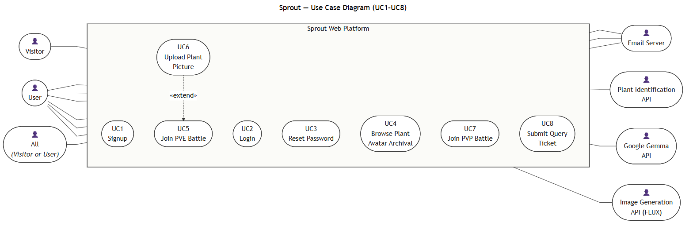

**Status of the exported figure: DELIVERED, 2026-07-25**, at `Sprout_Vault/_attachments/pm3-diagrams/use-case-diagram.png`, rendered from the source `UseCaseDiagram.mmd` held with the checkoff 3 diagram sources. It joins the nine sequence diagrams (UC1–UC6, UC7a, UC7b, UC8) and the domain class diagram delivered on 2026-07-24 in the same folder. The historical `usecase_preview.png` is superseded and **must not be submitted** in its place.

The figure was checked against the acceptance conditions agreed for it. Conditions 1–4 hold; conditions 5 and 6 are recorded below as outstanding corrections rather than claimed as met.

| # | Acceptance condition | Status on the delivered figure |
|---|---|---|
| 1 | UC1–UC8 numbering exactly as in Section 3.2 | **Met.** All eight ovals carry their UC number and the Section 3.2 title (UC4 uses the sequence-diagram alias *Browse Plant Avatar Archival*, recorded in Section 3.2) |
| 2 | `User` associated directly with **both** UC5 and UC6, plus the `«extend»` arrow from UC6 to UC5 | **Met.** `User` has direct associations to UC2–UC7 inclusive, and a dashed `«extend»` arrow runs from UC6 down to UC5 — the requirement-change R1 position |
| 3 | Requirement-document secondary actors, consistent with the sequence-diagram set | **Met, with a legend note required.** The figure draws `Email Server`, `Plant Identification API`, `Google Gemma API` and `Image Generation API (FLUX)` — the `C3T2_UseCaseDescription_1D.docx` actor set in readable form. These are the *requirement-document* names, and requirement-change row D3 has since replaced the provider chain (Plant.id → configured Gemini image model → background removal → FLORENTINE24 quantisation). The mapping is stated below and **must be added to the figure as a visible legend note before final submission** |
| 4 | No database, storage, engine, or multiplayer-server actor outside the system boundary | **Met.** Only human actors and genuine external services sit outside `Sprout Web Platform` |
| 5 | UC6 (web) and UC7 labelled **planned** | **NOT MET — outstanding.** Neither oval carries a *planned* label on the delivered figure. Tracked as Section 7.4 item 10 |
| 6 | UC8 associated with the `All` composite actor only | **Met.** The figure draws exactly one edge into UC8, from `All (Visitor or User)`; there is no duplicate `Visitor → UC8` association |

**Legend note to add to the figure (condition 3).** `Plant Identification API` = Plant.id; `Google Gemma API` = the configured Gemini image model that superseded Gemma for prompt/image generation; `Image Generation API (FLUX)` = the FLUX-era generation stage, now realised as background removal plus fixed 56×56 FLORENTINE24 quantisation. The requirement-document names are retained on the diagram so that it stays consistent with the sequence-diagram set, and the current providers are recorded in requirement-change row D3 (Section 2.2). Leaving the names unexplained on the figure would misrepresent the current design.

**Two further modelling corrections outstanding on the figure**, disclosed rather than concealed. First, the `All` composite actor carries no generalization arrows from `Visitor` and `User`, so the "Visitor or User" semantics live only in the node label; generalizations `Visitor → All` and `User → All` should be drawn. Second, the identity authority (Firebase Auth) appears nowhere as a secondary actor even though Section 3.2 lists it as the secondary actor for UC1, UC2 and UC3, and `Opponent User` is not drawn as the second primary actor of UC7. Both are tracked in Section 7.4 item 10.

The block below is a verbatim textual transcription of the delivered figure, provided so that the associations can be read and diffed as text. It is **not** a substitute for the UML figure above, and it is deliberately faithful to what was exported — including the two omissions just disclosed — so that the two artefacts cannot drift apart.

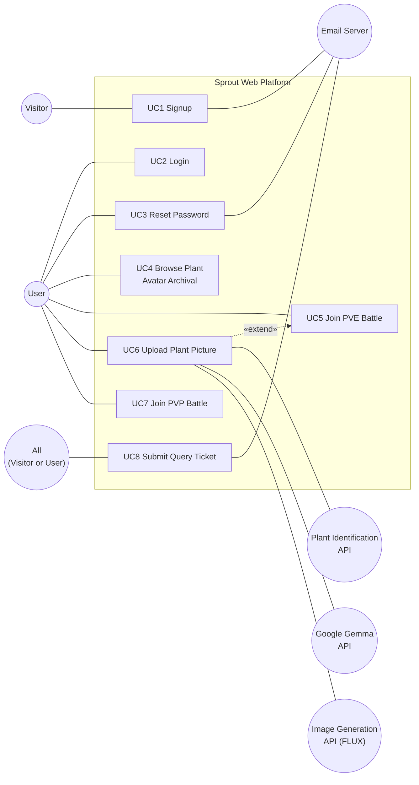

#### 3.3.3 Diagram rules applied to every artefact

1. Use the UC1–UC8 numbering in every artefact.
2. Show internal Sprout storage inside the system boundary, never as an actor.
3. Keep each operation-flow step atomic.
4. Use explicit decision conditions such as "confidence is at or above the configured threshold".
5. Put timeouts, invalid data, and delivery failures in alternative flows.
6. Complete every flow with a Sprout response to the initiating actor.
7. Label UC7, and any unintegrated UC5 path, as planned or isolated rather than implemented.
8. For the final report, add misuse cases for credential abuse, upload abuse, ticket spam, and duplicate or replayed battle actions.

#### 3.3.4 Note on alternative-flow numbering

Alternative-flow labels of the form `3a`, `4b`, `8c` are **referenced by the sequence diagrams** and are therefore reproduced verbatim from the requirements notes, including their original ordering. Where a diagram branch label differs from the description label, the difference is recorded explicitly in the relevant use case below rather than being silently renumbered.

---

### 3.4 UC1 — Signup and Verify Email

| Field | Value |
|---|---|
| ID and name | UC1 — Signup and Verify Email |
| Description | A visitor creates a Sprout account and verifies the email through a Sprout-hosted completion page. |
| Primary actor | Visitor |
| Secondary actors | Firebase Auth, Email Service |
| Trigger | Visitor requests account creation. |
| Precondition | None; duplicate identity is an alternative flow. |
| Postcondition | Firebase identity and Sprout profile exist; after action-code completion the profile is verified. |
| Error states | Invalid input, duplicate account, identity/profile failure, email delivery failure, invalid or expired action code, resend rate limit. |

**Main operation flow**

1. Visitor enters email, password, and display name (username).
2. Sprout validates the input, username, and password policy.
3. Sprout requests Firebase Auth to create an unverified identity.
4. Sprout creates the corresponding application profile.
5. Sprout requests a Firebase email-verification action link whose continue URL is Sprout `/verify-email`.
6. Sprout requests the Email Service to deliver the link.
7. Sprout confirms that the account is pending verification and provides a resend action.
8. Visitor follows the link to Sprout `/verify-email`.
9. Sprout's web boundary applies the Firebase action code.
10. Sprout refreshes the Firebase ID token and calls `/api/auth/me`.
11. The backend verifies the token, synchronises the local `isVerified` state, and confirms success.

**Alternative flows** (numbering follows the UC1 sequence diagram so that every diagram branch has a matching description entry)

- **2a Invalid input (general):** return field-specific validation and preserve non-secret input.
- **3a Invalid or unreachable email:** return a field-specific error and return the visitor to the form; create no identity.
- **3b Invalid username:** display name is empty, too long, already taken, or uses disallowed characters; return a field-specific error.
- **3c Invalid password:** password fails the policy; return the unmet criteria.
- **3d Email already registered:** return conflict and offer login or resend without creating another profile.
- **4a Identity creation fails:** return service error; no local profile is created.
- **4b Profile creation fails:** compensate or record a recoverable provisioning state; do not report a complete signup.
- **5a Authentication error or consent denied:** the ownership/action-code step does not complete; report failure and offer a retry from the start.
- **6a Email delivery fails:** retain the pending account, report a recoverable unsent state, and offer resend; a retry must not create a duplicate identity.
- **9a Invalid or expired action code:** report failure and offer resend.
- **Resend limit:** no more than three resend requests per 15 minutes per account or IP; return 429 when exceeded.

> **Resolved label collision.** The source requirements note used the label `3b` twice — once for *invalid username* (validation branch set, matching the sequence diagram) and once for *identity creation fails* (service branch set). The collision is now resolved once and consistently: the validation branches keep `3a` invalid email, `3b` invalid username, `3c` invalid password and `3d` already registered — which preserves the `3b invalid username` label the delivered UC1 diagram references — and the two provisioning failures become `4a` identity creation fails and `4b` profile creation fails. The same renumbering must be carried into `C3T2_UseCaseDescription_1D.docx` and the UC1 diagram re-exported so that all three artefacts read identically; that re-export is Section 7.4 item 10.

**Validation and security rules**

- Email must be syntactically valid and normalised.
- Password must contain at least eight characters, uppercase, lowercase, a number, and a symbol.
- Display name is trimmed, 1–50 characters, and limited to letters, numbers, spaces, hyphens, and underscores.
- Protected gameplay routes reject users whose Firebase token is valid but `emailVerified` is false.
- Firebase action codes are the verification authority; Sprout does not create a second signup-token table or signup OTP.
- Email links and credentials are never logged in deployed mode.

**Requirement change since Checkoff 2 (row R2).** The original description collected only email and password and listed alternative flows `3a`, `3b`, and `5a`. The implemented signup validates display name, email, password policy, and duplicates separately, so the 2026-07-24 sequence diagram is authoritative and the description above was corrected to match it, with the branch labels renumbered once as recorded above.

**Implementation status: Partially implemented.** The backend creates the Firebase identity and profile, generates the Firebase verification link, and calls the shared email service; signup recovery, in-app action-code handling, strict UID-keyed resend limits, and account/IP isolation are recorded as implemented through commit `a28e6e2`. The UC1 requirements note records the earlier state at commit `8e1077d`, where deployment used console email, no complete Sprout `/verify-email` page or resend endpoint existed, and an email failure could leave an account that could not be retried cleanly. Live email delivery to arbitrary addresses is not proven (Section 2.5). The live Firebase Auth and deployed-configuration system case `SYS-F01` is **PLANNED / NOT RUN**.

---

### 3.5 UC2 — Login

| Field | Value |
|---|---|
| ID and name | UC2 — Login |
| Description | An existing user authenticates with Firebase and opens the Sprout workspace with current profile and collection data. |
| Primary actor | User |
| Secondary actor | Firebase Auth |
| Trigger | User requests login. |
| Precondition | None; invalid credentials and unverified status are alternative flows. |
| Postcondition | A verified Firebase session is active and Sprout data is synchronised. |
| Error states | Invalid credentials, rate limit, unverified email, token verification failure, profile or data failure. |

**Main operation flow**

1. User enters email and password.
2. React requests Firebase `signInWithEmailAndPassword`.
3. Firebase returns an authenticated user and ID token.
4. React sends the Firebase ID token to `/api/auth/me`.
5. Express verifies the token with Firebase Admin.
6. The backend synchronises the local profile verification state.
7. The backend fetches current profile, collection, and game metadata.
8. Sprout grants the verified user access to the workspace.

**Alternative flows**

- **2a Invalid credentials or unknown email:** show one generic authentication error; never reveal which field was wrong.
- **2b Excess attempts:** apply configured Firebase/backend rate limiting and require retry later.
- **5a Invalid, expired, or tampered token:** return 401 and clear the local session.
- **6a Email unverified:** keep the authenticated Firebase session only long enough to show the verification/resend UI; protected gameplay remains blocked.
- **7a Application data unavailable:** show a retriable error; do not fabricate an empty archive as successful synchronisation.

**Security rules**

- Express accepts Firebase ID tokens in `Authorization: Bearer <id-token>`.
- Sprout does not issue a second custom login JWT.
- Frontend `ProtectedRoute` and backend authorisation middleware enforce the same verified-user rule.
- Authentication errors remain generic.

**Diagram-to-implementation delta to disclose.** The domain-level UC2 sequence diagram shows credential validation "against the DB" and a Sprout-issued session token. In the implementation, Firebase Auth is the identity authority and Sprout never sees the password (requirement-change row D1). The diagram remains valid as an analysis-level abstraction; the mapping is recorded in the design-to-implementation mapping table.

**Implementation status: Implemented.** Firebase client login and backend ID-token verification exist; on commit `a28e6e2` both frontend and backend protected routes reject unverified and no-email tokens. Google sign-in was added since Project Meeting 2 (Section 2.3, row F3) and needs no verification email, because Google asserts a verified email. The UC2 requirements note records the earlier state at commit `8e1077d`, where frontend protected routes still admitted an `unverified` state and the archive was not yet populated from the shared collection. Live Firebase Auth, authorised-domain, and deployed-configuration evidence (`SYS-F01`) is **PLANNED / NOT RUN**; Firebase ID-token verification is mocked at the Firebase Admin boundary in the current automated evidence.

---

### 3.6 UC3 — Reset Password via OTP

UC3 is a separate base use case, not an extension of UC2.

| Field | Value |
|---|---|
| ID and name | UC3 — Reset Password via OTP |
| Description | A person who may own an account requests an email OTP and sets a new password without revealing account existence. |
| Primary actor | User |
| Secondary actors | Email Service, Firebase Auth |
| Trigger | User requests password reset. |
| Precondition | None. |
| Postcondition | For a valid account and OTP, the Firebase password and password history are updated and the OTP is invalidated. |
| Error states | Invalid input, delivery failure, incorrect or expired OTP, attempt limit, weak or reused password, identity or database failure. |

**Main operation flow**

1. User enters an email address.
2. Sprout accepts a syntactically valid request.
3. If the account exists, Sprout generates a six-digit OTP with `crypto.randomInt`.
4. Sprout bcrypt-hashes the OTP and stores its 15-minute expiry and zero failed attempts.
5. Sprout requests the Email Service to deliver the plaintext OTP.
6. Sprout returns the same generic acknowledgement for known and unknown emails.
7. User enters the OTP and a new password.
8. Sprout validates the OTP hash, expiry, and failed-attempt count.
9. Sprout validates password strength and recent-password history.
10. Sprout updates the Firebase password and application password history as one controlled operation.
11. Sprout clears the OTP data and confirms reset success.

**Alternative flows**

- **3a Unknown email:** perform no account mutation and return the same acknowledgement as the main flow.
- **5a Email delivery failure for a known account:** retain a clear internal failure state; log securely and allow a fresh request. The public response must not reveal account existence.
- **8a Wrong OTP:** increment the failed-attempt counter and return a generic invalid-OTP error.
- **8b Five failed attempts:** invalidate the issued OTP and require a new request.
- **8c Expired OTP:** invalidate it and require a new request.
- **9a Weak or recently used password:** reject without consuming a valid OTP unless the security policy explicitly chooses otherwise.
- **10a Firebase or database update fails:** do not report success; retain enough internal state for a controlled retry without partial password-history corruption.

**Diagram label mapping.** The UC3 sequence diagram uses the labels of `C3T2_UseCaseDescription_1D.docx`: `3a` delivery timeout, `4a` maximum attempts reached, and `4b` expired-OTP resend. These correspond to description flows `5a`, `8b`, and `8c` respectively. The diagram's `5a`/`6b`/`7a` password branches are collapsed into a single "weak, mismatched, or recently used" else-branch, which corresponds to description flow `9a`.

**Rules**

- OTP plaintext exists only in the outgoing email payload.
- Reset-request responses do not disclose whether an account exists.
- A successful reset invalidates the OTP and prevents reuse.
- Password-history comparisons use production bcrypt cost; tests must allow the expected cryptographic runtime or use a controlled test cost at the adapter boundary.

**Requirement change since Checkoff 2 (row R4).** The original description displayed "No account found with this email address" for an unknown email. The system now returns the same generic acknowledgement whether or not the account exists. This is a deliberate anti-enumeration security refinement and is a documented, intentional difference from the sequence diagram.

**Implementation status: Partially implemented.** Request and reset endpoints and UI exist, including the hashed OTP, 15-minute TTL, Firebase password update, and password history. The readiness record states that generic anti-enumerating request handling, background email dispatch, the exact attempt cap, atomic consume, stale isolation, concurrency handling, password history, and the test-runtime fix are implemented on commit `a28e6e2`. The UC3 requirements note records the earlier state at commit `8e1077d`, where deployment remained in console-email mode, no five-attempt invalidation existed, and two Jest cases exceeded the default five-second timeout owing to multiple bcrypt cost-12 operations. Live SMTP delivery to a real inbox and graceful dispatcher drain remain pending; **no claim is made that a reset OTP has reached an arbitrary real inbox.**

---

### 3.7 UC4 — Browse Avatar Archival

Also titled *Browse Plant Collection* in the requirements note and *Browse Plant Avatar Archival* in the sequence diagram.

| Field | Value |
|---|---|
| ID and name | UC4 — Browse Avatar Archival |
| Description | A verified user browses one persistent collection entry per discovered species, including provenance, canonical art, and game metadata. |
| Primary actor | User |
| Secondary actors | None |
| Trigger | User opens the collection or archive. |
| Precondition | User has a verified authenticated session. |
| Postcondition | The user's current collection is displayed without exposing another user's private data. |
| Error states | Unauthorised access, data service failure, missing canonical asset, empty collection. |

**Main operation flow**

1. User requests the collection.
2. Sprout verifies the Firebase ID token and verified-email status.
3. Sprout fetches collection entries owned by the user.
4. Sprout resolves each entry to species metadata and a canonical sprite reference.
5. Sprout returns a paginated result.
6. The client displays status (`VISITED` or `CAUGHT`), species, sprite, first- and last-seen dates, nickname, and PVE progress.
7. User may open a collection entry for details.

**Alternative flows**

- **2a Unauthorised or unverified:** return 401 or 403 and route to login or the verification UI.
- **3a Empty collection:** show an empty state with the upload action.
- **3b Persistence unavailable:** show a retriable error rather than a false empty state.
- **4a Missing sprite object:** show an explicit placeholder and log the broken asset reference.
- **7a Foreign entry ID:** return 404 without leaking ownership details.

**Diagram label mapping, and two behavioural deltas.** The UC4 sequence diagram carries two branches, `1a` database unreachable and `1b` empty collection, which correspond to description flows `3b` and `3a` respectively. The correspondence is by position only: on both branches the diagram specifies *different behaviour* from the description, and the difference is recorded here rather than left for a grader to find.

| Branch | Delivered UC4 diagram shows | This description (design of record) requires | Reconciliation |
|---|---|---|---|
| `1a` / `3b` persistence unavailable | Returns cached data together with a synchronisation warning banner rather than failing outright | A **retriable error**, with no cache and no banner, so that a stale or absent read is never presented as a successful synchronisation | The description is the design of record. Serving cached data behind a banner would reintroduce exactly the "false empty state" the description forbids, and no cache layer exists in the implementation. The diagram is to be re-exported |
| `1b` / `3a` empty collection | Renders an empty state that directs the user to the **mobile app** | An empty state offering the **in-app upload action** (UC6) | The description is the design of record: UC6 is a base use case on the web platform since requirement-change R1, so an empty archive must offer upload rather than route the user off-platform. The diagram is to be re-exported |

Both re-exports are tracked as Section 7.4 item 10.

**Collection rules**

| Rule | Decision |
|---|---|
| Unique key | `(userId, speciesId)` |
| Repeated web scan | Updates `lastSeenAt`; does not duplicate entries |
| Provenance | Web creates `VISITED`; trusted mobile capture may promote to `CAUGHT`; status never demotes |
| Ownership of data | Canonical sprite art is shared; nickname, XP, history, and the optional private source photo are personal |

**Implementation status: Implemented (read path).** Owner-only Firestore `avatar_records` list and detail APIs, exact demo-record enable/disable, and the Archive page are implemented, with focused automated evidence at commit under test `7991254` (test IDs `CORE-I01`, `CORE-I03`, `CORE-F02`). Habitat and conservation status now appear in the archive detail panel and demo species data, per step 3. Two boundaries must be stated openly: the archive is **not** populated by the UC6 upload pipeline, so passing archive tests must not be read as upload evidence; and current Firestore evidence uses the Firestore Emulator, with real-browser history behaviour (`SYS-A01`), the full Archive-to-PVE journey (`SYS-P01`), and production Firestore persistence (`SYS-D01`) all **PLANNED / NOT RUN**.

---

### 3.8 UC5 — PVE Battle

| Field | Value |
|---|---|
| ID and name | UC5 — PVE Battle (Join PVE Battle) |
| Description | A verified user selects one collected plant and fights a fixed, versioned system-controlled opponent in an alternating turn-based battle. |
| Primary actor | User |
| Secondary actors | None. The bot and battle engine are internal Sprout components. |
| Trigger | User requests a PVE battle. |
| Precondition | User is verified and owns at least one collection entry eligible for PVE. |
| Postcondition | Battle is won, lost, or abandoned; one idempotent reward result is persisted. |
| Error states | No eligible plant, invalid or foreign session, stale action, invalid transition, persistence failure. |

**Main operation flow**

1. Sprout displays the user's eligible collected plants.
2. User selects one plant.
3. Sprout creates a battle session with a versioned NPC preset, initial HP, and a stored RNG seed.
4. Sprout enters `PLAYER_ACTION` and returns the current state and turn number.
5. User submits a valid move with the expected turn number.
6. Sprout transitions through `BOT_ACTION`, where the bot randomly selects one valid move using the stored seed.
7. Sprout resolves the round, appends action logs, and floors HP at zero.
8. Sprout checks the result.
9. If both plants remain active, Sprout increments the turn and returns to `PLAYER_ACTION`.
10. If the user wins or loses, Sprout marks completion and applies the reward once.
11. Sprout displays the battle summary and XP result.

**State machine**

```text
PLAYER_ACTION -> BOT_ACTION -> RESOLVE_ROUND -> CHECK_RESULT
      ^                                      |
      |---------------- active --------------|
                                             +-> WON / LOST
```

**Alternative flows**

- **2a No eligible plant:** direct the user to UC6; do not start an empty session. *(This is the branch that the UC6 `«extend»` relationship attaches to.)*
- **5a Invalid move:** reject without advancing the turn.
- **5b Stale or duplicate turn number:** return the current state without applying damage again.
- **7a Resolution failure:** keep the last persisted valid state and return a retriable error.
- **10a Reward retry:** detect the completion marker and return the original result without applying XP twice.
- **Abandon:** mark abandoned and apply no XP.

**Diagram label mapping, and two behavioural deltas.** The UC5 sequence diagram carries `2b` decline-upload dead end, `5a` NPC calculation error with turn retry, `8a` web-only save, and `8b` try-other-avatar. Branch `2b` corresponds to description flow `2a`; `5a` corresponds to `7a`; `8a` and `8b` are post-summary continuation choices that the description records as outcomes of steps 10–11 rather than as failure branches. Two differences are behavioural rather than positional and are disclosed here:

| Item | Delivered UC5 diagram shows | This description (design of record) requires | Reconciliation |
|---|---|---|---|
| Opponent construction (main flow step 3) | An `NPC` whose difficulty is **scaled to the player's skill** | A **fixed, versioned system-controlled opponent** — a versioned NPC preset | The description is the design of record and matches the implementation: the delivered catalogue is the fixed `thornback-v1` preset, whose compatibility and rejection branches are covered by `SUP-U01` (12/12). Difficulty scaling is a P2 item in `02 Requirements/Feature Priorities.md`, not Checkoff 3 behaviour. The diagram is to be re-exported |
| Branch `2b` / flow `2a`, user with no eligible avatar | A dead end that directs the user to the **mobile app** | **Direct the user to UC6** — the branch that the UC6 `«extend»` relationship attaches to | The description is the design of record. Routing to the mobile app would sever the `«extend»` relationship that requirement-change R1 established, and would make the extension point unreachable. The diagram is to be re-exported |

Both re-exports are tracked as Section 7.4 item 10.

**Rewards and limits**

| Outcome | Persistent result |
|---|---|
| Win | +20 PVE XP, +1 PVE win, update best win streak |
| Loss | +5 PVE XP, +1 PVE loss, reset current streak |
| Abandon | No XP |

Battle HP is temporary and restored after the session. XP does not scale combat stats in Checkoff 3. A public leaderboard is deferred, because unrestricted XP is farmable.

**Android reuse decision.** The alternating-state concept and versioned move/taxonomy data are reused from the Android reference application. Its activity-owned state, cloned player-garden opponent, and non-deterministic random calls are deliberately **not** copied: server authority, expected turn numbers, and a stored RNG seed are required for web retries and testing.

**Implementation status: Implemented.** The server-authoritative engine and catalogue, Firestore session and reward transactions, the HTTP API, the Battle page, and the shared-header pending-navigation guard are implemented, with focused automated evidence at commit under test `7991254` (test IDs `CORE-U01`, `CORE-U02`, `CORE-I02`, `CORE-F01`, plus supporting row `SUP-U01`). The real browser-to-backend Archive-to-PVE journey (`SYS-P01`) remains **PLANNED / NOT RUN**. One run qualification applies and is recorded in full as `QUAL-I01` in Section 6.3.

---

### 3.9 UC6 — Upload Plant Picture

UC6 is an independent base use case: it populates the collection whether or not the user starts PVE, and it additionally `«extend»`s UC5 for the in-battle upload path.

| Field | Value |
|---|---|
| ID and name | UC6 — Upload Plant Picture |
| Description | A verified user uploads a plant image. Sprout identifies the species, reuses or creates one versioned canonical sprite, and records the species as `VISITED` in the user's collection. |
| Primary actor | User |
| Secondary actors | Plant Identification Service, Prompt/Image Generation Service, Background Removal Service (requirement-document vocabulary: `PlantIdAPI`, `GemmaAPI`, `FluxAPI`) |
| Trigger | User submits a plant image. |
| Precondition | User has a verified authenticated session. |
| Postcondition | A successful scan event and one user/species collection entry exist; a completed canonical sprite is referenced. |
| Error states | Invalid or oversized file, rate limit, low confidence, provider timeout, generation, post-processing, or storage failure. |

**Main operation flow**

1. User selects or captures a plant image.
2. Sprout validates magic bytes, accepted format, size, and upload rate.
3. Sprout sends the valid image to the identification adapter.
4. The adapter returns a stable species ID, names, taxonomy, and confidence.
5. Sprout checks that confidence is at or above the configured threshold.
6. Sprout upserts species metadata by stable species ID.
7. Sprout looks up the canonical asset by species ID and generation-recipe version.
8. On a cache hit, Sprout reuses the completed canonical asset.
9. On a cache miss, Sprout acquires the unique recipe-generation lock.
10. The winning request creates a structured prompt and requests the configured Gemini image model.
11. Sprout removes the background, crops and pads to square, resizes to 56×56, quantises non-transparent RGB to FLORENTINE24, preserves alpha, and calculates a checksum.
12. Sprout stores the immutable PNG and marks the asset complete.
13. Concurrent losing requests reuse the completed winning asset.
14. Sprout upserts the user's collection entry as `VISITED` and records the scan event.
15. Sprout returns species, canonical sprite, provenance, and collection data.
16. The client displays the result and makes it available in UC4.

**Alternative flows**

- **2a Invalid image or type:** return `INVALID_IMAGE`; no external provider is called.
- **2b Over 5 MB:** return `IMAGE_TOO_LARGE`; no external provider is called.
- **2c Rate exceeded:** return `RATE_LIMITED`.
- **3a Identification timeout or failure:** return `IDENTIFICATION_UNAVAILABLE`.
- **5a Below threshold:** record the outcome, return `LOW_CONFIDENCE`, and suggest a better image.
- **10a Generation failure:** mark the recipe failed and retriable, and return `GENERATION_FAILED`.
- **11a Background removal or post-processing failure:** do not mark a completed asset; return `POSTPROCESS_FAILED`.
- **12a Storage failure:** do not point collection data at a missing object; return `STORAGE_FAILED`.

**Diagram label mapping, and the confidence gate resolved to one value.** The UC6 sequence diagram carries `2a` invalid image, `4a` low confidence, `7a` Gemma timeout, and `9a` generation failure, corresponding to description flows `2a`, `5a`, a provider-timeout case in the prompt stage, and `10a` respectively. The source material previously carried two different confidence gates — **≥ 0.85** on the delivered diagram and a named configuration value **defaulting to 0.70** in the requirements rules table. **That discrepancy is now resolved in favour of a single value: a named configuration value whose default is 0.85.** The configurable-threshold formulation remains the design of record, so the decision condition still reads "at or above the configured threshold"; the *default* is set to 0.85 so that the shipped default and the delivered diagram agree without a re-export. The rules table below has been updated to match, and the item is removed from the open-defects list in Section 7.3.

**Rules**

| Rule | Decision |
|---|---|
| Formats | JPEG, PNG, WEBP, verified by magic bytes |
| Maximum upload | 5 MB, enforced client-side and server-side |
| Confidence | Named configuration value, **default 0.85**, matching the delivered UC6 diagram; the decision condition reads "at or above the configured threshold". The earlier 0.70 draft default is superseded |
| Rate limit | 5 uploads per verified user per hour |
| Canonical key | `speciesId + promptVersion + modelVersion + paletteVersion` |
| Palette version | `florentine24-v1` |
| Collection uniqueness | `(userId, speciesId)` |
| Web provenance | Always `VISITED`; web cannot assign `CAUGHT` |
| Repeated scan | Update `lastSeenAt`, retain `firstSeenAt`, no duplicate entry |
| Private photo | Optional private storage path; never required to serve canonical art |

Provider payloads, prompts considered sensitive, credentials, and stack traces are never returned to the client. Deterministic fakes are the normal automated-test and backup-demo path.

**Requirement change since Checkoff 2 (rows R1 and D3).** UC6 was promoted from an extension-only sub use case to a base use case, and the provider chain was changed; both changes are recorded in Sections 2.1, 2.2 and 3.3.1 and are not restated here.

**Implementation status: Planned — not implemented on the web platform.** This is the single most important scope statement in the report. UC6 upload, real identification, AI and canonical processing, Storage integration, and upload-to-archive provenance are **not implemented and not evidenced** by the current archive records. The pipeline is being developed in parallel and is not merged. The Firebase Storage Blaze bucket activation and a secret-safe Admin write/read/delete preflight passed on 2026-07-21, but the application adapter, client rules, and deployed integration remain not run, and `STORAGE_MODE` is held at `local`. Live provider checks are blocked by missing `PLANTID_API_KEY`, `GEMINI_API_KEY`, and `REMOVE_BG_API_KEY`; mock or fixture passes must not be reported as live-provider evidence. The upload-to-archive system case `SYS-U01` (defined in `05 Testing/Test Matrix.md` and `docs/checkoff3/archive-pve-verification-evidence.md`) is recorded as **PLANNED / NOT RUN**, and the upload-validation, quantiser, and same-species concurrency acceptance items remain unticked. Passing UC4 archive tests do **not** constitute UC6 evidence.

---

### 3.10 UC7 — PVP Battle

| Field | Value |
|---|---|
| ID and name | UC7 — PVP Battle (Join PVP Battle) |
| Description | Two verified users match and battle with their eligible collections through a server-authoritative real-time session. |
| Primary actors | User and Opponent User |
| Secondary actors | None. The WebSocket gateway, matchmaking, and game engine are internal components. |
| Trigger | User selects PVP battle mode. |
| Precondition | Both users are verified and have eligible collection entries. |
| Postcondition | One authoritative result is persisted for both participants. |
| Error states | No opponent found within the matchmaking timeout; avatar-pick timeout; turn timeout; WebSocket failure during avatar selection; mid-battle disconnection; mid-battle WebSocket error; database write failure when persisting results. |

**Main operation flow** (derived from the delivered UC7a sequence diagram, not invented; UC7 remains **planned** and unimplemented)

1. User selects PVP battle mode and enters matchmaking with a skill rating.
2. Sprout matches the user with an opponent of comparable rating.
3. Sprout creates the shared battle session and opens the lobby for both participants.
4. Both participants pick an avatar from their own archive, in parallel, within the pick time limit.
5. Sprout loads the battle interface for both clients with both sets of statistics.
6. Sprout loops each turn — the active participant submits a move, the server validates and resolves it, and the result is mirrored to both clients — until one side reaches 0 HP.
7. Sprout determines the winner.
8. Sprout persists one `BattleResult` per participant.
9. Sprout displays the battle summary to both participants.

The trigger and the error-state list above are likewise derived from the delivered UC7a and UC7b diagrams rather than from the requirements note, which deliberately records UC7 as planned final architecture only. Each error state maps onto a labelled diagram branch in the alternative flows below.

**Alternative flows** (as labelled in the delivered diagrams)

- **UC7a 2a No opponent found within the timeout:** report that no opponents are available and offer PVE (UC5) or a later retry.
- **UC7a 4b Auto-assign:** if a user does not pick in time, randomly assign an avatar from that user's archive.
- **UC7a 6a Turn skip:** if a user misses the turn timer, skip that user's turn and pass to the opponent.
- **UC7a 9a Database write failure:** retry the write up to three times, then cache the results, schedule a background write, and notify both participants that statistics may be delayed.
- **UC7b 4a WebSocket failure during avatar selection:** auto-reconnect up to five times with increasing delay; on success resume selection, on exhaustion declare the session lost and return the players to the matchmaking queue.
- **UC7b 6b Mid-battle disconnection:** pause the battle and allow a 30-second grace period; on reconnection resume from current state, on expiry award the remaining user a default win and persist a disconnect penalty.
- **UC7b 6c WebSocket error mid-battle:** auto-reconnect up to five times; on success resume from server-side state, on exhaustion mark the battle a draw and persist the incomplete state.

**Planned controls**

- Server-authoritative turn order and validation.
- Idempotent action identifiers and expected turn numbers.
- Reconnection and timeout handling modelled as alternative flows.
- No client-provided damage or reward values.
- Matchmaking, seasonal leaderboard, and anti-farming rules defined before any public ranking.
- Misuse cases for replayed actions, foreign sessions, disconnection abuse, and tampered payloads.

**Implementation status: Planned.** UC7 is **not implemented** and is not part of the Checkoff 3 implemented claim. Only a dated plan and the UC7a/UC7b diagrams are presented, and both diagrams must be labelled "Planned" in the report and the demonstration. This position is unchanged from Project Meeting 2.

---

### 3.11 UC8 — Submit Query Ticket

| Field | Value |
|---|---|
| ID and name | UC8 — Submit Query Ticket |
| Description | A visitor or user submits a Contact Us query. Sprout persists it, returns a reference number, confirms receipt, and notifies the Sprout admin. |
| Primary actor | All (Visitor or User) |
| Secondary actor | Email Service |
| Trigger | Submitter sends the Contact Us form. |
| Precondition | None. |
| Postcondition | Ticket is persisted with a unique reference number; notification outcomes are recorded. |
| Error states | Invalid input, persistence failure, submitter-email failure, admin-email failure. |

**Canonical form fields**

| Field | Constraint |
|---|---|
| `name` | Trimmed, 1–100 characters, required |
| `email` | Valid email address, required |
| `organisation` | Trimmed, up to 120 characters, **optional** |
| `subject` | Trimmed, 1–150 characters, required |
| `category` (inquiry type) | `general`, `partnership`, `technical_support`, or `feedback` |
| `message` | Trimmed, 1–2000 characters, required |

The legacy values `bug`, `billing`, and `other` remain accepted by the API so that tickets stored before the realignment still decode; the Contact Us dropdown offers only the four documented types.

**Main operation flow**

1. Submitter enters name, email, organisation (optional), subject, inquiry type, and message.
2. Sprout validates the fields.
3. Sprout atomically creates the ticket and daily reference number.
4. Sprout attempts the submitter confirmation email.
5. Independently, Sprout attempts the Sprout-admin notification email.
6. Sprout records each notification outcome.
7. Sprout returns HTTP 201 with the reference number.

**Alternative flows**

- **2a Invalid input:** return field errors and create no ticket.
- **3a Persistence failure:** return 5xx and do not claim a reference number.
- **4a Submitter email fails:** record the failure, continue to the admin attempt, and return the persisted reference number.
- **5a Admin email fails:** record the failure; do not roll back or hide the ticket.
- **4a and 5a both fail:** preserve the ticket and both failure states for manual or automated retry.

**Diagram label mapping.** The UC8 sequence diagram carries `3a` validation failure and `5a` email timeout logged for retry, corresponding to description flows `2a` and `4a`/`5a`. The ticket persists and the reference number returns regardless of email outcome in both artefacts.

**Rules**

- Reference format: `SPR-YYYYMMDD-NNNN`, a zero-padded daily atomic sequence.
- Email is best-effort **after** authoritative ticket persistence.
- The two email sends are separate failure boundaries.
- In tests, use a fake or console adapter; in deployed mode, use the HTTPS email API (Resend) via `EMAIL_MODE=resend`, with SMTP retained as a configurable fallback and all secrets held in environment variables only (requirement-change row D4).
- The system sequence ends with Sprout returning the reference number. Do not draw Email Service → Submitter as the system acknowledgement.

**Requirement change since Checkoff 2 (row R3).** An interim implementation had reduced the form to `name`/`email`/`category`/`message`. Because the 2026-07-24 diagram set and `C3T2_UseCaseDescription_1D.docx` both specify the fuller form, the **implementation was corrected to match the requirement**, not the reverse.

**Contradictory local plan, explicitly rejected.** The untracked repository file `GOOGLE_SMTP_VERIFICATION_PLAN.md` proposes making UC8 database-only. That contradicts this use case and the team's outstanding admin-notification requirement, and it is **not** the adopted Checkoff 3 behaviour.

**Implementation status: Partially implemented.** Branch commit `ec01228` resolves the coupled-send defect: the ticket is created with a `pending` delivery state, both emails are attempted through `Promise.allSettled`, and each outcome is persisted. The documented automated evidence for those boundaries — persist-first ordering, independent submitter and admin outcomes, and controlled failure codes — is `TKT-U01`, `TKT-I01` and `EMAIL-U01` at commit `a28e6e2` (Section 6.4). The repository and query suites were also run at `ec01228`, but **those counts are self-reported in the commit message and are not consolidated into a signed evidence document** (Section 7.3 item 8), so `a28e6e2` remains the citable evidence commit for UC8; consolidating `ec01228` is Section 7.4 item 5. Two boundaries must be stated: that historical ticket regression was **intentionally not rerun** during the focused UC4/UC5 phase, so no current broad regression claim is made (`SUP-R01`, defined in `docs/checkoff3/archive-pve-verification-evidence.md`); and `EMAIL_MODE` is not yet verified against a live transport, so **no claim is made that the submitter or the admin received a real message**. Live delivery belongs to system case `SYS-E02`, which is **PLANNED / NOT RUN**, and is not part of the unit or integration result.

---

### 3.12 Implementation-status summary

**One status vocabulary is used in this table and in Section 7.1, with exactly three values and no per-row variants.** *Fully implemented* means the use-case postcondition is reached by the web code at the commit under test **and** is covered by executed automated evidence recorded in a named evidence document. *Partially implemented* means the code path exists and is evidenced, but at least one documented step of the use case has no executed proof in this submission — which includes use cases whose only evidence is supporting historical material that was intentionally not rerun. *Not implemented* means no code path exists.

| ID | Use case | Status | Current automated evidence | Principal outstanding item |
|---|---|---|---|---|
| UC1 | Signup and Verify Email | Partially implemented | Supporting historical regression (`SUP-R01`, `AUTH-U01`, `AUTH-U02`, `AUTH-I01`) at `a28e6e2`, not rerun in the focused phase | Live email delivery to a real inbox from the deployed backend (`SYS-E02` planned); live Firebase Auth and authorised-domain configuration (`SYS-F01` planned) |
| UC2 | Login | Partially implemented | Supporting historical regression (`AUTH-U03`, `AUTH-I01`) at `a28e6e2`, not rerun; Firebase Admin boundary mocked | No current rerun of the UC2 suites since `a28e6e2`; live Firebase Auth and authorised-domain evidence (`SYS-F01`) |
| UC3 | Reset Password via OTP | Partially implemented | Supporting historical regression (`AUTH-U04`, `AUTH-I02`) at `a28e6e2` | Live inbox delivery of the OTP (`SYS-E02`); graceful dispatcher drain |
| UC4 | Browse Avatar Archival | Fully implemented | `CORE-I01`, `CORE-I03`, `CORE-F02` at commit `7991254` | Real-browser and production-Firestore checks (`SYS-A01`, `SYS-D01`); archive is not populated by UC6 |
| UC5 | PVE Battle | Fully implemented | `CORE-U01`, `CORE-U02`, `CORE-I02`, `CORE-F01`, `SUP-U01` at commit `7991254` | Full browser-to-backend Archive-to-PVE journey (`SYS-P01`) |
| UC6 | Upload Plant Picture | Not implemented | None | The entire pipeline; `SYS-U01` planned / not run |
| UC7 | PVP Battle | Not implemented | None | Final-architecture diagrams only; no implementation claimed |
| UC8 | Submit Query Ticket | Partially implemented | `TKT-U01`, `TKT-I01`, `EMAIL-U01` at `a28e6e2`; the `ec01228` and `3ce3dc6` repository/query runs are self-reported and not consolidated | Verified live delivery to submitter and admin (`SYS-E02`); consolidation of the post-`7991254` counts |

The three limitations that bound every claim in this table — UC6 not implemented on web, UC7 not implemented, and unproven live email delivery — are stated in full in Section 2.5.

---

## 4. System Design

### 4.1 Architecture overview

Sprout is structured as a layered client–server application that follows the MVC pattern on the outside and the Boundary–Control–Entity (BCE) stereotypes on the inside. A React single-page client and an Express API are separate deployment boundaries that share one backend contract; the Android client (built by the mobile sub-team) is a second boundary onto the same contract. Firebase Auth is the identity authority, and Firestore is the production record store. The intent of the layering is that no framework or vendor type is allowed to leak upward into domain logic.

```text
React page (View / <<boundary>>)
      -> Express route + controller (Controller / inbound <<boundary>>)
            -> application service (<<control>>)
                  -> domain entity (<<entity>>)
                  -> repository interface -> Firestore adapter
                  -> provider adapter (Firebase Auth, SMTP, and planned scan providers)
```

The mapping between the two vocabularies is fixed for the whole project so that the class, BCE and sequence diagrams stay consistent:

| Component | MVC role | BCE stereotype | Responsibility |
|---|---|---|---|
| React page / component | View | `<<boundary>>` | Accept user input and render state |
| Express route / controller | Controller | inbound `<<boundary>>` | Translate HTTP to an application request and return stable HTTP results |
| Application service | Model orchestration | `<<control>>` | Coordinate one use case and enforce workflow rules |
| Domain object | Model | `<<entity>>` | Hold state and invariants independently of frameworks |
| Repository | Model persistence port | `<<repository>>` | Hide Firestore/SQLite details |
| External-service adapter | Integration port | outbound `<<boundary>>` | Translate provider-specific protocols and errors |

Three conventions follow directly from this table and are enforced in review: React components are never called controllers; Firebase and Firestore are never drawn as domain entities; and controllers never contain persistence or provider logic.

The cross-cutting rules adopted for Checkoff 3 are that controllers do not expose raw provider errors, services depend on repository and provider *interfaces* rather than SDKs, production credentials stay in server-side environment variables, deterministic fakes replace paid or unreliable providers in automated tests, canonical sprite writes are idempotent by versioned recipe key, and every implemented sequence terminates with a response to the initiating actor.

The backend module layout in the repository at the time of writing is `routes/`, `controllers/`, `services/`, `models/`, `repositories/`, `middleware/`, `database/` and `tests/`. Auth, avatar (archive), battle, query (ticket) and admin slices exist as route–controller–service–repository chains; `battle-engine.ts` and `seeded-rng.ts` hold the server-authoritative PVE state machine and its deterministic random source. There is **no upload route, controller or service, and no PVP route or multiplayer server** — UC6 on the web platform and UC7 are design only. The frontend is organised as `pages/`, `components/`, `context/` (including `AuthContext`) and `services/` (`firebaseClient.ts` for the Firebase client SDK, `sproutApi.ts`/`apiClient.ts` for the typed API client). The protected-route guard requires both an authenticated Firebase user and a verified email before gameplay routes render, while the verification page stays reachable by an authenticated but unverified user.

The intended deployment stance is the React frontend on Vercel, the Express backend on Render (or the currently approved Node host), Firebase Auth and Firestore for identity and production records, and Firebase Storage for image objects subject to Blaze-plan availability. Email uses the HTTPS email API (Resend) when deployed, selected by `EMAIL_MODE=resend`, with the SMTP adapter retained as a configurable fallback and a console/fake adapter locally and in tests (requirement-change row D4); live delivery to an arbitrary real inbox is not claimed anywhere in this report (Section 2.5).

### 4.2 Domain and class model

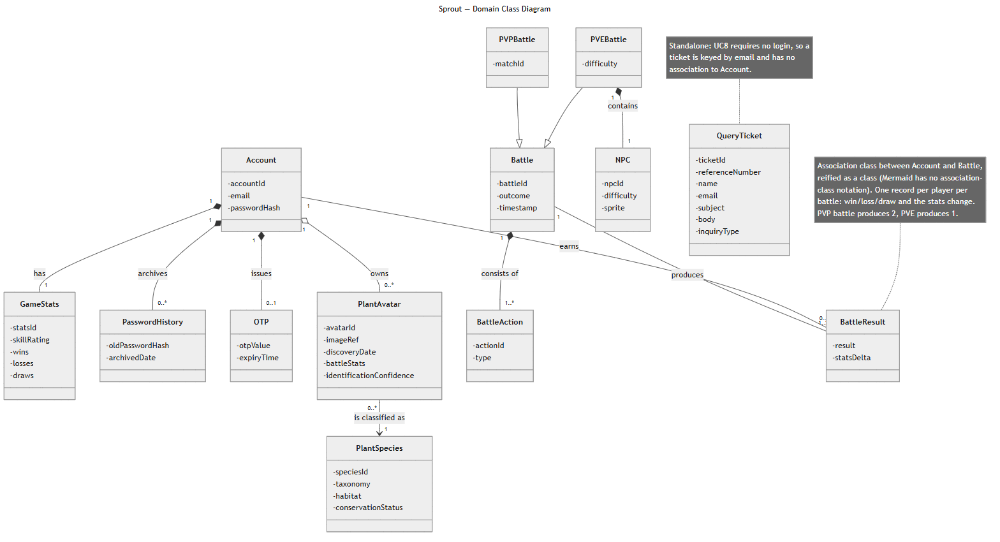

The domain class diagram is modelled at analysis level. Its vocabulary — `Account`, `GameStats`, `PasswordHistory`, `OTP`, `PlantAvatar`, `PlantSpecies`, `Battle`, `PVEBattle`, `PVPBattle`, `NPC`, `BattleAction`, `BattleResult`, `QueryTicket` — is the same vocabulary used by every sequence diagram in Section 4.3 and by the official use-case descriptions, satisfying the "same nouns across all diagrams" requirement. Attribute visibility is private and types are deliberately omitted at this level of abstraction.

The principal relationships are as follows. `Account` composes exactly one `GameStats`, zero or more `PasswordHistory` records and at most one live `OTP`; the composition captures the fact that none of these have meaning or lifetime outside their owning account. `Account` aggregates zero or more `PlantAvatar` instances, and each `PlantAvatar` is classified as exactly one `PlantSpecies` — an avatar is a user's individual specimen, whereas a species is shared reference data, so the relationship is a directed association rather than ownership. `PVEBattle` and `PVPBattle` specialise `Battle`; only `PVEBattle` composes an `NPC`, since a PVP match has two human sides. Every `Battle` composes one or more `BattleAction` entries, which form the per-turn log.

Two modelling decisions warrant explanation.

**`BattleResult` as a reified association class.** A battle outcome is not a property of an account and not a property of a battle: it is a property of the *pairing* of one participant with one battle, carrying that participant's `result` (win, loss or draw) and the `statsDelta` applied to their rating. This is precisely an association class on the `Account`–`Battle` association. Mermaid provides no association-class notation, so the class is reified — drawn as an ordinary class attached to both ends, with `Account "1" -- "0..*" BattleResult` and `Battle "1" -- "1..2" BattleResult`. The `1..2` multiplicity encodes the rule directly: a PVE battle produces one result record (for the human player only), while a PVP battle produces two, one per participant. A diagram note records this so the reification is not mistaken for an accidental extra entity.

**`QueryTicket` as a standalone class.** UC8 explicitly permits an unauthenticated visitor to submit a query, so a ticket cannot be required to reference an `Account`. It is keyed by the submitted email address instead and carries its own `referenceNumber`, `subject`, `body` and `inquiryType`. Attaching it to `Account` would have introduced a false dependency and would have made the anonymous path unrepresentable.

Because the runtime is Firebase/Firestore, the analysis classes do not map one-to-one onto stored documents. The recorded correspondence is: `Account` → Firebase Auth identity plus a Firestore user profile; `GameStats` → PVE experience and win/loss fields held on the user's collection entries; `OTP` → a hashed reset-OTP document with a 15-minute expiry and an attempt counter; `PlantAvatar` → `avatar_records` documents in the delivered Archive/PVE slice, with `UserSpeciesCollection` plus a canonical `SpriteAsset` as the target model; `PlantSpecies` → a `Species` document with a stable `speciesId`; `Battle`/`PVEBattle` → `PveBattleSession`, a state machine with turn number, RNG seed and HP; `BattleResult` → the one-time terminal progression applied by an idempotent reward routine; `NPC` → a fixed, versioned bot preset with seeded RNG; and `QueryTicket` → a Firestore ticket document with an atomic `SPR-YYYYMMDD-NNNN` reference and per-channel delivery statuses. `PVPBattle` and matchmaking have **no implementation**.

### 4.3 Sequence diagrams

#### 4.3.1 Conventions and design-to-implementation mapping

The nine delivered sequence diagrams use a single set of conventions. Lifelines run actor → `UI` boundary → one controller per subsystem (`AuthController`, `AvatarController`, `BattleController`, `PvpController`, `PlantController`, `QueryController`) → domain entities taken from the class diagram → `DB`. Only genuine externals are drawn as actors — `EmailServer`, `PlantIdAPI`, `GemmaAPI`, `FluxAPI` and the human actors; the database, the game engine and the multiplayer server remain internal participants, consistent with the rule that internal components are not actors. Object creation uses the `«create»` stereotype (UC3 additionally uses explicit create/destroy for the `OTP` lifeline), `alt` denotes exclusive outcomes, `opt` genuinely optional steps, `loop` turn and retry cycles, and `par` the simultaneous PVP picks. Fire-and-forget emails use the asynchronous arrow. Branch labels such as `3a`, `4b` and `6c` refer to the alternative-flow numbering of the use-case description document, not to Mermaid autonumbering. All ten files delivered on 2026-07-24 (nine sequences plus the class diagram) were machine-rendered without errors and checked line by line against the use-case description; the use case diagram exported on 2026-07-25 (Section 3.3.2) brings the delivered set to eleven. Where a rendered diagram was found to state different *behaviour* from its description — UC2, UC4 and UC5 — the difference is disclosed at the diagram and tabulated in the corresponding use-case section rather than left for the reader to discover.

The diagrams are deliberately analysis-level, which means several lifelines abstract over the Firebase/Firestore implementation. The following table summarises where the abstraction sits and what would have to be disclosed if a marker asked for code-level detail.

| Diagram element | Implemented as | Delta between diagram and code |
|---|---|---|
| `AuthController` + `Account` validation (UC1–UC3) | Firebase Auth (client SDK sign-in, ID tokens, action codes), Express token verification, Firestore profiles | UC2 shows credentials validated "against the DB"; in code Firebase Auth is the authority and Sprout never sees the password. UC1 creates the account only after ownership confirmation; in code the Firebase identity is created first, then verified by action-code link. |
| UC3 "no account found" response | Anti-enumeration: the API returns the same generic success response for known and unknown emails | The diagram follows the use-case description; the implemented behaviour is deliberately stricter, and is reported as a security refinement. |
| `OTP` entity | Hashed OTP document, 15-minute TTL, attempt counter in Firestore | Matches; the "account locked (4a)" branch corresponds to five-attempt invalidation. |
| `PlantController` + `PlantIdAPI`/`GemmaAPI`/`FluxAPI` (UC6) | **Planned** — no web upload pipeline exists | The report keeps the requirement-document actor names, but makes no claim that the web pipeline runs. |
| `BattleController`, `Battle`, `NPC`, `BattleResult` (UC5) | Server-authoritative engine with Firestore session and reward transactions (evidence at commit under test `7991254`) | The implementation is *richer* than the diagram — expected-turn numbers, seeded RNG, idempotent rewards — so the diagram remains a valid abstraction of it. |
| `PvpController`, `MultiplayerServer` (UC7) | **Planned final architecture — not implemented** | UC7a and UC7b are labelled planned throughout. |
| `QueryController` + `QueryTicket` (UC8) | Public Contact page → validation → Firestore ticket → atomic `SPR-YYYYMMDD-NNNN` reference → independent submitter and admin email attempts with stored delivery statuses | **Matches.** Diagram, description and implementation now agree on the field set. An interim implementation had reduced the form to `name, email, category, message`; the documented field set (`name`, `email`, `organisation`, `subject`, inquiry type, `message`) was restored at `3ce3dc6` — requirement-change row R3. |
| `DB` | Firestore only. The application services depend on repository interfaces, so a second adapter would be admissible, but none is currently exercised: every integration case in Sections 5 and 6 runs against the Firestore Emulator | The active SQLite runtime was removed on 22 July (row D2); no dual-persistence claim is made |
| `EmailServer` | HTTPS email API (Resend) in deployment via `EMAIL_MODE=resend`, SMTP retained as a configurable fallback, console/fake adapter locally and in tests (row D4) | **Real-inbox delivery is unverified; live email is not claimed.** |

#### 4.3.2 UC1 — Signup

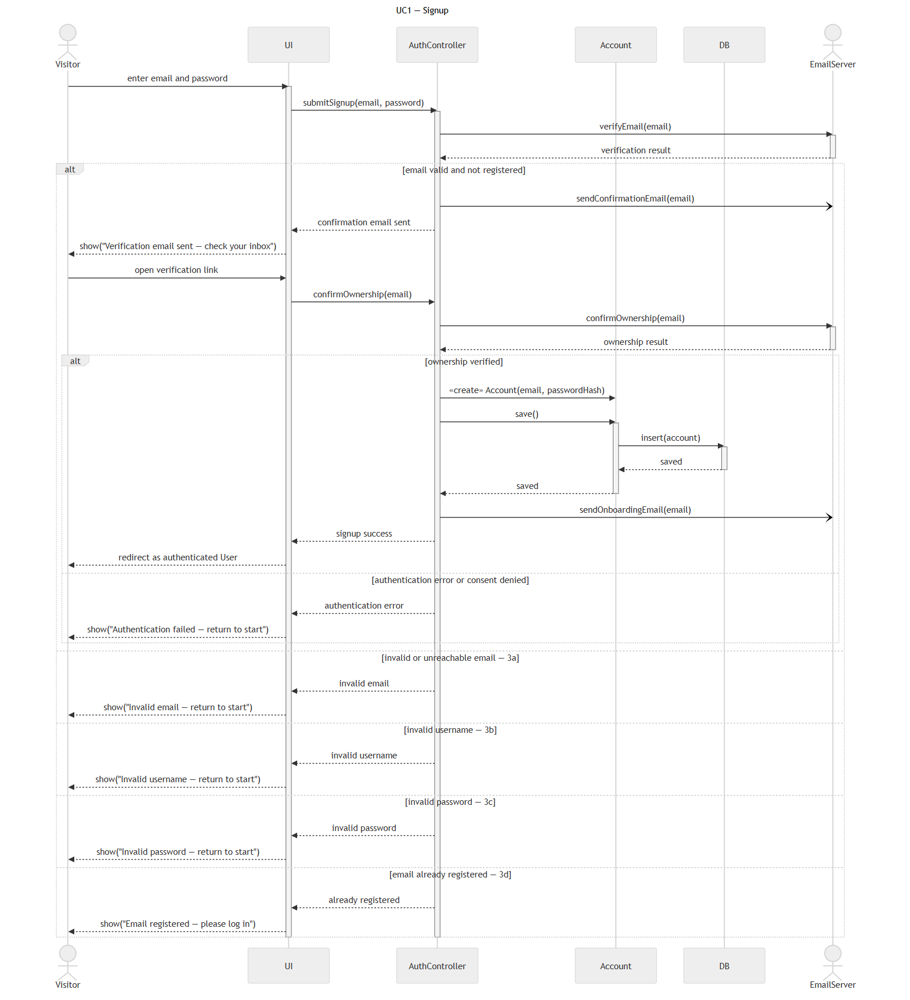

The diagram traces a visitor submitting an email and password, the address being checked, a confirmation email being dispatched asynchronously, and the account being created and persisted only once the visitor has opened the verification link and ownership has been confirmed. A successful path ends with an onboarding email and a redirect into the authenticated workspace. The alternative flows are an invalid or unreachable email, an invalid username, an invalid password, an already-registered email, and an authentication error or denied consent on the inner ownership branch. The branch-label mismatch previously recorded here is now resolved in one direction: Section 3.4 renumbers the UC1 alternative flows once and consistently as `3a` invalid email, `3b` invalid username, `3c` invalid password, `3d` already registered, `4a` identity creation fails and `4b` profile creation fails, which preserves every label the delivered diagram uses. The residual work is mechanical — the same renumbering must be applied to `C3T2_UseCaseDescription_1D.docx`, which still lists only an invalid-email and an already-registered alternative and has no username field, and the UC1 figure re-exported so the three artefacts read identically (Section 7.4 item 10).

#### 4.3.3 UC2 — Login

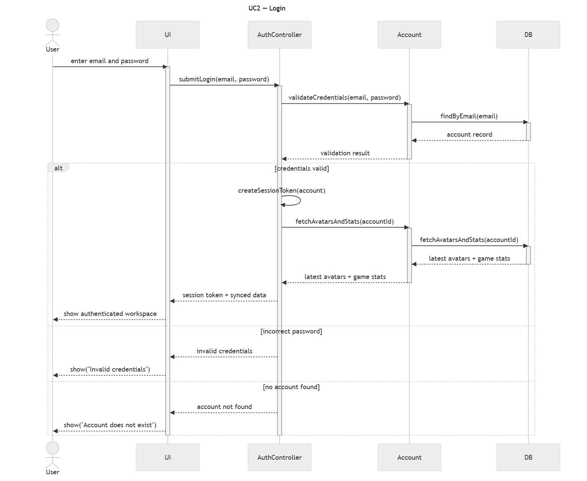

The diagram shows the user submitting credentials, `AuthController` delegating validation to `Account`, and — on success — a session token being created and the user's avatars and game statistics being fetched and returned together so the client can render a synchronised workspace in one round trip. The two alternative flows are an incorrect password and a non-existent account. As noted in the mapping table, the implemented flow differs in that Firebase Auth performs credential validation and issues the ID token; the diagram's `Account.validateCredentials` is an analysis-level abstraction of that exchange.

**Second diagram-to-implementation delta to disclose, in the same form used for UC3 in row R4.** The delivered UC2 diagram returns a **distinct message per branch** — one for an incorrect password, another for a non-existent account. The implementation deliberately returns **one generic authentication error** for both, as required by Section 3.5 alternative flow `2a` and the Section 3.5 security rules. This is the same account-enumeration class of defect that requirement-change row R4 fixes for UC3: distinct messages let an attacker distinguish registered from unregistered addresses by observing the response. The implemented generic-error behaviour is the design of record, and the UC2 diagram is to be corrected before final submission (Section 7.3 item 11, Section 7.4 item 10).

#### 4.3.4 UC3 — Reset Password

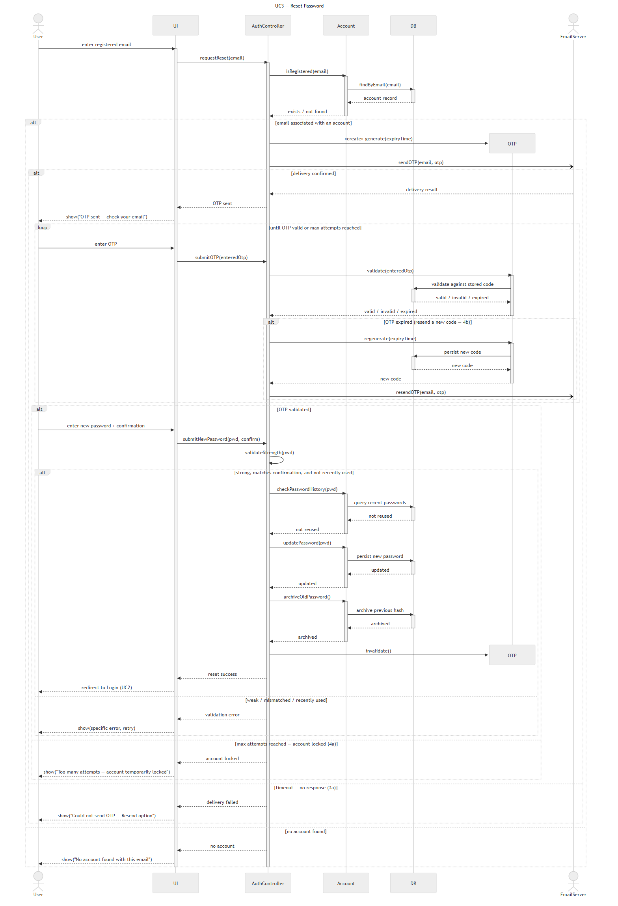

This is the most heavily branched diagram. It shows a registered-email check, the creation of an `OTP` object with an expiry time, asynchronous dispatch of the code, a bounded retry loop for OTP entry, and then password validation, password-history checking, the update, archival of the previous hash and explicit destruction of the OTP lifeline. The alternative flows are `3a` OTP-delivery timeout with a resend option, `4a` maximum attempts reached leading to a temporary lock, `4b` expired OTP triggering regeneration and resend inside the loop, and a combined weak/mismatched/recently-used branch on the new password. The nesting is intentional: the outer `alt` fragments are sequential gates (an account must exist before an OTP is issued; delivery must be confirmed before entry begins), whereas the inner fragments are terminal outcomes of the branch they sit in.

#### 4.3.5 UC4 — Browse Plant Avatar Archival

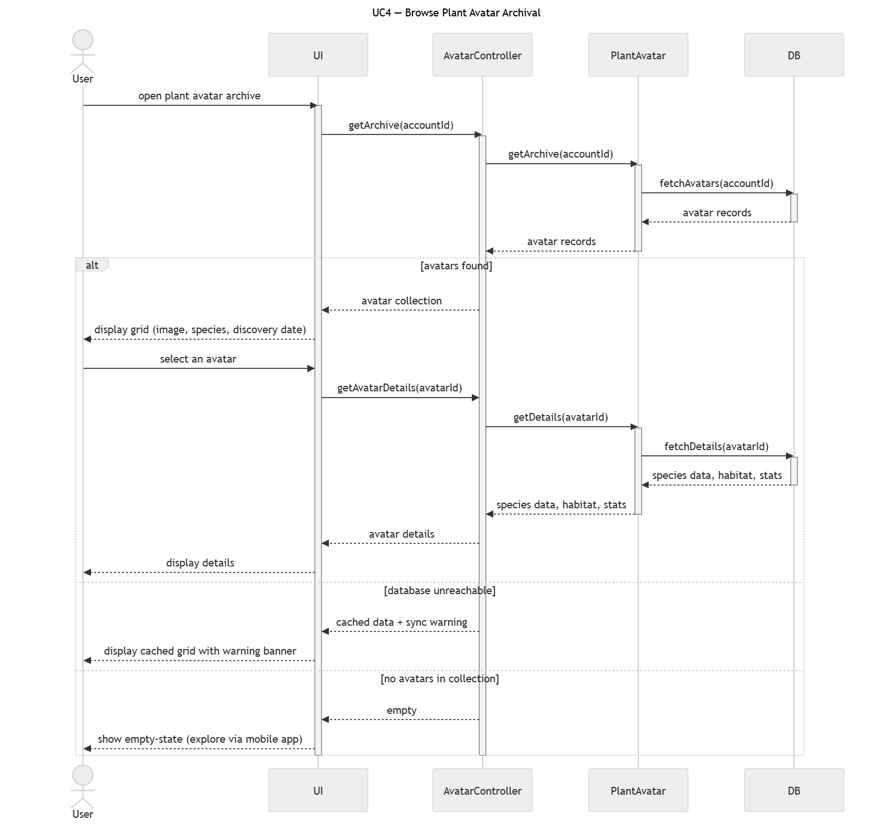

The diagram shows the archive being requested for an account, `AvatarController` delegating to `PlantAvatar`, the grid being rendered from the returned records, and a follow-up detail request when the user selects a single avatar. The alternative flows are a database-unreachable branch, which the diagram resolves by returning cached data together with a synchronisation warning banner rather than failing outright, and an empty-collection branch, which the diagram resolves by rendering an empty state directing the user to the mobile app. **Both branches differ behaviourally from the UC4 description, which requires a retriable error and an in-app upload action respectively.** The two deltas, and the decision that the description is the design of record, are tabulated in Section 3.7; the re-export is Section 7.4 item 10. Apart from those two branches this diagram corresponds to implemented code: owner-only Firestore list and detail APIs and the React Archive page.

#### 4.3.6 UC5 — Join PVE Battle

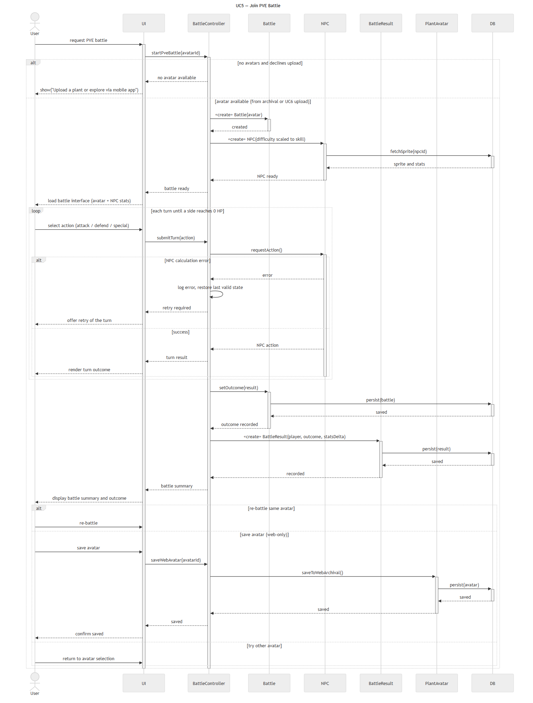

The diagram covers avatar selection, creation of a `Battle` and an `NPC`, a per-turn loop that continues until one side reaches zero hit points, and terminal persistence of both the `Battle` outcome and a `BattleResult` record before the summary is displayed. The alternative flows are `2b`, a user with no avatars who declines to upload; `5a`, an NPC calculation error which logs the fault, restores the last valid state and offers a turn retry; and the post-battle fork between re-battling the same avatar, saving the avatar to the web archive, and returning to avatar selection.

**Two behavioural deltas are disclosed rather than smoothed over.** The delivered figure scales the `NPC`'s difficulty to the player's skill, whereas UC5's description and the implementation both use a *fixed, versioned* NPC preset — the delivered `thornback-v1` catalogue covered by `SUP-U01` (12/12); difficulty scaling is a P2 item, not Checkoff 3 behaviour. The figure also resolves branch `2b` as a dead end that directs the avatar-less user to the mobile app, whereas UC5 flow `2a` requires that the user be directed to **UC6** — the branch to which the `«extend»` relationship attaches. Both are tabulated with their reconciliation in Section 3.8 and re-exported under Section 7.4 item 10. Apart from those, the implemented engine is *stronger* than the diagram: turns are guarded by an expected turn number, the bot uses a seeded RNG, and rewards are applied exactly once.

#### 4.3.7 UC6 — Upload Plant Picture — **PLANNED (not implemented on the web platform)**

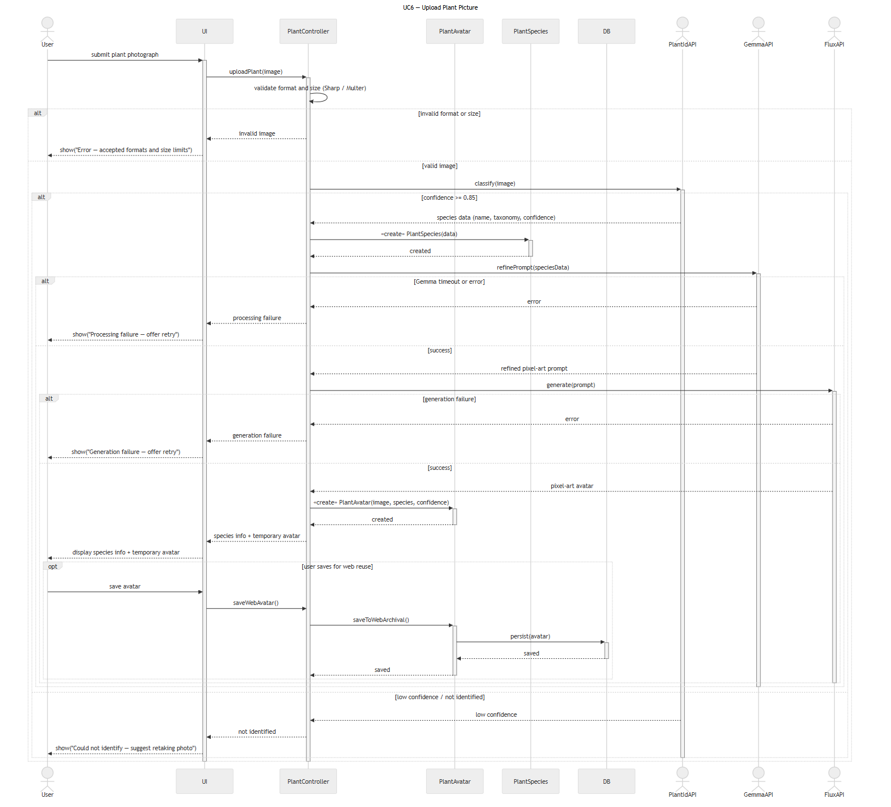

This diagram documents the intended upload and generation pipeline: format and size validation, classification via `PlantIdAPI`, creation of a `PlantSpecies`, prompt refinement via `GemmaAPI`, pixel-art generation via `FluxAPI`, creation of a temporary `PlantAvatar`, and an `opt` fragment for saving the avatar to the web archive. Its alternative flows are `2a` invalid format or size, `4a` low confidence below the configured threshold (default 0.85, per Section 3.9), `7a` a Gemma timeout or error, and `9a` a generation failure — the last three all returning a retry offer to the user. **No part of this pipeline is implemented on the web platform: there is no upload route, controller or service in the repository, and the diagram is presented as design intent only.**

#### 4.3.8 UC7a — Join PVP Battle — **PLANNED (not implemented)**

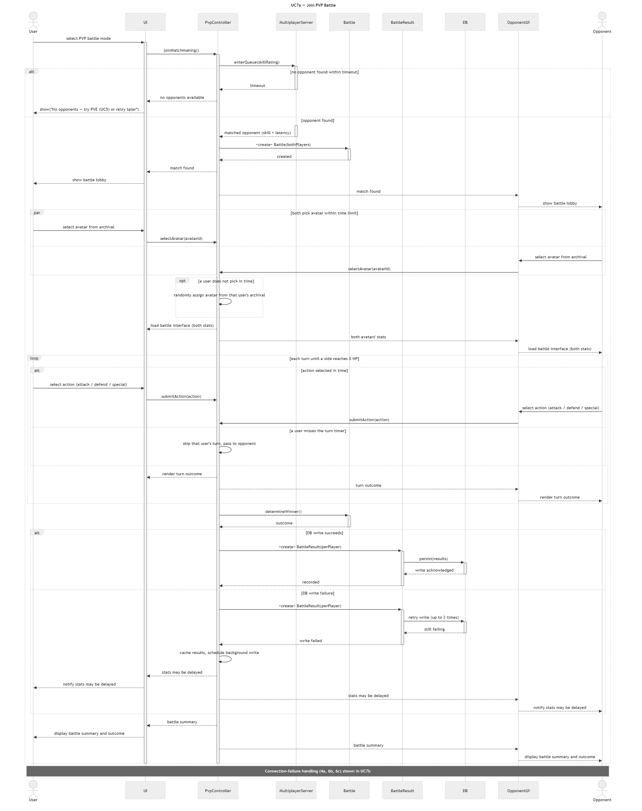

The diagram shows the intended happy-path match lifecycle: entering matchmaking with a skill rating, creation of a shared `Battle`, a `par` fragment in which both players choose avatars simultaneously, an alternating turn loop mirrored to both clients, winner determination, and persistence of one `BattleResult` per player. The alternative flows are `2a` no opponent found within the timeout (which redirects the user to PVE), `4b` automatic avatar assignment when a player does not pick in time, `6a` a skipped turn when the turn timer expires, and `9a` a database write failure that retries up to three times before caching the results, scheduling a background write and warning both players that statistics may be delayed. A note defers the connection-failure branches to UC7b. **PVP is planned final architecture; no matchmaking, multiplayer server or PVP battle code exists.**

#### 4.3.9 UC7b — Join PVP Battle (connection failures) — **PLANNED (not implemented)**

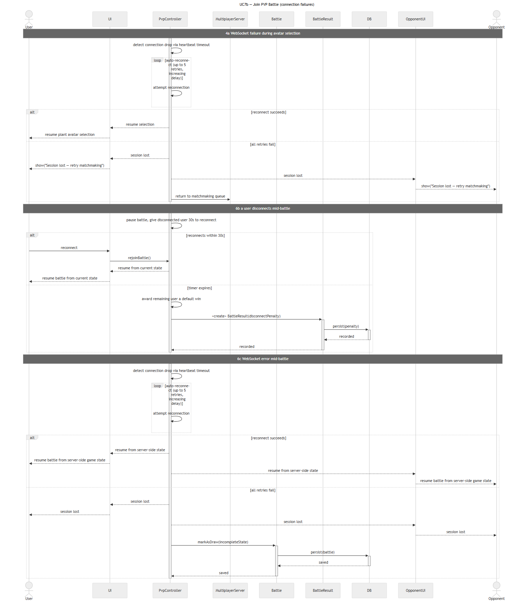

This companion diagram isolates the three failure scenarios that would clutter UC7a. Branch `4a` covers a WebSocket drop during avatar selection: heartbeat-timeout detection, up to five reconnection attempts with increasing delay, and either resumed selection or a lost session that returns both players to the matchmaking queue. Branch `6b` covers a mid-battle disconnection: the battle is paused, the absent player is given a 30-second grace period, and on expiry the remaining player is awarded a default win while a disconnection penalty is recorded. Branch `6c` covers a mid-battle socket error, where a successful reconnection resumes from server-side state and total failure marks the battle a draw. **This diagram is also planned architecture only.**

#### 4.3.10 UC8 — Submit Query Ticket

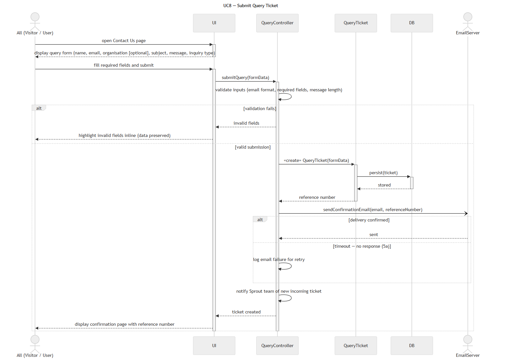

The diagram shows any visitor or user opening the Contact page, submitting the form, `QueryController` validating inputs, and a `QueryTicket` being created and persisted before any notification is attempted. The reference number is returned from persistence and displayed on a confirmation page. The alternative flows are `3a` validation failure, which highlights the offending fields inline while preserving entered data, and `5a` an email-delivery timeout, which is logged for retry. The important design property, visible in the ordering of the messages, is that the ticket exists and the reference number is issued regardless of whether either email succeeds; the admin notification is likewise independent of the submitter confirmation.

### 4.4 Database schema summary

Production persistence is Firebase Auth for credentials, Firestore for application records and Firebase Storage for image objects. The datastore is **Firestore only**: the active SQLite runtime was removed on 22 July (requirement-change row D2). Because application services depend on repository interfaces rather than on a database directly, the interface would permit a second adapter to be added later, but **no second adapter is currently exercised** — every integration case in Sections 5 and 6 runs against the Firestore Emulator, and no dual-persistence claim is made.

| Collection | Purpose | Key fields and rules |
|---|---|---|
| `users` | Profile, game state and reset-policy metadata | `id` is the Firebase UID and the primary identity; normalised `email` mirrored for lookup; `displayName` trimmed to 1–50 accepted characters; `isVerified` synchronised from the Firebase claim; `passwordHash` used only for history comparison, never as login authority; `resetOtpHash` stored as a bcrypt hash; `resetOtpExpiresAt` with a 15-minute TTL; `resetOtpFailedAttempts` invalidating at five; login/logout audit fields; `createdAt`/`updatedAt` |
| `password_history` | Prevents reuse of recent passwords | `id`, `userId`, `passwordHash`, `changedAt`; only the configured recent depth is retained; plaintext passwords and OTPs are never stored |
| `species` | Shared reference and game data | `speciesId` (stable provider taxon ID) is the primary key; scientific and common names are display metadata, not identity; versionable taxonomy/facts/rarity and base stats/default moves; `canonicalSpriteAssetId` |
| `sprite_assets` | Canonical generated art, one per recipe | `spriteAssetId`, `speciesId`, prompt/model/palette versions forming a reproducible recipe, unique `recipeKey`, `status` in `GENERATING`/`COMPLETED`/`FAILED`, lock owner and expiry for concurrent generation control, `objectPath` and `checksum` set only on completion, sanitised provider/error metadata |
| `user_species_collection` | One entry per user per species | Composite unique `(userId, speciesId)`; `status` is `VISITED` or `CAUGHT` and may only be promoted, never demoted; optional `nickname` and private `sourcePhotoPath`; `firstSeenAt` preserved and `lastSeenAt` updated; `pveXp`, `pveWins`, `pveLosses`, `currentWinStreak`, `bestWinStreak` all defaulting to 0 |
| `scan_events` | Append-only scan history | `scanId`, `userId`, upload hash, provider, confidence, species ID, outcome or stable error code, optional private photo path, timestamp; scan history may grow while collection rows stay one per user/species |
| `battle_sessions` | PVE session state | `sessionId`, `userId`, selected collection ID, NPC preset and version, RNG seed, turn number, state, HP snapshot, result, reward-applied marker, timestamps and an optimistic-lock version field |
| `battle_actions` | Per-turn PVE log | `actionId`, `sessionId`, turn number, actor, move ID, RNG result, damage/heal/effect, before/after state summary, timestamp; a unique `(sessionId, turnNumber, actor)` constraint prevents duplicate application of a turn |
| `query_tickets` | UC8 tickets | `id`; unique `refNumber` (`SPR-YYYYMMDD-NNNN`, atomic daily sequence); `name` trimmed 1–100; `email`; **`organisation` trimmed, up to 120 characters, optional**; **`subject` trimmed, 1–150 characters, required**; `category` (inquiry type); `message` trimmed 1–2000; `status`; submitter-email status; admin-email status; sanitised last email error; attempt timestamps; created/updated timestamps. The field set is exactly the canonical Section 3.11 form, restored at `3ce3dc6` (row R3). **Legacy-decode rule:** tickets stored before the realignment may carry no `organisation` and no `subject`, and may carry the legacy categories `bug`, `billing` or `other`; the decoder accepts them, treats a missing `organisation` as absent and a missing `subject` as empty, and the Contact Us dropdown offers only the four documented inquiry types |

Two invariants carry particular design weight. The daily ticket reference counter is atomic, and ticket persistence commits *before* any notification is attempted, so a failed email can never cause a lost ticket. In the battle tables, the reward-applied marker together with the unique turn constraint makes progression idempotent: replaying or duplicating a terminal request cannot award experience twice.

Image binaries are never stored in Firestore or SQLite — only paths and metadata. Object storage uses two path families with different sharing semantics:

```text
canonical-sprites/{speciesId}/{recipeHash}.png    shared, immutable
users/{userId}/plant-photos/{scanId}.{ext}        private to the owning user
```

Finally, the existing `avatar_records` documents used by the delivered Archive and PVE slice are treated as legacy import data. The planned migration resolves a stable species ID, creates or links a `species` and a `sprite_asset`, and then upserts a single `user_species_collection` row; the legacy source determines `VISITED` versus `CAUGHT` only where provenance is trustworthy, and uncertain records default to `VISITED`. This migration is **PLANNED / NOT RUN**.

---

## 5. Test Plan

This section sets out the test plan for Sprout: the lifecycle strategy under which tests are written and re-run, the tools employed, the unit and integration test cases in table form, the justified integration strategy, the use-case-derived system cases, the black-box/white-box technique coverage, and a dated timeline for implementing and executing the tests that remain.

All executed evidence below refers to **commit under test `7991254`** under **Node.js `v22.23.1`**, recorded in `sprout-app/docs/checkoff3/archive-pve-verification-evidence.md`. The first draft evidence artifact is commit `d2cc497`; the corrected grading/report evidence artifact is commit `5bc87d0`, which contains the split test taxonomy and the testing timeline. Any row marked `PLANNED / NOT RUN` has no passing evidence and must not be read as complete.

The three scope boundaries declared in Section 2.5 bound everything in this plan, and carry two test-specific consequences. UC6 is not implemented on the web platform, so the passing `avatar_records` archive tests exercise records that already exist; they do not exercise, and do not imply, an upload-to-archive pipeline. UC7 (PVP) is not implemented and therefore has no test cases in this plan beyond its place in the planned architecture. Automated evidence for email uses a console/fake adapter, so the deployed transport, credentials, and real-inbox behaviour remain unverified; live provider checks are additionally blocked by the absence of `PLANTID_API_KEY`, `GEMINI_API_KEY`, `REMOVE_BG_API_KEY`, and Gmail SMTP credentials.

### 5.1 Lifecycle testing strategy

Sprout follows an **iterative/agile lifecycle**. Each iteration moves from user-story and use-case refinement through analysis and design, code, unit tests, integration tests, and regression. Tests are written alongside each module rather than deferred to a single testing phase, which is recorded in the project risk register as the control for risk R07 ("test evidence too late").

Three complementary regimes operate within that lifecycle:

- **Progression testing** covers the increment currently under construction. For Checkoff 3 the progression increments are **UC4 (archive-record browsing and owner-scoped demo controls)** and **UC5 (PVE battle)**. UC6 upload and AI-pipeline tests are the *next* progression target and remain unwritten.
- **Regression testing** covers previously delivered behaviour. **UC1–UC3 (signup, login, password reset)** and **UC8 (query ticket)** hold supporting historical evidence recorded at commit `a28e6e2`. These suites were **intentionally not rerun** during the focused UC4/UC5 phase, so no current broad-regression claim is made. A GitHub Actions workflow authored at commit `89d6e3f` is *designed* to close this gap structurally rather than manually, by re-running the recorded command groups on every pull request to `main`, on every push to `main`, and on manual dispatch — but the workflow exists only on the branch `feat/checkoff3-auth-email` and is **absent from `origin/main`**, so neither trigger has ever fired and no cloud run is recorded. **The gap is therefore scheduled, not closed**; it closes structurally once the branch is pushed and the pull request to `main` is merged, after which each future increment inherits automatic regression cover as it lands.
- **System testing** is derived from the UC1–UC8 use-case documents, the sequence diagrams, and the state machines, rather than inferred from component tests. All system cases are currently planned.

The current gate is therefore a **focused gate, not a full-suite gate**. Broader regression, live provider checks, real-browser journeys, and production Firestore verification are separate gates scheduled in Section 5.8.

### 5.2 Testing tools

| Tool | What it is used for in Sprout | Current role |
|---|---|---|
| **Jest** | Backend unit tests, decoder and branch tests, Firestore repository tests, and service/controller/route orchestration tests | Executed evidence |
| **Supertest** | Black-box HTTP tests against the Express archive, demo, and PVE routes; asserts status codes and public response bodies only | Executed evidence |
| **Firebase Firestore Emulator** | Real Firestore query, transaction, ownership, concurrency, and replay semantics without touching production data | Executed evidence (emulator only; **not** production Firestore) |
| **fast-check** | Property-based testing over generated battle states; invariant checks with recorded seeds and automatic shrinking to a minimal failing input | Executed evidence |
| **Vitest** | Frontend test runner for the React client under jsdom | Executed evidence |
| **React Testing Library + MemoryRouter** | Renders the real page, router, and shared components together and asserts DOM-visible behaviour; `sproutApi` is mocked at the network boundary | Executed evidence |
| **Playwright** | Real-browser history (Back/Forward) and full browser-to-backend use-case journeys | **PLANNED / NOT RUN** |
| **GitHub Actions** | Continuous regression. Workflow `.github/workflows/tests.yml` (introduced `89d6e3f`; server Jest entrypoint pinned at `cdbe171`; auth/admin groups added at `583bd3b`) is configured to run on pull request to `main`, push to `main`, and `workflow_dispatch`. Two jobs on `ubuntu-latest`: a server job on Node 22 with Temurin JDK 21 for the emulator, and a client job on Node 22. No secrets are required — server tests force the emulator via `tests/setup-env.ts`, email runs in console mode, and client tests mock `sproutApi`. | Implemented on branch `feat/checkoff3-auth-email`; the file is **not present on `origin/main`**, so the `push: main` trigger cannot have fired and no pull request exists. **First cloud run occurs when the branch is pushed and the pull request is opened — no cloud run of any colour is recorded yet** |
| **Jest coverage reporter (`jest --coverage`)** | Statement, branch, function and line coverage for the Express server | **PLANNED / NOT RUN.** Not currently configured in `server/package.json`; no server coverage figure exists anywhere in this report |
| **Vitest coverage reporter (`vitest --coverage`, `@vitest/coverage-v8`)** | Statement, branch, function and line coverage for the React client | **PLANNED / NOT RUN.** `@vitest/coverage-v8` is present as a client devDependency, but no coverage script is defined and no run has been recorded |
| **Postman / manual cloud-console checks** | Supplemental API demonstration, controlled-inbox inspection, deployed-configuration inspection | Supplemental only; not a substitute for framework or browser system tests |

Two mocking boundaries must be stated explicitly, because they bound what the evidence proves. Firebase ID-token verification is mocked **only at the Firebase Admin boundary**, and Firestore integration runs against the **emulator**. Neither proves live Firebase Auth configuration, authorised-domain behaviour, or production Firestore security rules.

### 5.3 Unit test cases

Unit cases exercise a single module or pure function in isolation. They are written decomposition bottom-up (leaf modules first) and combine black-box equivalence/boundary selection with white-box branch, path, invariant, and property selection.

#### 5.3.1 Executed unit cases

| Test ID | Use case | Strategy | Tool | Expected result | Actual result | Evidence path |
|---|---|---|---|---|---|---|
| CORE-U01 | UC4/UC5: server-authoritative avatar eligibility | Decomposition bottom-up unit testing; black-box expiry boundaries plus white-box eligibility branches | Jest | Collected avatars are eligible, temporary avatars are decided using server time, and the exact expiry instant is rejected | **PASS: 1 suite, 6/6** | `server/tests/battle-eligibility.test.ts` |
| CORE-U02 | UC5: battle engine round resolution and generated-state properties | Decomposition bottom-up unit and property testing; white-box branch, path, invariant, and generated-state cases | Jest, fast-check | Legal transitions preserve HP, energy, legal-move, terminal-state, immutability, and deterministic-replay invariants | **PASS: 2 suites, 27/27** | `server/tests/battle-engine.test.ts`; `server/tests/battle-engine.property.test.ts` |
| SUP-U01 | UC5 (supporting): versioned battle catalog contract | Decomposition bottom-up unit testing; white-box compatibility and rejection branches | Jest | Stored `thornback-v1` data remains compatible while incomplete, forged, or unsupported move sets are rejected | **PASS: 1 suite, 12/12** | `server/tests/battle-catalog.test.ts` |

SUP-U01 is a supporting hardening row. It is counted in the totals but is not presented as a separate headline use-case claim.

The rows above are **suite-level roll-ups**: each aggregates many individual cases. Because the rubric asks for unit test *cases* in table form, the individual cases behind the highest-value suites — `battle-eligibility` (6), `battle-api` (18) and `avatar-demo` (22) — are expanded one row per case, with precondition/input, action, expected and actual, in **Appendix 9.7**. The tables here remain the roll-up.

#### 5.3.2 Supporting historical unit cases (UC1–UC3, not rerun)

Every identifier in this table is defined here *and* in `docs/checkoff3/auth-email-verification-evidence.md`, which is the source evidence document for the `a28e6e2` phase. `AUTH-U02` and `AUTH-U03` were previously cited in Sections 7.1 and 8.2 without a defining row; those definitions are supplied below so the traceability chain resolves inside this report.

| Test ID | Use case | Strategy | Tool | Expected result | Actual result | Evidence path |
|---|---|---|---|---|---|---|
| AUTH-U01 | UC1: signup input boundaries and resend controls | Black-box equivalence/boundary plus white-box branch | Jest | Valid and invalid profile inputs, and resend quotas, follow the auth contract | SUPPORTING HISTORICAL PASS at `a28e6e2`; **not rerun** in the focused phase | `docs/checkoff3/auth-email-verification-evidence.md`; `server/tests/auth.test.ts` |
| AUTH-U02 | UC1: recoverable verification delivery and resend abuse controls | Black-box quota boundaries plus white-box branch and isolation paths | Jest, Supertest | Strict unverified bearer auth precedes the UID-keyed quota of 3 requests per 15 minutes; account isolation holds across IP/NAT, and the separate pre-auth IP cap of 20 requests per 15 minutes applies | SUPPORTING HISTORICAL PASS at `a28e6e2`; **not rerun** in the focused phase | `docs/checkoff3/auth-email-verification-evidence.md`; `server/tests/auth.test.ts:360`, `:473`, `:504`, `:531`, `:556` |
| AUTH-U03 | UC2: invalid, unverified, no-email and verified auth states | Black-box equivalence classes over token states plus white-box guard branches | Jest, Supertest, Vitest | Normal backend protection requires `email_verified === true`, including for tokens carrying no email claim; strict resend/session paths still accept authenticated unverified tokens; frontend guards enforce the same rule | SUPPORTING HISTORICAL PASS at `a28e6e2`; **not rerun** in the focused phase | `docs/checkoff3/auth-email-verification-evidence.md`; `server/tests/auth.test.ts:360`, `:628`; `client/src/pages/LoginPage.test.tsx:40`; `client/src/components/common/ProtectedRoute.test.tsx:40` |
| AUTH-U04 | UC3: OTP expiry, attempt cap, atomic consume, password history | Boundary, branch, concurrency, and replay | Jest | Reset remains generic (anti-enumerating), bounded, one-time, and history-aware | SUPPORTING HISTORICAL PASS at `a28e6e2`; **not rerun** in the focused phase | `docs/checkoff3/auth-email-verification-evidence.md`; `server/tests/auth.test.ts` |
| EMAIL-U01 | UC1/UC3/UC8: email failure secrecy and preflight reporting | White-box failure-path branches with injected secret text | Jest | Background-dispatch rejection, ticket provider/persistence failure, and transport verification rejection expose no injected secret text, while explicit missing-environment diagnostics remain intact | SUPPORTING HISTORICAL PASS at `a28e6e2`; **not rerun** in the focused phase | `docs/checkoff3/auth-email-verification-evidence.md`; `server/tests/background-dispatch.test.ts:3`; `server/tests/query.test.ts:155`, `:180`; `server/tests/email.test.ts:214` |
| TKT-U01 | UC8: submitter and admin notification outcomes | Pairwise outcome combinations over the two independent notification boundaries | Jest, Supertest | Submitter failure, admin failure, and dual failure each still attempt both notifications and persist independent statuses with controlled reason codes only | SUPPORTING HISTORICAL PASS at `a28e6e2`; **not rerun** in the focused phase | `docs/checkoff3/auth-email-verification-evidence.md`; `server/tests/query.test.ts:118`, `:155` |

#### 5.3.3 Planned unit cases (UC6 — pipeline not implemented)

| Test ID | Use case | Strategy | Tool | Expected result | Actual result | Evidence path |
|---|---|---|---|---|---|---|
| IMG-U01 | UC6: upload format, magic bytes, empty / exact-5 MB / over-limit inputs | Black-box equivalence-class and boundary-value unit tests | Jest | Invalid and oversized input is rejected; supported boundary inputs follow the upload contract | **PLANNED / NOT RUN** | `02 Requirements/UC6 Upload Plant Picture.md` |
| IMG-U02 | UC6: identification confidence threshold | Black-box boundary values (below / at / above threshold) | Jest | Each confidence band maps predictably to an accepted, provisional, or rejected outcome | **PLANNED / NOT RUN** | `02 Requirements/UC6 Upload Plant Picture.md` |
| IMG-U03 | UC6: 56×56 quantiser output, palette closure, alpha, determinism | White-box invariant and property tests over arbitrary dimensions and RGBA values | Jest, fast-check | Output is 56×56, palette-closed to FLORENTINE24, alpha-preserving, and deterministic by checksum | **PLANNED / NOT RUN** | `03 Design/GenAI Sprite Pipeline.md` |
| IMG-U04 | UC6: recipe-key determinism, cache hit, generation lock, expired-lock recovery | White-box branch, concurrency, and replay cases | Jest | Exactly one generation wins; concurrent losers and retries reuse the canonical result | **PLANNED / NOT RUN** | `03 Design/GenAI Sprite Pipeline.md` |

### 5.4 Integration strategy

#### 5.4.1 Definitions

The course distinguishes two axes: the *structure* used to order integration (decomposition tree versus runtime call graph), and the *direction* of travel along it (top-down versus bottom-up).

| Strategy | Definition |
|---|---|
| **Decomposition top-down** | Begins at the highest-level subsystem in the static module tree and substitutes lower modules with **stubs**, then moves downward, replacing stubs with real modules. |
| **Decomposition bottom-up** | Begins with leaf utilities and modules, verifies them with **drivers**, then combines them into progressively larger static subsystems. |
| **Call-graph top-down** | Begins at a runtime **caller** with its callees **mocked**, then progressively replaces those mocks with real callees. |
| **Call-graph bottom-up** | Verifies runtime **callees** first, then integrates the callers that invoke them, following the direction in which messages actually flow at run time. |
| **Call-graph pairwise** | Isolates a single caller–callee **edge** at a time, so that a failure is attributable to exactly one interface. |

#### 5.4.2 Strategy selected for the Sprout backend: call-graph bottom-up

The backend integration follows the runtime call order:

```text
engine/catalog
  -> Firestore repository/transaction
    -> service/controller/route
      -> HTTP
```

This order is justified on three grounds:

1. **Risk is concentrated in interactions, not in ownership.** A decomposition tree describes which module statically owns which code. Sprout's actual defect risk lies in what happens *between* the pure battle engine, the Firestore transaction, the application service, and the HTTP layer — duplicate turns, double rewards, and ownership leakage are all cross-layer failures. The call graph is the structure that matches the risk.
2. **Each layer is only integrated once its callees are already trusted.** Pure battle rules and catalog compatibility are established (CORE-U02, SUP-U01) before transaction behaviour is exercised; Firestore ownership, concurrency, transaction-retry, and replay behaviour are established (CORE-I01, CORE-I03) before service/controller/route behaviour is asserted through HTTP (CORE-I02). A failure at any stage is therefore attributable to the layer just added, not to an untested dependency beneath it.
3. **It preserves traceability to the sequence diagrams.** The runtime order maps one-to-one onto the sequence-diagram messages for UC4 and UC5, so each integration case can be cited against a specific message without claiming that the whole browser system has been exercised.

Bottom-up is preferred over top-down here because the leaf layers (engine, catalog, repository) are the ones carrying the invariants that matter — HP bounds, one-time reward, owner isolation — and stubbing them out to test the HTTP layer first would have deferred exactly the evidence the grading criteria require. Decomposition bottom-up remains in use, but only for the genuinely pure leaf modules (Section 5.3.1); it is not the backend *integration* claim.

#### 5.4.3 Strategy selected for the React client: top-down caller-side component integration

The React suites render the **real** Archive or Battle page together with the real `MemoryRouter` and the real shared components (including `AppHeader`), while **`sproutApi` is mocked at the network boundary**. This is call-graph top-down from the caller side: the page is the caller under test, its network callee is mocked, and the mock would be progressively replaced by a real backend in a later Playwright stage. It was chosen because page orchestration — loading, empty, error, retry, unmount, pagination, and navigation-lock state — is testable and deterministic before a live backend exists, and because it isolates UI regressions from backend flakiness.

#### 5.4.4 Coverage claim and its limits

**No systematic call-graph pairwise coverage is claimed.** Sprout does not test every caller–callee combination in isolation. Only *selected* mocked boundary and outcome cases on two edges are isolated: the caller-side `page -> sproutApi` edge, and the `auth -> Firebase verification` edge. The UC6 provider edges (plant identification, Gemini, background removal) have no edge tests because the pipeline they would connect does not exist.

### 5.5 Integration test cases

#### 5.5.1 Executed backend integration cases (call-graph bottom-up)

| Test ID | Use case | Strategy | Tool | Expected result | Actual result | Evidence path |
|---|---|---|---|---|---|---|
| CORE-I01 | UC4/UC5: owner-only archive reads and Firestore battle state/reward persistence | Call-graph bottom-up backend integration; black-box ownership and boundary cases plus white-box transaction, concurrency, and replay paths | Jest, Supertest, Firestore Emulator | Archive list/detail responses stay owner-only and bounded; battle transactions advance once and apply terminal progression once | **PASS: 2 suites, 96/96** | `server/tests/battle-repository.test.ts`; `server/tests/avatar-api.test.ts` |
| CORE-I02 | UC5: start, read, act on, abandon, and complete a PVE battle over HTTP | Call-graph bottom-up from engine/catalog through Firestore repository/transaction and service/controller/route, then black-box HTTP | Jest, Supertest, Firestore Emulator | Verified callers receive controlled public state; malformed, stale, foreign, and duplicate requests cannot corrupt a session or double-reward it | **PASS: 1 suite, 18/18** | `server/tests/battle-api.test.ts` |
| CORE-I03 | UC4: owner-scoped demo archive enable/disable | Call-graph bottom-up repository-to-HTTP integration; black-box auth/outcome cases plus white-box collision, transaction-retry, and race paths | Jest, Supertest, Firestore Emulator | Demo mutation is exact, owner-scoped, idempotent, race-safe, and preserves collected records | **PASS: 1 suite, 22/22** | `server/tests/avatar-demo.test.ts` |

As in Section 5.3.1, these are suite-level roll-ups. The 18 individual cases behind `CORE-I02` and the 22 behind `CORE-I03` are expanded one row per case, with precondition/input, action, expected and actual, in **Appendix 9.7**.

#### 5.5.2 Executed frontend integration cases (top-down caller-side)

| Test ID | Use case | Strategy | Tool | Expected result | Actual result | Evidence path |
|---|---|---|---|---|---|---|
| CORE-F01 | UC5: operate PVE through the real Battle page, router, and shared header | Top-down caller-side component integration; real page/router/components with `sproutApi` mocked at the network boundary | Vitest, React Testing Library, MemoryRouter | Roster, start, action, replay, and abandon states render correctly; all header and page navigation is locked only while a non-idempotent start or replay is pending | **PASS: 2 files, 28/28** | `client/src/pages/BattlePage.test.tsx`; `client/src/components/common/AppHeader.navigation-lock.test.tsx` |
| CORE-F02 | UC4: browse and mutate the archive through the real Archive page | Top-down caller-side component integration with mocked `sproutApi`; black-box DOM and state-transition cases | Vitest, React Testing Library, MemoryRouter | Loading, empty, pagination, demo mutation, retry, unmount, image fallback, and Archive-to-Battle handoff states match the public UI contract | **PASS: 1 file, 14/14** | `client/src/pages/ArchivePage.test.tsx` |

The six command groups above (CORE-U01/SUP-U01, CORE-I01, CORE-I02, CORE-U02/CORE-I03, CORE-F01, CORE-F02) are non-overlapping; their combined assertion and file total is recorded in Section 6.

#### 5.5.3 Focused-run qualification

| Test ID | Use case | Strategy | Tool | Expected result | Actual result | Evidence path |
|---|---|---|---|---|---|---|
| QUAL-I01 | UC4/UC5: prior *combined* focused emulator setup | Combined focused backend integration setup | Jest, Supertest, Firestore Emulator | Every focused case completes within the configured setup timeout | **113/114 completed; one `beforeEach` exceeded the configured 15-second limit.** This was a setup-timeout observation, not a demonstrated behaviour defect. The isolated PVE HTTP suite subsequently passed 18/18 and every named focused set above passed. | `server/tests/battle-api.test.ts`; `server/package.json` |

The reasoning behind reporting this row, and the rule that it must never be rewritten as a combined 114/114 pass, is set out with the row itself in Section 6.3.

#### 5.5.4 Supporting historical integration cases (not rerun)

| Test ID | Use case | Strategy | Tool | Expected result | Actual result | Evidence path |
|---|---|---|---|---|---|---|
| AUTH-I01 | UC1/UC2: action-code application, profile refresh, protected-route access | Selected caller-side `auth -> Firebase verification` edge plus component state | Jest, Supertest, Vitest, Firebase fake | Automated boundaries accept verified users and reject invalid or unverified users | SUPPORTING HISTORICAL PASS at `a28e6e2`; **live Firebase action-code and authorised-domain flow not run** | `docs/checkoff3/auth-email-verification-evidence.md` |
| AUTH-I02 | UC3: reset request anti-enumeration, email OTP, reset, and new login | Call-graph bottom-up across request → OTP store → dispatcher → reset, with black-box response-equality cases | Jest, Supertest, Vitest | Known and unknown valid emails return the exact same generic 200 body after one bcrypt hash each; unknown-address PII is neither persisted nor mailed; provider latency is decoupled; provider and persistence failures emit controlled codes only | SUPPORTING HISTORICAL PASS at `a28e6e2`; **live SMTP inbox receipt and login with the new password not run** | `docs/checkoff3/auth-email-verification-evidence.md`; `server/tests/auth.test.ts:731`, `:753`, `:778`, `:804`; `server/tests/background-dispatch.test.ts:3`; `client/src/pages/LoginPage.test.tsx:59` |
| TKT-I01 | UC8: persisted ticket with independent submitter and admin notifications | Call-graph bottom-up with selected outcome combinations | Jest, Supertest | Ticket persistence succeeds independently of either notification outcome; only controlled failure codes are stored | SUPPORTING HISTORICAL PASS at `a28e6e2`; **live delivery not run** | `docs/checkoff3/auth-email-verification-evidence.md`; `server/tests/query.test.ts` |
| FE-U01 | UC1/UC2/UC8: frontend auth states and honest Contact Us copy | Top-down component-state integration | Vitest, React Testing Library | Verification, route protection, login, and ticket copy match the public behaviour actually implemented | SUPPORTING HISTORICAL PASS at `a28e6e2`; **not rerun** in the focused phase | `docs/checkoff3/auth-email-verification-evidence.md` |
| SUP-R01 | UC1–UC3/UC8: combined auth, reset, and Contact Us regression | Iterative regression; black-box HTTP/DOM with selected branch and concurrency cases | Jest, Supertest, Vitest | Earlier behaviour remains traceable without being counted as current UC4/UC5 evidence | SUPPORTING HISTORICAL EVIDENCE ONLY; intentionally not rerun, so **no current broad-regression claim is made** | `docs/checkoff3/auth-email-verification-evidence.md` |

#### 5.5.5 Planned integration cases (UC6 — pipeline not implemented)

| Test ID | Use case | Strategy | Tool | Expected result | Actual result | Evidence path |
|---|---|---|---|---|---|---|
| IMG-I01 | UC6/UC4: `POST /api/upload/plant` through identification, canonical processing/storage, to archive record | Call-graph bottom-up backend integration | Jest, Supertest | One valid upload reaches identification, processing, and storage, and creates exactly one archive record | **PLANNED / NOT RUN** | `02 Requirements/UC6 Upload Plant Picture.md`; `02 Requirements/UC4 Browse Avatar Archival.md` |
| IMG-I02 | UC6: concurrent same-species uploads | Call-graph bottom-up with white-box lock and replay paths | Jest, Supertest | Exactly one generation occurs and all concurrent callers share the resulting canonical asset | **PLANNED / NOT RUN.** Defined here and in Section 6.5; **an `IMG-I02` row must also be added to `05 Testing/Test Matrix.md` under "Planned progression and system evidence", where the UC6 rows currently stop at `IMG-U04`/`IMG-I01`** | `03 Design/GenAI Sprite Pipeline.md` |
| FE-U03 | UC6/UC4: upload UI through to archive provenance | Top-down caller-side component integration | Vitest, RTL, MemoryRouter | Progress, error, success, and provenance states match the eventual upload contract | **PLANNED / NOT RUN.** The frontend test framework exists; **the UC6 flow it would test does not.** | `02 Requirements/UC6 Upload Plant Picture.md` |

**Identifier collision resolved.** This planned UC6 frontend case was previously numbered `FE-U02`. That identifier is already taken: `docs/checkoff3/auth-email-verification-evidence.md` defines `FE-U02` as the UC8 honest-notification-copy case, recorded as AUTOMATED PASS at `a28e6e2` against `client/src/pages/ContactPage.test.tsx:18`. A grader resolving `FE-U02` against that document would have found a recorded PASS for an identifier this report presents as unrun UC6 work. The planned UC6 case is therefore renumbered **`FE-U03`** throughout this report, and the same renumbering must be applied in `05 Testing/Test Matrix.md` and `docs/checkoff3/archive-pve-verification-evidence.md`; `FE-U02` continues to point at the recorded UC8 Contact Us copy pass.

#### 5.5.6 Suites delivered after `7991254` — executed locally, counts not consolidated

These suites exist in the repository and cover surfaces the report claims as delivered increments in Section 7.2. They are listed so that the case tables cover the feature set rather than only the focused UC4/UC5 set. **None of them contributes to the 223-assertion focused total, and none has a consolidated evidence document**: the counts below are those self-reported in the commit messages (Section 7.3 item 8). Consolidating them at a named commit under test is Section 7.4 item 5.

| Test ID | Use case / surface | Strategy | Tool | Expected result | Actual result | Evidence path |
|---|---|---|---|---|---|---|
| ADM-I01 | Admin account dashboard: allowlist gate, account listing, account deletion | Call-graph bottom-up route-to-HTTP integration; black-box authorisation classes plus white-box fail-closed branches | Jest, Supertest, Firestore Emulator | `ADMIN_EMAILS` fails closed when unset or empty, matches case-insensitively, cannot be reached through the development bypass header, refuses self-deletion, and leaves the profile intact when the Firebase deletion fails | 16 cases present in the suite. Pass count **self-reported 16/16 at `583bd3b`; not consolidated — [TEAM TO FILL]**. Listed in CI server group 7 but **no cloud run recorded** | `server/tests/admin-api.test.ts` |
| ADM-F01 | Admin dashboard page behaviour | Top-down caller-side component integration with mocked `sproutApi` | Vitest, React Testing Library | Listing, deletion confirmation, and unauthorised states render according to the public UI contract | **Self-reported within the client 71/71 across 10 files at `583bd3b`; not consolidated — [TEAM TO FILL]** | `client/src/pages/AdminPage.test.tsx` |
| GSI-F01 | UC2/UC1: Google sign-in popup outcomes | Top-down caller-side component integration; black-box outcome classes | Vitest, React Testing Library | Cancelled popup, blocked popup, and an existing password account for the same address each map to a readable message rather than a raw provider error | **Self-reported within the client 71/71 across 10 files at `583bd3b`; not consolidated — [TEAM TO FILL]** | `client/src/pages/LoginPage.test.tsx`; `client/src/pages/SignupPage.test.tsx` |
| EMAIL-U02 | Resend HTTPS transport: abort budget and mode switching | White-box branch and timeout paths at the transport adapter | Jest | `EMAIL_MODE=resend` posts over HTTPS with a ten-second abort so a stalled provider cannot hold a user request open; console and SMTP modes are unchanged; credentials are never logged | **Self-reported 23/23 including 8 new Resend cases at `4bbe0d1`; not consolidated — [TEAM TO FILL]** | `server/tests/email.test.ts` |
| TKT-F01 | UC8: Contact Us page fields, validation and honest notification copy | Top-down caller-side component integration with mocked `sproutApi` | Vitest, React Testing Library | The realigned field set (`organisation`, `subject`, four inquiry types) renders and validates, and the confirmation copy describes notification as attempted rather than guaranteed | **Self-reported within the client 76/76 across 10 files at `3ce3dc6`; not consolidated — [TEAM TO FILL].** `client/src/pages/ContactPage.test.tsx` is **not listed in any CI workflow group**, so it is not gated by CI; adding it is Section 7.4 item 12 | `client/src/pages/ContactPage.test.tsx` |

Two command groups covering these suites — server `admin-api`/`auth`/`query`/`email` (CI group 7), and client `LoginPage`/`SignupPage`/`AdminPage` (CI group 8) — were added to the CI workflow at commit `583bd3b`. **No cloud run of either group has been recorded**, so their CI-observed pass counts remain **[TEAM TO FILL]**.

### 5.6 System and end-to-end test cases

System cases are derived from the UC1–UC8 use-case documents rather than inferred from component behaviour. **All are currently planned.** They are listed here because the rubric credits a stated end-to-end plan, and because listing them makes the boundary of the current evidence explicit.

| Test ID | Use case | Strategy | Tool | Expected result | Actual result | Evidence path |
|---|---|---|---|---|---|---|
| SYS-A01 | UC4: real-browser archive history | Use-case-derived black-box browser system test | Playwright | Browser Back and Forward preserve a coherent archive → detail → battle navigation state | **PLANNED / NOT RUN.** JSDOM `beforeunload` coverage is not real-browser proof. | `docs/checkoff3/archive-pve-verification-evidence.md` |
| SYS-P01 | UC4/UC5: full Archive-to-PVE browser-to-backend journey | Use-case-derived black-box system test | Playwright | A verified user loads Firestore archive records, starts PVE, completes or replays it, and observes persisted progression through the live HTTP stack | **PLANNED / NOT RUN** | `02 Requirements/UC4 Browse Avatar Archival.md`; `02 Requirements/UC5 PVE Battle.md` |
| SYS-F01 | UC1/UC2: live Firebase Auth and deployed configuration | Use-case-derived live system test | Playwright plus a controlled Firebase account | Real sign-in, ID-token verification, authorised domain, and protected archive/PVE access all work against deployed configuration | **PLANNED / NOT RUN.** Firebase verification is mocked at the Admin boundary in all current automated evidence. | `docs/checkoff3/auth-email-verification-evidence.md` |
| SYS-D01 | UC4/UC5: production Firestore persistence | Use-case-derived live datastore system test | Playwright plus manual cloud-console inspection | Production rules and configuration preserve owner isolation and durable archive/battle progression | **PLANNED / NOT RUN.** All current Firestore evidence uses the emulator. | `docs/checkoff3/archive-pve-verification-evidence.md` |
| SYS-E02 | UC1–UC3/UC8: deployed email regression journey | Use-case-derived live system test | Playwright plus controlled inboxes | Controlled inboxes demonstrate verification, reset OTP, and ticket notification delivery end to end | **PLANNED / NOT RUN. Live email delivery to arbitrary addresses is not proven at all.** Blocked on SMTP/provider credentials. | `docs/checkoff3/auth-email-verification-evidence.md` |
| SYS-U01 | UC6/UC4: upload and AI pipeline through to archive | Use-case-derived progression system test | Jest/Supertest plus Playwright and a manual provider check | A valid upload completes identification, canonical processing and storage, and archive persistence without duplicate generation | **PLANNED / NOT RUN.** Current `avatar_records` evidence does not imply that this pipeline exists. | `02 Requirements/UC6 Upload Plant Picture.md` |
| SEC-A01 | All: deployed secret and security-rule audit | Audit and misuse cases | Secret scan and checklist | No secret is exposed in the repository or evidence, and production rules fail closed | PARTIAL: historical Firebase Storage Admin bucket preflight passed (2026-07-21). **Final deployment audit PLANNED / NOT RUN.** | `04 Tech Stack/Firebase Storage Activation.md` |

UC7 (PVP) has no system case in this plan. It is not implemented.

### 5.7 Black-box and white-box technique coverage

| Technique | Selection basis | Where applied in Sprout |
|---|---|---|
| **Equivalence partitioning** (black-box) | Input and resource classes | Owned / foreign / missing resources; valid / invalid requests; eligible / ineligible avatars; verified / unverified / no-email tokens |
| **Boundary-value analysis** (black-box) | Values at and either side of a limit | Pagination page and page-size limits; the exact avatar expiry instant; HP and energy bounds; expected-turn number; resend quotas; OTP expiry and attempt cap; planned exact-5 MB upload limit and confidence threshold |
| **State-transition testing** (black-box) | Documented state machines | Loading → error → retry; active → terminal → abandoned battles; demo enable/disable; navigation-lock acquire and release |
| **Branch and path testing** (white-box) | Implementation control flow | Catalog and decoder rejection; stale and future turns; invalid move IDs; missing profiles; retry and unmount paths |
| **Invariant and property testing** (white-box) | Domain invariants over generated inputs | HP never negative; energy bounds; only legal moves offered; terminal state absorbing; state immutability; seeded deterministic replay (fast-check, with seeds recorded so failures replay and shrink to a minimal input) |
| **Concurrency and replay testing** (white-box) | Transactional code paths | Duplicate actions; Firestore transaction-callback retries; exactly-once terminal progression; race-safe demo mutation |
| **Robustness / fuzz testing** (planned) | Malformed and hostile input | Identified targets: upload boundary (filenames, MIME/header disagreement, truncated bytes, decompression bombs); provider response parsing; quantiser over arbitrary dimensions; Unicode/control characters and null bytes in contact and auth inputs; missing, malformed, expired, and replayed Firebase tokens and action codes; battle actions with foreign sessions and long action sequences; reference and recipe-key uniqueness under concurrency. Invariants to assert: no process crash, no leaked stack trace or secret, no partial authoritative write on invalid input, and `VISITED` never becoming `CAUGHT` through a web-only path. **PLANNED / NOT RUN** except for the executed fast-check battle properties in CORE-U02. |

### 5.8 Timeline for the remaining tests

The table below covers implementation *and* execution of everything still outstanding. Every row carries a calendar date. Rows dated to and including 26 Jul 2026 correspond to the dates already recorded in the project timeline; rows after that date are **proposed by this report** and become committed on team sign-off, because the PM3 checkoff, final presentation, and group-report deadlines are recorded in `01 Project/Timeline and Milestones.md` only as "Aug 2026, exact date not confirmed". No row is left undated.

**Slipped rows are re-dated in place rather than left overdue.** This report is dated 2026-07-25. Two rows scheduled on or before that date had not executed and are marked **SLIPPED — rescheduled** with a new date, so the schedule remains executable rather than silently overdue.

Owners are given by documented role. `01 Project/Team and Roles.md` names an individual only for the backend, cloud infrastructure and testing role, so every other owner is recorded as its **role plus [TEAM TO FILL]**. This is a genuine gap in the project record, not an oversight in this table: assigning a named member to work the vault does not attribute to them would be a fabricated claim about a person, so the role is named and the name is left for the team to fill. Closing it is the first action in Section 7.4.

| Date | Work item | Test IDs | Tool | Owner | Exit condition | Status |
|---|---|---|---|---|---|---|
| 20 Jul 2026 | Test strategy, integration order, and evidence boundaries recorded | — | — | Zhi Feng (backend/cloud/testing) | Strategy and claim boundaries written down | Completed |
| 21 Jul 2026 | Auth/email evidence retained as supporting historical regression; Firebase Storage Admin preflight | AUTH-U01, AUTH-U04, AUTH-I01, TKT-I01, FE-U01 | Jest, Supertest, Vitest | Zhi Feng | Historical evidence labelled and not double-counted | Completed |
| 22 Jul 2026 | Firestore-only archive/PVE increment established; active SQLite runtime removed | — | — | Zhi Feng | Test target stabilised on Firestore | Completed |
| 23 Jul 2026 | Six focused command groups executed at commit `7991254` | CORE-U01, CORE-U02, CORE-I01, CORE-I02, CORE-I03, CORE-F01, CORE-F02, SUP-U01, QUAL-I01 | Jest, Supertest, Firestore Emulator, fast-check, Vitest, RTL | Zhi Feng | 223 passing assertions across 11 files, non-overlapping | Completed |
| 23 Jul 2026 | Report taxonomy split into unit / backend integration / frontend integration / qualification / planned rows | — | — | Zhi Feng | Evidence artifact `5bc87d0` synchronised with the matrix | Completed |
| 24 Jul 2026 → **re-dated 28 Jul 2026** | Real-browser Back/Forward and full Archive-to-PVE browser-to-backend checks | SYS-A01, SYS-P01 | Playwright | **Frontend role — [TEAM TO FILL]**, supported by Zhi Feng | Cases authored and executed, or explicitly disclosed as not run | **SLIPPED — rescheduled to 28 Jul 2026** |
| 25 Jul 2026 → **re-dated 26 Jul 2026** | Traceability pass (use case → sequence → code → test → screenshot/video); live Firebase Auth and production Firestore checks *only if* a controlled environment is available | SYS-F01, SYS-D01 | Playwright, manual cloud-console inspection | Zhi Feng; **Requirements/coordination role — [TEAM TO FILL]** for traceability | Each report claim linked to a named test ID and evidence path | **SLIPPED — rescheduled to 26 Jul 2026** |
| 26 Jul 2026 | First GitHub Actions cloud run: push branch `feat/checkoff3-auth-email` and open the pull request to `main` | All CI groups (1–8) | GitHub Actions | Zhi Feng | A green cloud run recorded — run URL, run number, job names and status pasted into Section 6.6 — and pass counts for the two added auth/admin groups captured | **Scheduled — no cloud run recorded yet** |
| 26 Jul 2026 | PM3 evidence freeze: review, rehearsal, backup, and explicit disclosure of every unexecuted live/system case | — | — | All roles | PM3 video submitted with honest not-run disclosure | **Scheduled** |
| 27 Jul 2026 | Cut the demonstration video and produce the segment map; capture the four required screenshots (Archive with records, completed PVE summary with XP, Contact Us reference number, focused-run terminal output) | — | Screen capture | **Requirements/coordination role — [TEAM TO FILL]**, with Zhi Feng for the terminal capture | Every Section 7.1 and Section 8.2 timestamp cell carries a real `mm:ss`, and the four screenshots are committed under `Sprout_Vault/_attachments/pm3-evidence/` | **PLANNED / NOT RUN** |
| 27–31 Jul 2026 (proposed) | Broad regression rerun of UC1–UC3 and UC8 so that SUP-R01 becomes a *current* rather than historical claim | SUP-R01, AUTH-U01, AUTH-U02, AUTH-U03, AUTH-U04, AUTH-I01, AUTH-I02, TKT-U01, TKT-I01, EMAIL-U01, FE-U01, FE-U02 | Jest, Supertest, Vitest, Firestore Emulator, GitHub Actions | Zhi Feng | A current broad-regression pass recorded at a named commit | **PLANNED / NOT RUN** |
| 29 Jul 2026 (proposed) | Raise the emulator setup budget in `server/package.json` and execute one **combined** run of every implemented server and client suite at a single named commit under Node v22.23.1 | All executed IDs | Jest, Supertest, Vitest, Firestore Emulator | Zhi Feng | One combined total recorded in Section 6.0, replacing the six separately-invoked command groups as the headline; QUAL-I01 retained as the historical qualification | **PLANNED / NOT RUN** |
| 29 Jul 2026 (proposed) | Add `jest --coverage` and `vitest --coverage` and record per-package statement/branch/function/line coverage; gate both in `.github/workflows/tests.yml` | — | Jest coverage, `@vitest/coverage-v8` | Zhi Feng | A coverage table exists in Section 6.7 with real figures and named below-threshold modules, reproducible from CI | **PLANNED / NOT RUN** |
| 30 Jul 2026 (proposed) | Add `client/src/pages/ContactPage.test.tsx` and the remaining ungated suites to a CI workflow group | TKT-F01 | GitHub Actions, Vitest | **Frontend role — [TEAM TO FILL]** | Section 6.6 no longer has to disclose an ungated suite | **PLANNED / NOT RUN** |
| 27–31 Jul 2026 (proposed) | Install and configure the Playwright harness in CI (browser download cache, base URL, seeded controlled account) | SYS-A01, SYS-P01 | Playwright, GitHub Actions | **Frontend role — [TEAM TO FILL]**, supported by Zhi Feng | Playwright runs headless in the workflow alongside the Jest and Vitest jobs | **PLANNED / NOT RUN** |
| 3 Aug 2026 (proposed), before PM3 checkoff | Implement the UC6 upload endpoint, then write its unit tests | IMG-U01, IMG-U02, IMG-U03, IMG-U04 | Jest, fast-check | Zhi Feng (backend) with **AI/game-design role — [TEAM TO FILL]** for the recipe fixtures | Upload validation, confidence banding, quantiser output, and recipe cache/lock unit tests pass | **PLANNED / NOT RUN — pipeline not implemented** |
| 7 Aug 2026 (proposed) | UC6 pipeline integration tests, bottom-up along the same call graph (adapter → service → route → HTTP) | IMG-I01, IMG-I02, FE-U03 | Jest, Supertest, Vitest, RTL | **Frontend role — [TEAM TO FILL]**, supported by Zhi Feng | One upload creates exactly one archive record; concurrent same-species uploads produce one canonical asset | **PLANNED / NOT RUN** |
| 10 Aug 2026 (proposed) | Live provider preflights once `PLANTID_API_KEY`, `GEMINI_API_KEY`, and `REMOVE_BG_API_KEY` are supplied | SYS-U01 | Manual provider check plus recorded fixtures | Zhi Feng | Each provider returns a usable response; sanitised fixtures captured for deterministic replay | **PLANNED / NOT RUN — blocked on credentials** |
| 12 Aug 2026 (proposed) | Live email regression once the Resend sending domain is verified and the deployed backend is available | SYS-E02 | Deployed backend plus controlled inboxes | Zhi Feng | Verification email, reset OTP, and ticket notifications observed in controlled inboxes, with secrets redacted in evidence | **PLANNED / NOT RUN — live delivery to arbitrary addresses currently unproven** |
| 14 Aug 2026 (proposed), before the final demo | Production Firestore and deployed Firebase Auth verification | SYS-F01, SYS-D01 | Playwright plus manual cloud inspection | Zhi Feng | Owner isolation and durable progression hold under production rules; authorised-domain sign-in works | **PLANNED / NOT RUN** |
| 17 Aug 2026 (proposed), before the final demo | Robustness and fuzzing campaign against the identified targets, with seeds recorded and failures shrunk | Section 5.7 fuzz targets | fast-check, Supertest | Zhi Feng | No crash, no leaked stack trace or secret, and no partial authoritative write on any generated invalid input | **PLANNED / NOT RUN** |
| 19 Aug 2026 (proposed), before final submission | Final deployment secret and security-rule audit | SEC-A01 | Secret scan and checklist | Zhi Feng | No secret exposed; production rules verified to fail closed | **PLANNED / NOT RUN (partial preflight only)** |
| 21 Aug 2026 (proposed), final submission | Final full-suite gate: every implemented suite green in CI at the submission commit, with a written disclosure of all remaining not-run cases | All | GitHub Actions | All roles | One recorded green run at a named submission commit, plus an explicit not-run list | **PLANNED / NOT RUN** |

The mechanism *intended* to make this schedule executable rather than aspirational is the CI workflow: `.github/workflows/tests.yml` already mirrors the recorded command groups and requires no secrets, so each item above can be added to the same pipeline as it lands. That mechanism cannot yet discharge the claim, because the workflow is absent from `origin/main` and **no cloud run has ever executed** (Section 5.2 and the 26 Jul row above). Until that first run is recorded, the schedule is enforced manually by local execution at named commits, exactly as the 23 Jul row was. Once CI runs, continuous integration supplies the regression evidence; the live checkoff demonstration supplies the progression evidence by running the suites in front of the assessor.

---

## 6. Test Cases and Results

The current automated evidence set is a *focused* gate rather than a full-suite gate. At commit under test `7991254`, six non-overlapping focused command groups produced **223 passing assertions across 11 focused files** under Node.js `v22.23.1`. Firebase ID-token verification is mocked only at the Firebase Admin boundary; all Firestore repository, transaction, ownership and HTTP integration cases run against the Firebase Firestore Emulator rather than the production project. Since that recording, further suites have been added. Admin account management (`server/tests/admin-api.test.ts`, 16 cases) is **wired into CI server group 7 at `583bd3b` but has not been executed in any recorded cloud run** — see Section 5.8, where the first cloud run is scheduled and no run is yet recorded — so its pass count remains **[TEAM TO FILL]** per Section 5.5.6. Google sign-in cases in `client/src/pages/LoginPage.test.tsx` and `client/src/pages/SignupPage.test.tsx` are likewise listed in CI group 8 but not yet executed in the cloud. Contact-form cases exist in `server/tests/query.test.ts` (covered by CI group 7) and in `client/src/pages/ContactPage.test.tsx`, which **is present in the repository but is not listed in any workflow group and is therefore not gated by CI at all** (Sections 5.5.6, 6.6, 9.3). These newer suites are *additional* to, and are not counted within, the 223-assertion figure, and no re-tallied combined total has been recorded, so none is claimed here. The scope boundaries of Section 2.5 apply to every row below: no row may be read as evidence for UC6 or UC7, and the automated ticket and verification cases assert notification behaviour independently of real inbox delivery.

### 6.0 Combined full-suite run — PLANNED / NOT RUN

The strongest recorded result in this report is a set of **six separately-invoked, non-overlapping command groups**. No single run exists in which everything implemented passes together, and this is stated at the head of the section rather than left to be inferred. `QUAL-I01` (Section 6.3) records the one prior *combined* attempt as 113/114, with one `beforeEach` exceeding the configured 15-second emulator setup limit; the UC1–UC3 and UC8 suites are historical-only and were intentionally not rerun (Sections 5.1, 6.4); and the post-`7991254` suites are self-reported in commit messages (Section 7.3 item 8).

| Headline row | Scope | Tool | Exit condition | Actual result |
|---|---|---|---|---|
| COMBINED-01 | Every implemented server and client suite, executed in one run at one named commit under Node.js `v22.23.1`, after raising the emulator setup budget in `server/package.json` | Jest, Supertest, Firestore Emulator, fast-check, Vitest, RTL | One combined total, at a named commit, with no group invoked separately | **PLANNED / NOT RUN.** Combined total: **[TEAM TO FILL]**. Scheduled 29 Jul 2026 in Section 5.8 |

Until COMBINED-01 is executed, Sections 6.1–6.3 remain the citable evidence and `QUAL-I01` remains the qualification on how it was collected. It must not be rewritten as a combined pass.

### 6.1 Core focused evidence

These are the headline passing rows. Decoder compatibility, retry/unmount behaviour, responsive containment and accessibility hardening are supporting cases *within* these totals and are not presented as separate use-case claims.

| Test ID | Use case | Strategy | Tool | Expected result | Actual result | Evidence path |
|---|---|---|---|---|---|---|
| CORE-U01 | UC4/UC5: server-authoritative avatar eligibility | Decomposition bottom-up unit testing; black-box expiry boundaries plus white-box eligibility branches | Jest | Server time determines collected/temporary eligibility and rejects the exact expiry boundary | PASS: 1 suite, 6/6 | `server/tests/battle-eligibility.test.ts` |
| CORE-I01 | UC4/UC5: owner archive and Firestore battle persistence | Call-graph bottom-up; black-box ownership/boundary plus white-box transaction, concurrency and replay paths | Jest, Supertest, Firestore Emulator | Owner-only bounded archive reads; battle transactions advance once and apply terminal progression once | PASS: 2 suites, 96/96 | `server/tests/battle-repository.test.ts`; `server/tests/avatar-api.test.ts` |
| CORE-I02 | UC5: PVE HTTP API | Call-graph bottom-up from engine/catalog through Firestore repository/transaction, service/controller/route, then black-box HTTP | Jest, Supertest, Firestore Emulator | Verified start/read/action/abandon/completion requests return controlled public state without duplicate progression | PASS: 1 suite, 18/18 | `server/tests/battle-api.test.ts` |
| CORE-F01 | UC5: Battle page and real shared-header navigation | Top-down caller-side component integration with real page/router/components and mocked `sproutApi` | Vitest, React Testing Library, MemoryRouter | PVE states render correctly and navigation locks only while a pending non-idempotent start or replay is in flight | PASS: 2 files, 28/28 | `client/src/pages/BattlePage.test.tsx`; `client/src/components/common/AppHeader.navigation-lock.test.tsx` |
| CORE-U02 | UC5: battle engine and generated-state properties | Decomposition bottom-up unit/property testing; white-box branch, path, invariant and generated-state cases | Jest, fast-check | Legal transitions preserve HP, energy, legal-move, terminal-state, immutability and deterministic-replay invariants | PASS: 2 suites, 27/27 | `server/tests/battle-engine.test.ts`; `server/tests/battle-engine.property.test.ts` |
| CORE-I03 | UC4: owner-scoped demo archive enable/disable | Call-graph bottom-up repository/HTTP integration; black-box auth/outcome plus white-box collision, transaction-retry and race paths | Jest, Supertest, Firestore Emulator | Demo mutation is exact, owner-scoped, idempotent, race-safe and preserves collected records | PASS: 1 suite, 22/22 | `server/tests/avatar-demo.test.ts` |
| CORE-F02 | UC4: Archive page | Top-down caller-side component integration with real page/router/components and mocked `sproutApi`; black-box DOM/state cases | Vitest, React Testing Library, MemoryRouter | Loading, empty, pagination, demo mutation, retry, unmount, image fallback and Archive-to-Battle handoff states match the public UI contract | PASS: 1 file, 14/14 | `client/src/pages/ArchivePage.test.tsx` |

### 6.2 Supporting hardening

The row below is included in the 223-assertion total but is not a separate headline use-case claim.

| Test ID | Use case | Strategy | Tool | Expected result | Actual result | Evidence path |
|---|---|---|---|---|---|---|
| SUP-U01 | UC5 support: versioned battle catalog compatibility | Decomposition bottom-up unit testing; white-box compatibility and rejection branches | Jest | Stored `thornback-v1` data remains compatible while incomplete, forged or unsupported move sets are rejected | PASS: 1 suite, 12/12 | `server/tests/battle-catalog.test.ts` |

### 6.3 Focused run qualification

This row is recorded for transparency about how the focused evidence was obtained. It is a *setup-timeout observation* in a prior combined run configuration, not a demonstrated product defect. It must not be reported as a defect, and it must not be silently rewritten as a combined 114/114 pass.

| Test ID | Use case | Strategy | Tool | Expected result | Actual result | Evidence path |
|---|---|---|---|---|---|---|
| QUAL-I01 | UC4/UC5: prior combined focused emulator setup | Combined focused backend integration setup | Jest, Supertest, Firestore Emulator | Every focused case completes within the configured setup timeout | 113/114 completed; one `beforeEach` exceeded the configured 15-second limit. This was a setup-timeout observation, not a demonstrated behaviour defect. The isolated PVE HTTP API subsequently passed 18/18, and every named focused set above passed. | `server/tests/battle-api.test.ts`; `server/package.json` |

The isolated 18/18 run recorded as CORE-I02 is the evidence for PVE HTTP behaviour; the combined run is reported only as a qualification on how that evidence was collected.

### 6.4 Supporting historical regression

The rows below preserve earlier UC1–UC3 and UC8 evidence at commit `a28e6e2`. They are **not** counted toward the current 223 assertions and were intentionally not rerun during the focused UC4/UC5 phase, so no current broad regression claim is made from them. **Every identifier cited as evidence anywhere in this report is defined in a table — this one, Section 5.3.2, Section 5.5.4, Section 5.5.6, Section 6.1–6.3 or Section 6.5 — so the traceability chain resolves without leaving the report.** Where an identifier originates in an external document, that document is named in the evidence-path column.

| Test ID | Use case | Strategy | Tool | Expected result | Actual result | Evidence path |
|---|---|---|---|---|---|---|
| AUTH-U01 | UC1: signup boundaries and resend controls | Black-box equivalence/boundary plus white-box branch | Jest | Valid and invalid profile inputs and resend quotas follow the auth contract | SUPPORTING HISTORICAL PASS at `a28e6e2`; not rerun in this focused phase | `docs/checkoff3/auth-email-verification-evidence.md`; `server/tests/auth.test.ts` |
| AUTH-U02 | UC1: recoverable verification delivery and resend abuse controls | Black-box quota boundaries plus white-box branch and isolation paths | Jest, Supertest | Strict unverified bearer auth precedes the UID-keyed 3-per-15-minute quota; account isolation holds across IP/NAT; the separate pre-auth cap of 20 per 15 minutes per IP applies | SUPPORTING HISTORICAL PASS at `a28e6e2`; not rerun in this focused phase | `docs/checkoff3/auth-email-verification-evidence.md`; `server/tests/auth.test.ts:360`, `:473`, `:504`, `:531`, `:556` |
| AUTH-U03 | UC2: invalid, unverified, no-email and verified auth states | Black-box equivalence classes over token states plus white-box guard branches | Jest, Supertest, Vitest | Backend protection requires `email_verified === true`, including for tokens with no email claim; strict resend/session paths still accept authenticated unverified tokens; frontend guards agree | SUPPORTING HISTORICAL PASS at `a28e6e2`; not rerun in this focused phase | `docs/checkoff3/auth-email-verification-evidence.md`; `server/tests/auth.test.ts:360`, `:628`; `client/src/pages/LoginPage.test.tsx:40`; `client/src/components/common/ProtectedRoute.test.tsx:40` |
| AUTH-I01 | UC1/UC2: action code, profile refresh, protected access | Selected caller-side auth-to-Firebase verification edge plus component state | Jest, Supertest, Vitest, Firebase fake | Automated boundaries accept verified users and reject invalid or unverified users | SUPPORTING HISTORICAL PASS at `a28e6e2`; live Firebase action-code and authorized-domain flow not run | `docs/checkoff3/auth-email-verification-evidence.md` |
| AUTH-U04 | UC3: OTP expiry, attempts, consume and history | Boundary, branch, concurrency and replay | Jest | Password reset remains generic, bounded, one-time and history-aware | SUPPORTING HISTORICAL PASS at `a28e6e2`; not rerun in this focused phase | `docs/checkoff3/auth-email-verification-evidence.md`; `server/tests/auth.test.ts` |
| AUTH-I02 | UC3: reset request anti-enumeration, email OTP, reset, and new login | Call-graph bottom-up across request → OTP store → dispatcher → reset, with black-box response-equality cases | Jest, Supertest, Vitest | Known and unknown valid emails return the identical generic 200 body after one bcrypt hash each; unknown-address PII is neither persisted nor mailed; provider latency is decoupled; failures emit controlled codes only | SUPPORTING HISTORICAL PASS at `a28e6e2`; **LIVE BLOCKED** — inbox receipt and login with the new password not run | `docs/checkoff3/auth-email-verification-evidence.md`; `server/tests/auth.test.ts:731`, `:753`, `:778`, `:804`; `server/tests/background-dispatch.test.ts:3`; `client/src/pages/LoginPage.test.tsx:59` |
| TKT-U01 | UC8: submitter and admin notification outcomes | Pairwise outcome combinations over the two independent notification boundaries | Jest, Supertest | Submitter failure, admin failure and dual failure each still attempt both notifications and persist independent statuses with controlled reason codes only | SUPPORTING HISTORICAL PASS at `a28e6e2`; not rerun in this focused phase | `docs/checkoff3/auth-email-verification-evidence.md`; `server/tests/query.test.ts:118`, `:155` |
| TKT-I01 | UC8: persisted ticket and independent notifications | Call-graph bottom-up with selected outcome combinations | Jest, Supertest | Ticket persistence is independent of submitter and admin notification outcomes | SUPPORTING HISTORICAL PASS at `a28e6e2`; live delivery not run | `docs/checkoff3/auth-email-verification-evidence.md`; `server/tests/query.test.ts` |
| EMAIL-U01 | UC1/UC3/UC8: email failure secrecy and preflight reporting | White-box failure-path branches with injected secret text | Jest | Dispatch rejection, ticket provider/persistence failure and transport verification rejection expose no injected secret text; explicit missing-environment diagnostics remain intact | SUPPORTING HISTORICAL PASS at `a28e6e2`; not rerun in this focused phase | `docs/checkoff3/auth-email-verification-evidence.md`; `server/tests/background-dispatch.test.ts:3`; `server/tests/query.test.ts:155`, `:180`; `server/tests/email.test.ts:214` |
| FE-U01 | UC1/UC2/UC8: frontend auth and honest Contact Us states | Top-down component state integration | Vitest, React Testing Library | Verification, protection, login and ticket copy match public behaviour | SUPPORTING HISTORICAL PASS at `a28e6e2`; not rerun in this focused phase | `docs/checkoff3/auth-email-verification-evidence.md` |
| FE-U02 | UC8: honest notification copy on the Contact Us page | Top-down component-state integration | Vitest, React Testing Library | The ContactPage flow confirms ticket storage and describes submitter/team notification as *attempted* rather than guaranteed | SUPPORTING HISTORICAL PASS at `a28e6e2`; not rerun in this focused phase. **This identifier belongs to UC8, not to the planned UC6 case, which is renumbered `FE-U03` (Section 5.5.5)** | `docs/checkoff3/auth-email-verification-evidence.md`; `client/src/pages/ContactPage.test.tsx:18` |
| SUP-R01 | UC1–UC3/UC8: combined auth, reset and Contact Us regression | Iterative regression; black-box HTTP/DOM with selected branch and concurrency cases | Jest, Supertest, Vitest | Earlier behaviour remains traceable without being counted as current UC4/UC5 evidence | SUPPORTING HISTORICAL EVIDENCE ONLY; intentionally not rerun, so **no current broad-regression claim is made** | `docs/checkoff3/archive-pve-verification-evidence.md`; `docs/checkoff3/auth-email-verification-evidence.md` |

The TKT-I01 and AUTH-I01 rows assert notification *behaviour* only. Live email delivery to arbitrary addresses has not been demonstrated and is tracked below as SYS-E02.

### 6.5 Planned progression and system evidence

None of the rows below has been executed. UC6 upload and AI-pipeline work remains planned: the passing `avatar_records` archive tests in Sections 6.1–6.2 do **not** imply that upload, plant identification, AI generation, canonical asset processing, or the upload-to-archive pipeline exists on the web platform.

| Test ID | Use case | Strategy | Tool | Expected result | Actual result | Evidence path |
|---|---|---|---|---|---|---|
| IMG-U01 | UC6: upload format, magic bytes, empty/exact-limit/over-limit cases | Black-box equivalence and boundary unit tests | Jest | Invalid input is rejected and supported boundary inputs follow the upload contract | PLANNED / NOT RUN | `02 Requirements/UC6 Upload Plant Picture.md` |
| IMG-U02 | UC6: confidence threshold | Black-box boundary values | Jest | Below-, at- and above-threshold identification results map predictably | PLANNED / NOT RUN | `02 Requirements/UC6 Upload Plant Picture.md` |
| IMG-U03 | UC6: 56x56 palette, alpha and determinism | White-box invariant/property tests | Jest, fast-check | Output is deterministic, palette-closed, alpha-preserving and 56x56 | PLANNED / NOT RUN | `03 Design/GenAI Sprite Pipeline.md` |
| IMG-U04 | UC6: recipe cache, lock and retry | White-box branch, concurrency and replay | Jest | One generation wins and retries reuse the canonical result | PLANNED / NOT RUN | `03 Design/GenAI Sprite Pipeline.md` |
| IMG-I01 | UC6/UC4: upload to archive | Call-graph bottom-up backend integration | Jest, Supertest | Upload reaches identification, processing and storage and creates exactly one archive record | PLANNED / NOT RUN | `02 Requirements/UC6 Upload Plant Picture.md`; `02 Requirements/UC4 Browse Avatar Archival.md` |
| IMG-I02 | UC6: concurrent same-species uploads | Call-graph bottom-up with white-box lock and replay paths | Jest, Supertest | Exactly one generation occurs and all concurrent callers share the resulting canonical asset | PLANNED / NOT RUN. Defined here and in Section 5.5.5; **an `IMG-I02` row must also be added to `05 Testing/Test Matrix.md`, whose UC6 rows currently stop at `IMG-U04`/`IMG-I01`** | `03 Design/GenAI Sprite Pipeline.md` |
| FE-U03 | UC6/UC4: upload UI to archive provenance | Top-down caller-side component integration | Vitest, React Testing Library, MemoryRouter | Progress, error, success and provenance states match the eventual upload contract | PLANNED / NOT RUN; the frontend test framework exists, but this UC6 flow does not. Renumbered from `FE-U02`, which is taken by the recorded UC8 case in Section 6.4 | `02 Requirements/UC6 Upload Plant Picture.md` |
| SYS-A01 | UC4: browser Back/Forward | Use-case-derived black-box browser system test | Playwright | Real browser history preserves coherent archive/detail/battle navigation | PLANNED / NOT RUN; JSDOM `beforeunload` coverage is not real-browser proof | `docs/checkoff3/archive-pve-verification-evidence.md` |
| SYS-P01 | UC4/UC5: full Archive-to-PVE browser-to-backend flow | Use-case-derived black-box system test | Playwright | A verified user completes the real HTTP/Firestore journey and observes persisted progression | PLANNED / NOT RUN | `02 Requirements/UC4 Browse Avatar Archival.md`; `02 Requirements/UC5 PVE Battle.md` |
| SYS-F01 | UC1/UC2: live Firebase Auth and deployed configuration | Use-case-derived live system test | Playwright plus controlled Firebase account | Deployed sign-in, token verification, authorized domain and protected access work | PLANNED / NOT RUN; Firebase verification is mocked at the Admin boundary in automated tests | `docs/checkoff3/auth-email-verification-evidence.md` |
| SYS-D01 | UC4/UC5: production Firestore | Use-case-derived live datastore system test | Playwright / manual cloud inspection | Production rules and configuration preserve owner isolation and durable progression | PLANNED / NOT RUN; current integration uses the Firestore Emulator | `docs/checkoff3/archive-pve-verification-evidence.md` |
| SYS-E02 | UC1–UC3/UC8: deployed email regression journey | Use-case-derived live system test | Playwright / manual inbox | Controlled inboxes prove verification, reset and ticket notification behaviour | PLANNED / NOT RUN | `docs/checkoff3/auth-email-verification-evidence.md` |
| SEC-A01 | All: deployed secret and rules audit | Audit and misuse cases | Secret scan / checklist | No secret is exposed and production rules and configuration fail closed | PARTIAL historical Admin bucket preflight; final deployment audit PLANNED / NOT RUN | `04 Tech Stack/Firebase Storage Activation.md` |

SYS-E02 is the row that would prove live email delivery. Until it is executed, the project makes no claim that verification, reset or ticket-notification messages are delivered to arbitrary external inboxes.

### 6.6 Continuous integration

**Status: configured, never executed.** The focused evidence set is encoded as a GitHub Actions workflow at `.github/workflows/tests.yml`, configured to run on every pull request targeting `main`, on every push to `main`, and on manual dispatch. The workflow mirrors the same non-overlapping command groups recorded in `docs/checkoff3/archive-pve-verification-evidence.md`. It exists **only on the branch `feat/checkoff3-auth-email` and is absent from `origin/main`**, so the `push: main` trigger cannot have fired, no pull request has been opened, and **no cloud run — green or otherwise — has ever taken place**. No branch-protection rule requiring this workflow as a status check has been configured, so no claim is made that a pull request cannot merge without it; that rule is part of the same outstanding work.

The `server-focused` job installs the workspaces on Node.js 22, typechecks the server, then runs **group 1 directly** — the eligibility and catalog unit suites, which need no emulator — followed by **groups 2, 3, 4 and 7 through `firebase emulators:exec`**: battle repository plus avatar HTTP API; PVE HTTP API; battle engine unit/property plus demo archive; and admin account management with the auth, query and email suites. The `client-focused` job runs the Vitest groups for BattlePage with the AppHeader navigation lock (group 5), ArchivePage (group 6), and the auth pages including Google sign-in together with the admin dashboard (group 8). The workflow requires no secrets: server tests force the Firestore Emulator through `tests/setup-env.ts`, which sets the emulator host and project variables and strips service-account credentials; email runs in console mode; and client tests mock `sproutApi` at the network boundary.

Three consequences follow honestly from that design. First, because emulator and console-mode email are used throughout, CI will prove behaviour against local test doubles and the emulator, not against production Firestore, live Firebase Auth or a real mail provider — those remain the planned `SYS-*` rows in Section 6.5. Second, `client/src/pages/ContactPage.test.tsx` and several other suites present in the repository are not listed in any workflow group, so they are not gated by CI; adding them is outstanding work rather than a completed control. Third, and most importantly, **an unrun workflow cannot discharge the regression claim it is asked to carry**. When the first run happens (scheduled 26 Jul 2026, Section 5.8), its run URL, run number, job names and status are to be recorded here:

| Field | Value |
|---|---|
| Run URL | **PLANNED / NOT RUN — [TEAM TO FILL]** |
| Run number | **PLANNED / NOT RUN — [TEAM TO FILL]** |
| Jobs and status | **PLANNED / NOT RUN — [TEAM TO FILL]** (`server-focused`, `client-focused`) |
| Pass counts for CI groups 7 and 8 | **PLANNED / NOT RUN — [TEAM TO FILL]** |

### 6.7 Code coverage

**No code-coverage figure exists for this submission, and none is claimed.** The 223 assertions recorded in Sections 6.1–6.2 are an assertion count, not a coverage measure: they say how many checks ran, not how much of the implemented code those checks exercised. Neither `jest --coverage` nor `vitest --coverage` is currently configured or gated (Section 5.2), so the report cannot state what proportion of the server or client is covered. Recording the figure is scheduled for 29 Jul 2026 in Section 5.8; the table below is the shape it must take, and is deliberately left unfilled rather than estimated.

| Package | Statements | Branches | Functions | Lines | Modules below the agreed threshold |
|---|---|---|---|---|---|
| `server` | **PLANNED / NOT RUN — [TEAM TO FILL]** | **[TEAM TO FILL]** | **[TEAM TO FILL]** | **[TEAM TO FILL]** | **[TEAM TO FILL]** |
| `client` | **PLANNED / NOT RUN — [TEAM TO FILL]** | **[TEAM TO FILL]** | **[TEAM TO FILL]** | **[TEAM TO FILL]** | **[TEAM TO FILL]** |

To make the figure reproducible rather than a one-off local number, the coverage reporters are to be added to `server/package.json` and `client/package.json` and gated in `.github/workflows/tests.yml` alongside the existing groups, so that every subsequent run republishes it.

---

## 7. Implementation Status and Demonstration

### 7.1 Status by use case

Status is assessed against the use-case postconditions recorded in `02 Requirements/UC1–UC8`, using **exactly the same three-value vocabulary as Section 3.12, with no per-row variants**. "Fully implemented" means the postcondition is reached by the web code **at the commit under test** and is covered by executed automated evidence recorded in a named evidence document. "Partially implemented" means the code path exists and is evidenced, but at least one documented step has no executed proof in this submission — which includes any use case whose only evidence is supporting historical material that was intentionally not rerun. "Not implemented" means no code path exists. The definition is deliberately anchored to the commit under test rather than to the deployed stack, because **nothing in this submission has been exercised against the deployed stack**: every live/deployed system case (`SYS-F01`, `SYS-D01`, `SYS-E02`, `SYS-A01`, `SYS-P01`) is PLANNED / NOT RUN.

Evidence identifiers refer to the test matrix in `05 Testing/Test Matrix.md`, to `docs/checkoff3/archive-pve-verification-evidence.md` and to `docs/checkoff3/auth-email-verification-evidence.md`. Every identifier cited in the table below is also defined in a table inside this report — `CORE-*`, `SUP-*` and `QUAL-*` in Sections 6.1–6.3; `AUTH-*`, `TKT-*`, `EMAIL-*`, `FE-*` and `SUP-R01` in Section 6.4; `ADM-*`, `GSI-*` and `EMAIL-U02` in Section 5.5.6; `IMG-*` and `SYS-*` in Section 6.5 — so the traceability chain resolves without leaving the document. The originating evidence document is named alongside each identifier whose home is outside the Test Matrix.

**Demonstration evidence: PLANNED / NOT RUN.** No video has been cut and no video segment map exists in the project vault at the time of writing, so every timestamp below is left for the team to insert after the recording is made. This is the single largest evidence gap in the report and it is stated here rather than buried: **a grader currently has no visual artefact of any implemented feature working.** In addition to the timestamps, the following four captures must be produced and committed under `Sprout_Vault/_attachments/pm3-evidence/`, then embedded in this section. They are scheduled for 27 Jul 2026 in Section 5.8.

| Required capture | What it must show | Status |
|---|---|---|
| Archive page with records | The UC4 Archive page rendering the owner-scoped record set, with pagination controls visible | **PLANNED / NOT RUN — [TEAM TO FILL]** |
| Completed PVE battle summary | The UC5 terminal summary screen showing the result and the applied XP | **PLANNED / NOT RUN — [TEAM TO FILL]** |
| Contact Us reference number | The UC8 confirmation state showing a returned `SPR-YYYYMMDD-NNNN` reference | **PLANNED / NOT RUN — [TEAM TO FILL]** |
| Focused-run terminal output | The terminal capture of the six focused command groups at `7991254` showing the per-group pass counts summing to 223 assertions across 11 files | **PLANNED / NOT RUN — [TEAM TO FILL]** |

| UC | Use case | Status | Evidence | Demonstration segment (video timestamp) |
|---|---|---|---|---|
| UC1 | Signup and verify email | **Partially implemented** | Firebase identity plus Sprout profile, verification action link with a Sprout `/verify-email` continue URL, and strict UID-keyed resend (3 per 15 minutes, account/IP isolated): `AUTH-U01`, `AUTH-U02`, `AUTH-I01` (all defined in Sections 5.3.2 and 6.4, sourced from `docs/checkoff3/auth-email-verification-evidence.md`), supporting historical pass at `a28e6e2`, **not rerun**. Google sign-in added at `583bd3b` reaches a verified session without any outbound mail; its counts are self-reported (Section 5.5.6). **Gaps:** delivery of a verification link to an arbitrary real inbox is not proven (`SYS-E02` PLANNED / NOT RUN), and live Firebase Auth / authorised-domain configuration is unverified (`SYS-F01` PLANNED / NOT RUN). | Signup walkthrough: email/password signup showing the pending-verification state and resend control, then Google sign-in as the mail-independent path — **PLANNED / NOT RUN, [TEAM TO FILL]** |
| UC2 | Login | **Partially implemented** | Firebase client sign-in, backend `Authorization: Bearer <id-token>` verification through Firebase Admin, and the same verified-user rule enforced by frontend `ProtectedRoute` and backend middleware: `AUTH-U03`, `AUTH-I01` at `a28e6e2` (defined in Sections 5.3.2 and 6.4, sourced from `docs/checkoff3/auth-email-verification-evidence.md`); `client/src/pages/LoginPage.test.tsx` extended at `583bd3b`. **Gap:** the only evidence is supporting historical material that was intentionally not rerun, so there is **no current executed proof since `a28e6e2`**; Firebase verification is mocked at the Admin boundary and live authorized-domain sign-in is `SYS-F01` PLANNED / NOT RUN. This matches the Section 3.12 grade exactly. | Login and protected-route rejection of an unverified session — **PLANNED / NOT RUN, [TEAM TO FILL]** |
| UC3 | Reset password via OTP | **Partially implemented** | Anti-enumerating request, `crypto.randomInt` six-digit OTP, bcrypt hash with 15-minute expiry, five-attempt invalidation, atomic one-time consume, password-history rejection, and controlled failure codes: `AUTH-U04`, `AUTH-I02` at `a28e6e2` (both defined in Sections 5.3.2/5.5.4 and 6.4). **Gap:** live OTP receipt in a real inbox and the subsequent login with the new password were not run (`SYS-E02`). | Reset request, OTP entry from the team inbox or console transport, and new-password login — **PLANNED / NOT RUN, [TEAM TO FILL]** |
| UC4 | Browse plant collection (archive) | **Fully implemented** | Owner-only Firestore `avatar_records` list and detail APIs, bounded pagination, foreign-record 404 without ownership leakage, exact owner-scoped demo enable/disable, and the real Archive page: `CORE-I01` (96/96), `CORE-I03` (22/22), `CORE-F02` (14/14) executed at the commit under test `7991254` and recorded in `docs/checkoff3/archive-pve-verification-evidence.md`. Per-case expansion in Appendix 9.7. Habitat and conservation-status detail added at `3ce3dc6`; layout refined at `9e85a7d`. **Qualification:** the postcondition covered is the browse/read path — records are seeded by the owner-scoped demo set, not produced by UC6 — and real-browser history behaviour (`SYS-A01`) and production Firestore (`SYS-D01`) are PLANNED / NOT RUN. | Archive browse, pagination, detail panel, and demo-set enable/disable — **PLANNED / NOT RUN, [TEAM TO FILL]** |
| UC5 | PVE battle | **Fully implemented** | Server-authoritative alternating state machine with a stored RNG seed, versioned NPC preset, HP/energy invariants, stale and duplicate turn rejection, exactly-once terminal reward application, and the real Battle page with a pending-navigation lock: `CORE-U01` (6/6), `CORE-U02` (27/27, includes fast-check property cases), `CORE-I01`, `CORE-I02` (18/18), `CORE-F01` (28/28), `SUP-U01` (12/12) executed at `7991254`. Per-case expansion in Appendix 9.7. **Qualification:** the full browser-to-backend journey is `SYS-P01` PLANNED / NOT RUN, and the run qualification `QUAL-I01` applies (Section 6.3). | Archive-to-Battle handoff, a complete PVE round, terminal result with XP, replay and abandon — **PLANNED / NOT RUN, [TEAM TO FILL]** |
| UC6 | Upload plant picture | **Not implemented** | No implementation exists on the web platform. Upload validation, plant identification, canonical sprite generation, FLORENTINE24 post-processing, object storage, and upload-to-archive provenance are all recorded as PLANNED / NOT RUN: `IMG-U01`–`IMG-U04`, `IMG-I01`, `IMG-I02`, `FE-U03`, `SYS-U01`. The passing UC4 archive evidence does not imply this pipeline exists. | No live demonstration. Planned-architecture slide with the UC6 sequence diagram, explicitly labelled planned — **PLANNED / NOT RUN, [TEAM TO FILL]** |
| UC7 | PVP battle | **Not implemented** | Planned final architecture only. The UC7a happy-path and UC7b connection-failure sequence diagrams were delivered on 2026-07-24; no code, no tests. | No live demonstration. Planned-architecture slide, explicitly labelled planned — **PLANNED / NOT RUN, [TEAM TO FILL]** |
| UC8 | Submit query ticket | **Partially implemented** | Persist-first ticket with an atomic daily reference `SPR-YYYYMMDD-NNNN`, independent submitter and admin notification attempts, per-notification outcome codes, and honest frontend copy: `TKT-U01`, `TKT-I01`, `EMAIL-U01`, `FE-U02` at `a28e6e2` (all defined in Section 6.4, sourced from `docs/checkoff3/auth-email-verification-evidence.md`), **not rerun**. The form was realigned to the documented field set (organisation, subject, four inquiry types) at `3ce3dc6`, and `client/src/pages/ContactPage.tsx` and `server/models/ticket.ts` both carry `organisation` and `subject` today; the `3ce3dc6` counts are self-reported (Section 5.5.6). **Gap:** live delivery to a submitter address and to the Sprout admin inbox is not proven (`SYS-E02`). | Contact Us submission returning a reference number, with the stored ticket and recorded notification outcomes — **PLANNED / NOT RUN, [TEAM TO FILL]** |

### 7.2 Work completed since Project Meeting 2

Seven increments were added after PM2. The first two are the graded Checkoff 3 evidence set; the remaining five were added afterwards to make the system demonstrable and to protect the evidence.

**UC4 archive with owner-only records and demo controls.** The active SQLite runtime was removed in favour of a Firestore-only datastore (`40a7f42`), with the one-time profile reconciliation and its migration evidence recorded separately at `4f52b0c`; the Archive page was then connected to owner-scoped `avatar_records` (`93c1fc5`). A gated per-user demo set (`cde62c9`, hardened at `6163375` and `fc5b6e4`) allows a verified owner to enable or disable an exact set of demonstration records; the operation is idempotent, race-safe under Firestore transaction retry, and never removes genuinely collected records. Pagination bounds and the Archive-to-Battle handoff were hardened at `8757231`.

**UC5 server-authoritative PVE with seeded RNG and idempotent rewards.** A deterministic battle engine (`3cca01f`) resolves alternating `PLAYER_ACTION → BOT_ACTION → RESOLVE_ROUND → CHECK_RESULT` rounds; the bot selects its move from the session's stored seed, so a replayed sequence reproduces the same battle exactly. Sessions and rewards are persisted in Firestore transactions (`da5c0dd`) such that a duplicate or stale action returns the current state rather than applying damage or XP twice, and terminal progression (win +20 XP, loss +5 XP, abandon +0 XP) is applied exactly once. The HTTP API (`22e4dad`, privacy-hardened at `64c27e3`) exposes only controlled public state, the persisted move catalogue is validated against forged or unsupported sets (`8bcb458`), and the React Battle page was wired to those APIs (`7aa3bc8`, review fixes at `0046938`). The focused evidence recorded for this increment at commit under test `7991254`, and its corrected grading artifact `5bc87d0`, are reported in Section 6.

**Google sign-in (`583bd3b`).** Firebase `signInWithPopup` was added to both the login and signup pages. Google asserts `email_verified`, so these accounts reach a verified session without the verification-link step and without any outbound mail, which makes the signup path demonstrable irrespective of mail transport. The backend already auto-provisions a Sprout profile on the first `/api/auth/me` call, so no server change was required; popup-specific outcomes (cancelled, blocked, and an existing password account for the same address) are mapped to readable messages.

**Admin account dashboard (`583bd3b`).** A dashboard at `/admin` lists Sprout accounts and deletes one, removing both the Firebase identity and the Firestore profile so the email address is freed for re-registration — the purpose being repeatable signup and OTP walkthroughs between demo runs. Authorisation is an `ADMIN_EMAILS` allowlist layered on top of the existing verified-token middleware. It fails closed when unset or empty, matches case-insensitively, cannot be reached through the development bypass header (which supplies no email claim), refuses self-deletion, and leaves the profile intact if the Firebase deletion fails, so the operation is retriable rather than leaving a login without a profile.

**Resend HTTPS email transport (`4bbe0d1`).** Render's free tier blocks outbound SMTP: connections to port 587 hang until timeout, which stalled signup and ticket requests for approximately two minutes and delivered nothing. An `EMAIL_MODE=resend` transport was added behind the existing `send()` contract, posting to the Resend API over port 443 with a ten-second abort so a stalled provider cannot hold a user request open. Console and SMTP modes are unchanged. The same commit fixed a test-isolation defect: because entry points import `../env`, `dotenv` was loading a developer's real `server/.env` into the suites, so the auth and email tests passed on CI but failed on a configured machine; `tests/setup-env.ts` now pins those values and clears transport credentials.

**Continuous integration (`89d6e3f`, `cdbe171`).** `.github/workflows/tests.yml` is configured to re-run the recorded evidence commands on every pull request to `main`, on pushes to `main`, and on manual dispatch. **The workflow lives only on `feat/checkoff3-auth-email` and is absent from `origin/main`, so it has never executed**; the description below is of what it will do once the branch is pushed and the pull request opened. The server job provisions Node 22 and Temurin 21, caches the Firebase emulator binaries, type-checks, then runs **group 1 directly (no emulator)** and **groups 2–4 and 7 through `firebase emulators:exec`**; the client job runs the Vitest groups 5, 6, and 8. Group 7 (`admin-api`, `auth`, `query`, `email`) and group 8 (auth pages including Google sign-in, and the admin dashboard) were added with the corresponding features at `583bd3b`. A CI-only fault was fixed at `cdbe171`: inside `emulators:exec`, a bare `jest` resolved to the jest 30 hoisted at the workspace root and crashed the server's jest 29 environment, so every group now invokes `node node_modules/jest/bin/jest.js` explicitly. What CI will and will not prove — and the fact that it has proved nothing yet — is set out in Section 6.6.

**Web client field-guide redesign (`23b6077`, `9e85a7d`, `aec5e5c`).** The archive species-facts list was laid out at `9e85a7d`, the web client was given its field-guide visual treatment at `23b6077`, and archive-plate and battle-arena rendering defects were fixed at `aec5e5c`, which is the evidence-freeze commit for the commit-count appendix in Section 8.4. These are presentation changes over the already-evidenced UC4 and UC5 surfaces; **no new test evidence is claimed for them, and the CORE-* counts in Section 6 remain those recorded at `7991254`.**

Deployment configuration is recorded in `render.yaml` (service `sprout-backend`, health check `/api/health`), `vercel.json`, and `deploy/README.md`; the secret-bearing `deploy/*.env` files are gitignored and untracked.

### 7.3 Known bugs and limitations

These are stated without mitigation. Each is a gap the team is aware of, not a claim of completeness.

1. **UC6 is not implemented on the web platform.** There is no upload endpoint, no plant identification call, no Gemini generation, no background removal, no FLORENTINE24 quantiser, and no Firebase Storage application adapter. `STORAGE_MODE` remains `local`. A live Firebase Storage *Admin* write/read/delete preflight passed on 2026-07-21 against `sprout-dev-66f08.firebasestorage.app`, but Firebase Admin bypasses Storage Security Rules, so this proves neither client rule behaviour nor an application pipeline. The archive is therefore populated by the demo set, not by a scan.
2. **UC7 PVP is not implemented.** Only diagrams and a planned control list exist.
3. **Live email delivery to arbitrary addresses is not proven.** Until a custom sending domain is verified in Resend, the only permitted sender is the shared `onboarding@resend.dev` address, which can deliver solely to the team's own Resend account address. No evidence document records a successful send to an external recipient inbox for UC1, UC3, or UC8. Additionally, the background dispatcher is in-memory and non-durable: a process restart can lose a queued message.
4. **Real-browser system tests have not been run.** `SYS-A01` (browser Back/Forward across archive, detail, and battle) and `SYS-P01` (the full Archive-to-PVE browser-to-backend journey) are PLANNED / NOT RUN. The JSDOM `beforeunload` coverage in `AppHeader.navigation-lock.test.tsx` is not real-browser proof, and no Playwright suite exists.
5. **Production Firestore has not been exercised.** All Firestore query, transaction, ownership, concurrency, and replay evidence comes from the Firebase Firestore Emulator. `SYS-D01`, covering production rules and durable persistence, is PLANNED / NOT RUN.
6. **Live Firebase Auth configuration has not been exercised.** Firebase ID-token verification is mocked at the Firebase Admin boundary in every automated test. Deployed sign-in, authorized-domain behaviour, and live action-code completion (`SYS-F01`) are PLANNED / NOT RUN, so no verification action code has ever been applied end to end.
7. **One recorded run qualification (`QUAL-I01`).** The prior combined focused emulator run is reported in full in Section 6.3; it is a setup-timeout observation, not a demonstrated behaviour defect, and must not be reported as a 114/114 combined pass.
8. **The broad UC1–UC3 and UC8 regression has not been re-run as a whole since commit `a28e6e2`.** That evidence is supporting historical material only. The pass counts quoted in the post-`7991254` commit messages (email 23/23 with 8 new Resend cases at `4bbe0d1`; admin 16/16 and the combined auth/query/email/admin 89/89, battle and avatar groups 163/163, client 71/71 across 10 files at `583bd3b`; server query/ticket/avatar 53/53 and client 76/76 across 10 files at `3ce3dc6`) are **self-reported in the commit messages and are not yet consolidated into a signed evidence document** in the manner of `archive-pve-verification-evidence.md`. Only the 223 assertions at `7991254` carry that level of documentation.
9. **Anti-enumeration on password reset is best-effort, not side-channel-free.** Known and unknown addresses receive an identical generic 200 body after an identical lookup and one bcrypt hash, but a known account performs an additional OTP write before responding, so observable timing can still differ.
10. **Demonstration affordances are configuration risks.** `AUTH_DEV_BYPASS`, `DEMO_AUTH_BYPASS`, and `ENABLE_DEMO_TOOLS` exist to make the demo repeatable and must remain disabled outside a controlled demo. The admin allowlist fails closed when `ADMIN_EMAILS` is unset, but a misconfigured deployment that populates it incorrectly would expose account deletion.
11. **Diagram-to-description defects remain open, though three are now closed.** Closed since the last revision: the duplicated UC1 `3b` label is renumbered once and consistently (Section 3.4); the UC6 confidence gate is resolved to a single value, a configured default of 0.85 matching the delivered diagram (Section 3.9); and the use case diagram showing UC6 as a base use case with the `«extend»` relationship to UC5 **has been exported and is embedded at Section 3.3.2**. Still open, all tracked in Section 7.4 item 10: (a) the UC1 renumbering must be carried into `C3T2_UseCaseDescription_1D.docx`, which still lists only an invalid-email and an already-registered alternative and has no username field, and the UC1 figure re-exported; (b) the UC2 diagram returns a distinct message per failure branch where the implementation deliberately returns one generic authentication error to prevent account enumeration (Section 4.3.3); (c) the UC4 diagram serves cached data with a warning banner where the description requires a retriable error, and points an empty archive at the mobile app where the description requires the in-app upload action (Section 3.7); (d) the UC5 diagram scales NPC difficulty to player skill where the description and implementation use a fixed versioned preset, and routes the avatar-less user to the mobile app where the description requires UC6 (Section 3.8); (e) the exported use case diagram does not yet label UC6-web and UC7 as *planned*, carries no legend note mapping the requirement-document provider names to the current D3 chain, draws no generalizations from `Visitor` and `User` to the `All` composite, and omits both the identity-authority actor for UC1–UC3 and the `Opponent User` actor for UC7. Separately, three `react/only-export-components` lint warnings persist in `AuthContext.tsx` and `PlantVisuals.tsx`.

### 7.4 Plan for the remaining features

Items are ordered by dependency. **Every row carries a calendar date consistent with Section 5.8, and every row names an owner.** Owners are drawn from `01 Project/Team and Roles.md`, which names an individual only for the backend, cloud infrastructure and testing role. Where the vault records no name for a role, the row names the *role* and marks the individual **[TEAM TO FILL]**: attributing this work to a named member on no evidence would be a fabricated claim, and the honest form of the gap is a named role awaiting assignment. **Item 0 exists to close that gap, and is the first action in the plan.**

| # | Remaining work | Exit criterion | Owner | Target |
|---|---|---|---|---|
| 0 | Complete the role-to-name mapping in `01 Project/Team and Roles.md` and in Section 1, then assign every `[TEAM TO FILL]` owner in this table, in Section 5.8 and in Section 8.2 | Each of the requirements/coordination, frontend, and AI/game-design roles names an individual, and no owner cell in this report reads `[TEAM TO FILL]` | All members, coordinated by Zhi Feng | 26 Jul 2026 |
| 1 | Verify a custom sending domain in Resend and set `RESEND_FROM` on the deployed backend | One UC1 verification link, one UC3 OTP, and one UC8 pair of notifications delivered to controlled external inboxes, evidenced with redacted screenshots (`SYS-E02`) | Zhi Feng (backend, cloud, testing) | 12 Aug 2026 (proposed); attempted pre-checkoff if the domain clears earlier |
| 2 | Live Firebase Auth and deployed configuration check (`SYS-F01`) | Real sign-in on the Vercel origin, authorized-domain acceptance, `applyActionCode` completion, and protected archive/PVE access on the deployed stack | Zhi Feng (backend, cloud, testing) | 14 Aug 2026 (proposed) |
| 3 | Real-browser system tests (`SYS-A01`, `SYS-P01`) in Playwright | Browser Back/Forward preserves coherent archive/detail/battle state, and a verified user completes Archive → PVE → persisted progression through the live HTTP stack | **Frontend role — [TEAM TO FILL]**, supported by Zhi Feng | **Slipped from 24 Jul; rescheduled to 28 Jul 2026**, with the CI harness by 31 Jul 2026 |
| 4 | Production Firestore persistence check (`SYS-D01`) | Deployed rules preserve owner isolation and archive/battle progression survives a session, verified by cloud-console inspection | Zhi Feng (backend, cloud, testing) | 14 Aug 2026 (proposed) |
| 5 | Consolidate post-`7991254` evidence into a signed document | A single evidence file covering the Resend, Google sign-in, admin dashboard, and UC8 realignment suites (`ADM-I01`, `ADM-F01`, `GSI-F01`, `EMAIL-U02`, `TKT-F01`) at a named commit under test and a named Node runtime, replacing the self-reported commit-message counts and the `ec01228` figures | Zhi Feng (backend, cloud, testing) | 27 Jul 2026, before the report freeze |
| 6 | UC6 upload and identification (`IMG-U01`, `IMG-U02`, `IMG-I01`) | Magic-byte, format, size, and rate validation plus a threshold-gated identification adapter, with the documented `INVALID_IMAGE` / `IMAGE_TOO_LARGE` / `RATE_LIMITED` / `LOW_CONFIDENCE` / `IDENTIFICATION_UNAVAILABLE` codes | Zhi Feng (backend) with **AI/game-design role — [TEAM TO FILL]** | 3 Aug 2026 (proposed) |
| 7 | UC6 canonical sprite pipeline (`IMG-U03`, `IMG-U04`, `IMG-I02`) | Generation lock on `speciesId + promptVersion + modelVersion + paletteVersion`, background removal, square crop, 56×56 resize, FLORENTINE24 quantisation with preserved alpha, checksum, and immutable storage; concurrent same-species requests produce exactly one canonical asset | Zhi Feng (backend) with **AI/game-design role — [TEAM TO FILL]** for the recipe fixtures | 7 Aug 2026 (proposed) |
| 8 | UC6 → UC4 provenance (`SYS-U01`, `FE-U03`) | An upload creates exactly one `(userId, speciesId)` entry as `VISITED`, a repeated upload updates `lastSeenAt` without duplicating, and the record appears in the archive | **Frontend role — [TEAM TO FILL]**, supported by Zhi Feng | 10 Aug 2026 (proposed) |
| 9 | UC7 PVP | Not scheduled for implementation. Deliverable is the dated final-architecture diagram plus the misuse cases for replayed actions, foreign sessions, disconnect abuse, and tampered payloads. **Justification for the deferral:** `02 Requirements/Feature Priorities.md` classifies real-time PVP and matchmaking as a **P2 "planned final architecture"** item, below the P0 upload-to-archive chain and the P1 PVE slice, and its scope rule requires that the integrated evidence chain be protected first — so UC7's omission is a recorded scoping decision taken at PM2 and unchanged since, not an unplanned gap | **Requirements/coordination role — [TEAM TO FILL]** | 19 Aug 2026 (proposed), final report only |
| 10 | Diagram reconciliation: carry the UC1 renumbering into `C3T2_UseCaseDescription_1D.docx` and re-export UC1; correct the UC2 distinct-message branches to one generic error; correct the UC4 cached-data-with-banner and mobile-app-empty-state branches; correct the UC5 skill-scaled NPC and mobile-app dead end; add `planned` labels to UC6-web and UC7 on the use case diagram, plus the D3 provider legend note, the `Visitor → All` and `User → All` generalizations, the identity-authority actor for UC1–UC3, and the `Opponent User` actor for UC7 | Every diagram matches its use-case description, every unimplemented path is visibly labelled planned, and Section 7.3 item 11 is empty of diagram entries | **Requirements/coordination role — [TEAM TO FILL]**, with the **frontend role — [TEAM TO FILL]** for the exports | 27 Jul 2026, before the report freeze |
| 11 | Cut the demonstration video, record the segment map, and capture the four required screenshots | Each row of the tables in Sections 7.1 and 8.2 carries a real `mm:ss` timestamp; the Archive, PVE-summary, Contact-Us-reference and focused-run-terminal captures are committed and embedded; UC6/UC7 appear only as planned-architecture slides | **Requirements/coordination role — [TEAM TO FILL]**, with Zhi Feng for the terminal capture | 27 Jul 2026, at recording |
| 12 | Gate the remaining suites in CI and record the first green cloud run | `client/src/pages/ContactPage.test.tsx` and the other ungated suites are listed in a workflow group; the run URL, run number, job names and status are recorded in Section 6.6; Section 6.7 carries real coverage figures | Zhi Feng, with **frontend role — [TEAM TO FILL]** for the client groups | 26 Jul 2026 (first run), 30 Jul 2026 (remaining suites and coverage) |

The governing scope rule is unchanged from `02 Requirements/Feature Priorities.md`: the integrated evidence chain is protected first, and a smaller feature with correct diagrams and executed tests is preferred to a broader demonstration with undocumented behaviour. Accordingly, items 0–5 and 10–12 close honesty and evidence gaps in what already exists, and take precedence over items 6–8, which add new capability.

---

## 8. Feature Progress and Workload Distribution

### 8.1 Evidence standard applied

This section records feature progress against a single, uniform evidence standard, because the PM3 rubric permits an individual mark of zero where a member's contribution cannot be substantiated, and permits individual interviews to resolve ambiguity. The standard adopted by the team is the one already recorded in the project knowledge base: every feature row must name a single owner and link to (i) an exact source artefact — a commit hash, pull request, or committed document — (ii) a named automated test case or evidence document covering that artefact, and (iii) a timestamp in the demonstration video at which the behaviour is shown.

Two consequences of this standard are stated plainly. First, a row is only filled in below where the artefact exists in the repository or the project vault at the time of writing; where it does not, the cell reads `PLANNED / NOT RUN` or `[TEAM TO FILL]`. Second, no contribution is inferred from meeting notes, task assignment, or verbal report. Task assignment records what a member was asked to do; it is not evidence that the work was done, and it is therefore not used here as a substitute for an artefact.

The scope boundaries of Section 2.5 apply to this table as well: no row may be read as progress on UC6 or UC7, and any "email" row is a code-and-test claim rather than a delivery claim, because the SMTP path is exercised only against fakes and fail-closed preflights.

Demonstration-video timestamps are recorded as `PLANNED / NOT RUN` throughout, because the traceability milestone (`use case -> sequence -> code -> test -> screenshot/video timestamp`) slipped from 25 July and is now scheduled for 26 July, with the recording itself on 27 July (Section 5.8). No timestamps have yet been captured. This is a gap in the evidence chain and is disclosed rather than filled with an estimate.

### 8.2 Per-member evidence table

| Member | Feature / deliverable | Artefact (commit, file, or doc) | Test evidence | Demo timestamp |
|---|---|---|---|---|
| Zhi Feng | UC5 PVE server-authoritative battle engine and versioned catalogue | Commit under test `7991254` (`7991254a7a10a69961b120dc8fe9f8a26327b1e8`); `server/tests/battle-engine.test.ts`, `server/tests/battle-engine.property.test.ts`, `server/tests/battle-catalog.test.ts` | CORE-U02 PASS, 2 suites, 27/27 (Jest, fast-check); SUP-U01 PASS, 1 suite, 12/12 | PLANNED / NOT RUN |
| Zhi Feng | UC5 Firestore battle session, transaction, and one-time reward persistence | Commit `7991254`; `server/tests/battle-repository.test.ts`, `server/tests/avatar-api.test.ts` | CORE-I01 PASS, 2 suites, 96/96 (Jest, Supertest, Firestore Emulator) | PLANNED / NOT RUN |
| Zhi Feng | UC5 PVE HTTP API (start, read, act, abandon, complete) | Commit `7991254`; `server/tests/battle-api.test.ts` | CORE-I02 PASS, 1 suite, 18/18 (isolated emulator run). Qualification QUAL-I01: an earlier *combined* run completed 113/114 with one `beforeEach` exceeding the 15-second setup limit — a setup-timeout observation, not a product defect | PLANNED / NOT RUN |
| Zhi Feng | UC4 owner-only Firestore `avatar_records` archive list/detail API | Commit `7991254`; `server/tests/avatar-api.test.ts` | CORE-I01 PASS (see above) — ownership, boundary, and pagination cases | PLANNED / NOT RUN |
| Zhi Feng | UC4 exact owner-scoped demo archive enable/disable | Commit `7991254`; `server/tests/avatar-demo.test.ts` | CORE-I03 PASS, 1 suite, 22/22 (idempotency, collision, transaction-retry, race paths) | PLANNED / NOT RUN |
| Zhi Feng | UC4/UC5 server-authoritative avatar battle eligibility | Commit `7991254`; `server/tests/battle-eligibility.test.ts` | CORE-U01 PASS, 1 suite, 6/6 (server-time expiry boundary rejected at the exact instant) | PLANNED / NOT RUN |
| Zhi Feng | Test strategy, taxonomy, and report tables for Checkoff 3 | `docs/checkoff3/archive-pve-verification-evidence.md`; first-draft artefact commit `d2cc497`, corrected grading/report artefact commit `5bc87d0` (split taxonomy and testing timeline), clarification commit `b2556c9` | Document records 223 passing assertions across 11 focused files under Node.js `v22.23.1`, with six non-overlapping command groups reproduced verbatim | PLANNED / NOT RUN |
| Zhi Feng | UC1–UC3 auth: signup validation, verification resend quota, reset OTP lifecycle | Commit `a28e6e2` (`a28e6e26eecf19e8d0fa2a1fc0d6fd9b1c0d2b97`); `server/tests/auth.test.ts` | AUTH-U01/U02/U03/U04, AUTH-I01/I02 AUTOMATED PASS at `a28e6e2` (each defined in Sections 5.3.2, 5.5.4 and 6.4). **Supporting historical regression only** — intentionally not rerun in the focused UC4/UC5 phase, so no current broad regression claim is made. Live inbox delivery: LIVE BLOCKED / NOT RUN | PLANNED / NOT RUN |
| Zhi Feng | UC8 Contact Us persist-first ticket with independent submitter/admin notification outcomes | Commit `a28e6e2`; `server/tests/query.test.ts`, `server/tests/background-dispatch.test.ts`, `server/tests/email.test.ts` | TKT-U01, TKT-I01, EMAIL-U01, FE-U02 AUTOMATED PASS at `a28e6e2` (each defined in Sections 5.3.2 and 6.4); controlled failure codes only, no secret leakage. Live recipient/admin delivery: NOT RUN | PLANNED / NOT RUN |
| Zhi Feng | Firestore-only cutover and one-time profile reconciliation | Runtime removal `40a7f42`; profile reconciliation and migration evidence `4f52b0c`; `docs/checkoff3/firestore-migration-evidence.md`; `server/tests/reconcile-sqlite-to-firestore.test.ts` | RED-then-GREEN recorded; follow-up GREEN 1 suite / 9 tests; full server suite PASS 10 suites / 88 tests; guarded dry-run, apply, and post-apply dry-run all reported `Safe: Yes` | PLANNED / NOT RUN |
| Zhi Feng | Cloud infrastructure: Firebase Storage bucket activation and Admin write/read/delete preflight | `docs/checkoff3/auth-email-verification-evidence.md`; vault note `04 Tech Stack/Firebase Storage Activation.md` | LIVE BACKEND ADMIN PASS, 2026-07-21 01:49 +08:00, `bucket=sprout-dev-66f08.firebasestorage.app writeReadDelete=true`. Admin bypasses Storage Security Rules, so client-rule behaviour is **not** proven; `STORAGE_MODE=local` remains deployed | PLANNED / NOT RUN |
| Zhi Feng | Fail-closed configuration preflights for SMTP and Storage | `server` scripts `check:email`, `check:storage`; `docs/checkoff3/auth-email-verification-evidence.md` | EXPECTED BLOCKED (exit 1) in both cases with the missing variable named and no connection attempted — a negative-path result, not a live-delivery result | PLANNED / NOT RUN |
| Nathaniel Sim | [TEAM TO FILL] | [TEAM TO FILL] *(a commit hash or PR number in the web repository, or a committed document/diagram file with its version)* | [TEAM TO FILL] *(the named test file and case count covering that artefact)* | PLANNED / NOT RUN |
| Justin Teh | [TEAM TO FILL] | [TEAM TO FILL] *(e.g. the requirement-change log or use-case description document, cited by filename and revision)* | [TEAM TO FILL] *(for a documentation deliverable, the review record or the traceability row it supports)* | PLANNED / NOT RUN |
| Omar Fayaz | [TEAM TO FILL] | [TEAM TO FILL] *(e.g. the exported diagram file and the source file it was rendered from)* | [TEAM TO FILL] *(the machine-render check or review sign-off that verified the diagram)* | PLANNED / NOT RUN |
| Andrina | [TEAM TO FILL] | [TEAM TO FILL] *(a commit hash, PR number, or committed design/diagram file)* | [TEAM TO FILL] *(the named test file, or the review record for a non-code artefact)* | PLANNED / NOT RUN |
| Li Xiang | [TEAM TO FILL] | [TEAM TO FILL] *(a commit hash or PR number for the component or page owned)* | [TEAM TO FILL] *(the named frontend test file, e.g. a `*.test.tsx` covering that component)* | PLANNED / NOT RUN |
| [TEAM TO FILL — owner of the frontend integration surface] | UC4 Archive page and UC5 Battle page component behaviour | Commit `7991254`; `client/src/pages/ArchivePage.test.tsx`, `client/src/pages/BattlePage.test.tsx`, `client/src/components/common/AppHeader.navigation-lock.test.tsx` | CORE-F01 PASS, 2 files, 28/28; CORE-F02 PASS, 1 file, 14/14 (Vitest, React Testing Library, MemoryRouter, `sproutApi` mocked at the network boundary) | PLANNED / NOT RUN |
| [TEAM TO FILL — owner of the PM3 diagram set] | Domain class diagram and UC1–UC8 sequence diagrams delivered 2026-07-24 | Delivery recorded in vault note `06 Meetings and Feedback/Checkoff 3 Readiness and Development Plan.md`; the exported diagram files themselves are **not** stored in the vault and must be cited by filename | Verified against `C3T2_UseCaseDescription_1D.docx` and machine-rendered without errors. Outstanding: label UC7a/UC7b and web UC6 as *planned*, fix the UC1 alternative-flow label mismatch, re-export the use case diagram | PLANNED / NOT RUN |
| — | UC6 upload, identification, AI/canonical sprite pipeline, Storage integration, upload-to-archive provenance | **Not implemented on the web platform.** No owner may claim this row | PLANNED / NOT RUN (SYS-U01). Existing `avatar_records` and the Storage Admin preflight do **not** evidence this pipeline | PLANNED / NOT RUN |
| — | UC7 PVP and advanced leaderboard | **Not implemented.** Final-architecture diagram and dated work plan only | PLANNED / NOT RUN | PLANNED / NOT RUN |

Note on the two frontend rows attributed to `[TEAM TO FILL]`: the test files exist and pass, but the vault does not record which member authored the pages under test. The rows are therefore listed with the artefact and test evidence intact and the owner left open, rather than being attributed by assumption.

**Statement of what this table currently evidences.** Thirteen of the twenty rows are Zhi Feng; five named members have no completed row; two rows have no assigned owner. Section 8.4 shows a single author identity across all refs of the audited repository. **As submitted, this section therefore records the workload of one member and does not evidence distribution.** Section 8.1 notes that the rubric permits an individual mark of zero where contribution cannot be substantiated, so this is a material gap, not a formatting one. Closing it is Section 7.4 item 0, dated 26 Jul 2026: before the evidence freeze every named member must complete all three cells of their row to the standard in Section 8.3, and any member whose work lives in another repository must name that repository explicitly in the artefact cell so that Appendix 8.A does not appear to contradict the claim.

#### Per-feature progress log

The table above is a point-in-time artefact list. The log below records *progress over time* — each entry states the date, the feature, the member, and the status transition, so the rate and sequence of delivery are visible rather than inferred. Dates are the commit dates in the audited repository, or the dated vault record for non-code deliverables. Rows for members other than Zhi Feng cannot be reconstructed from the artefacts available and are marked `[TEAM TO FILL]` rather than estimated.

| Date | Feature / deliverable | Member | Status moved from → to | Anchor |
|---|---|---|---|---|
| 2026-07-08 | Repository and first-time local setup | Zhi Feng | Not started → In progress | First commit in the audited repository (Section 8.4 date span) |
| 2026-07-20 | Test strategy, integration order and evidence boundaries | Zhi Feng | Not started → Complete | Section 5.8, 20 Jul row |
| 2026-07-21 | UC1–UC3/UC8 auth and email evidence | Zhi Feng | In progress → Complete, retained as supporting historical regression | `a28e6e2`; `docs/checkoff3/auth-email-verification-evidence.md` |
| 2026-07-21 | Firebase Storage bucket activation and Admin preflight | Zhi Feng | Not started → Partial (Admin preflight passed; client rules unproven) | `04 Tech Stack/Firebase Storage Activation.md` |
| 2026-07-22 | Firestore-only datastore; active SQLite runtime removed | Zhi Feng | In progress → Complete | `40a7f42`; reconciliation `4f52b0c` |
| 2026-07-22 | UC4 archive connected to owner-scoped `avatar_records` | Zhi Feng | In progress → Complete | `93c1fc5`; demo set `cde62c9`, hardened `6163375`, `fc5b6e4`; pagination `8757231` |
| 2026-07-23 | UC5 PVE engine, Firestore transactions, HTTP API, Battle page | Zhi Feng | In progress → Complete | `3cca01f`, `da5c0dd`, `22e4dad`, `64c27e3`, `8bcb458`, `7aa3bc8`, `0046938` |
| 2026-07-23 | Focused evidence set: six command groups, 223 assertions, 11 files | Zhi Feng | Not started → Complete | Commit under test `7991254`; artefacts `d2cc497` → `5bc87d0` |
| 2026-07-24 | Domain class diagram and UC1–UC8 sequence diagrams | **[TEAM TO FILL]** — owner of the PM3 diagram set | Not started → Delivered, corrections outstanding (Section 7.3 item 11) | `06 Meetings and Feedback/Checkoff 3 Readiness and Development Plan.md`; `_attachments/pm3-diagrams/` |
| 2026-07-24 | Resend HTTPS email transport and test-isolation fix | Zhi Feng | Not started → Complete; counts not consolidated | `4bbe0d1`; `EMAIL-U02` (Section 5.5.6) |
| 2026-07-24 | Google sign-in and admin account dashboard | Zhi Feng | Not started → Complete; counts not consolidated | `583bd3b`; `GSI-F01`, `ADM-I01`, `ADM-F01` (Section 5.5.6) |
| 2026-07-24 | Continuous integration workflow | Zhi Feng | Not started → Authored on branch, **never executed** | `89d6e3f`, pinned `cdbe171`, extended `583bd3b`; Section 6.6 |
| 2026-07-25 | UC8 Contact Us form realigned to the documented field set | Zhi Feng | Drifted → Realigned; counts not consolidated | `3ce3dc6`; requirement-change row R3 |
| 2026-07-25 | Web client field-guide redesign and archive/battle defect fixes | Zhi Feng | In progress → Complete; no new test evidence claimed | `23b6077`, `9e85a7d`, `aec5e5c` |
| 2026-07-25 | Use case diagram export (UC1–UC8, `«extend»`, boundary) | **[TEAM TO FILL]** — owner of the PM3 diagram set | PLANNED / NOT RUN → Delivered, `planned` labels and legend note outstanding | `_attachments/pm3-diagrams/use-case-diagram.png`; Section 3.3.2 |
| **[TEAM TO FILL]** | **[TEAM TO FILL]** — Nathaniel Sim | **[TEAM TO FILL]** | **[TEAM TO FILL]** | **[TEAM TO FILL]** |
| **[TEAM TO FILL]** | **[TEAM TO FILL]** — Justin Teh | **[TEAM TO FILL]** | **[TEAM TO FILL]** | **[TEAM TO FILL]** |
| **[TEAM TO FILL]** | **[TEAM TO FILL]** — Omar Fayaz | **[TEAM TO FILL]** | **[TEAM TO FILL]** | **[TEAM TO FILL]** |
| **[TEAM TO FILL]** | **[TEAM TO FILL]** — Andrina | **[TEAM TO FILL]** | **[TEAM TO FILL]** | **[TEAM TO FILL]** |
| **[TEAM TO FILL]** | **[TEAM TO FILL]** — Li Xiang | **[TEAM TO FILL]** | **[TEAM TO FILL]** | **[TEAM TO FILL]** |

### 8.3 How to complete this table

Each member should replace their own `[TEAM TO FILL]` cells before the evidence freeze. Three items are required per row, and a row with fewer than three is treated as incomplete:

1. **Artefact.** A commit hash (at least seven characters, from the web repository or whichever repository the work lives in) or a pull request number. For a non-code deliverable, give the exact filename and its revision or delivery date, and state where the file is stored. If the work was done in a repository other than the one audited in Appendix 8.A, name that repository explicitly — otherwise the commit-count appendix will appear to contradict the claim.
2. **Test evidence.** The **filename** of the test that covers the artefact, for example `server/tests/battle-api.test.ts` or `client/src/pages/ArchivePage.test.tsx`, together with the observed pass count in the form *n/n*. Quote the result actually observed; if the test has not been run, write `PLANNED / NOT RUN`. For a documentation or diagram deliverable, substitute the review record, the render check, or the traceability row it supports. Do not cite a screenshot of test code — the rubric asks for table-form results.
3. **Demo timestamp.** A timestamp in the submitted demonstration video, in `mm:ss` form, at which the behaviour is visibly exercised. If the feature is not shown in the video, write `PLANNED / NOT RUN`; do not point at a timestamp where the feature is only described.

A claim that cannot satisfy all three should be entered honestly as a partial row. An accurate partial row is preferable to an unsupported complete one, since the assessor may verify any cell directly against the repository, and a claim that fails verification damages the whole table.

### 8.4 Appendix 8.A — Commit counts by author

*Commit counts only; this is not a proxy for contribution.*

The following is the unedited output of `git shortlog -sne --all`, executed on 2026-07-25 **at the evidence-freeze commit `aec5e5c`** against the working repository at `.worktrees/checkoff3-auth-email`. The commit is named explicitly so that the figure is reproducible: a grader re-running the command at a later commit will legitimately see a larger number, and the earlier figure of 88 in a previous revision of this report predated the `23b6077` and `aec5e5c` increments now listed in Section 7.2.

```text
    90	Zhi Feng <zhifeng_chia@mymail.sutd.edu.sg>
```

| Author (name and email as recorded in git) | Commits reachable from all refs |
|---|---:|
| Zhi Feng `<zhifeng_chia@mymail.sutd.edu.sg>` | 90 |

Supplementary figures from the same repository at the same commit: 90 commits are reachable from all refs; `origin/main` and `origin/console-log-email-server` each show 16 commits; the commit dates span 2026-07-08 to 2026-07-25; and exactly one distinct author identity and one distinct committer identity appear across all refs.

**This table must not be read as a measure of contribution, for four reasons.** First, it counts only the repository audited above; several members may have worked in other repositories, and any such work is invisible here. Second, documentation, requirement analysis, use-case writing, and the diagram set delivered on 2026-07-24 produce no commits in this repository at all, yet are graded deliverables. Third, commit counts are trivially inflatable and say nothing about the size, difficulty, or correctness of a change. Fourth, work committed under a shared or misconfigured git identity is silently reassigned by this command.

The appendix is included solely because it is a reproducible, machine-generated fact about one repository, and because concealing it would be worse than presenting it with its limitations stated. The per-member table in Section 8.2, not this appendix, is the evidence the team offers for workload distribution. Members whose work is absent from this appendix should complete their Section 8.2 rows and name the repository or storage location in which their artefacts reside.

---

## 9. Appendix: Evidence Index

This index lists the documents and repository paths a grader can open to verify each claim made above. Two conventions apply. Vault paths are relative to `Sprout_Vault/`; repository paths are relative to the web repository root (`sprout-app/`, checked out for this submission at the worktree `.worktrees/checkoff3-auth-email`). Where a claim is marked **PLANNED / NOT RUN**, there is deliberately no artefact to open — the marker itself is the claim, and Section 9.6 lists what would have to exist for it to be discharged.

### 9.1 Vault documents by claim

| Claim in this report | Vault document |
|---|---|
| Problem, value proposition, target users (Section 1) | `01 Project/Problem and Value Proposition.md`; `01 Project/Project Overview.md` |
| Team composition and role groups; the unfilled role-to-name mapping (Sections 1, 7.4, 8.2) | `01 Project/Team and Roles.md` |
| Dated milestones and the timeline underlying Section 5.8 | `01 Project/Timeline and Milestones.md` |
| Rubric basis for the evidence standard in Section 8.1 | `01 Project/Course Deliverables and Rubrics.md` |
| Requirement and design changes R1–R4, D1–D4 (Sections 2.1–2.2) | `06 Meetings and Feedback/Checkoff 3 Requirement Changes.md` |
| Actor set, canonical UC1–UC8 list, relationships, actor-vocabulary decision (Sections 3.1–3.3) | `02 Requirements/Use Case Model.md` |
| Per-use-case descriptions, flows, rules and implementation status (Sections 3.4–3.11) | `02 Requirements/UC1 Signup.md`; `UC2 Login.md`; `UC3 Reset Password.md`; `UC4 Browse Avatar Archival.md`; `UC5 PVE Battle.md`; `UC6 Upload Plant Picture.md`; `UC7 PVP Battle.md`; `UC8 Submit Query Ticket.md` (all in `02 Requirements/`) |
| Scope rule quoted in Section 7.4; deferred P2 items in Section 2.4 | `02 Requirements/Feature Priorities.md` |
| Non-functional constraints behind the design rules in Section 4.1 | `02 Requirements/Non-Functional Requirements.md` |
| Layered architecture, MVC/BCE mapping, module layout (Section 4.1) | `03 Design/System Architecture.md` |
| Domain vocabulary, `BattleResult` reification, `QueryTicket` independence (Section 4.2) | `03 Design/Domain Model.md` |
| Collection definitions and invariants (Section 4.4) | `03 Design/Database Schema.md` |
| Sequence-diagram conventions, branch-label mapping, delivery record (Section 4.3) | `03 Design/Sequence Diagram Plan.md` |
| Endpoint contract behind the HTTP cases CORE-I02/CORE-I03 | `03 Design/API Contract.md` |
| Canonical sprite recipe, lock, FLORENTINE24 quantiser (Sections 3.9, 5.3.3, 5.5.5) | `03 Design/GenAI Sprite Pipeline.md` |
| UI conventions for the Archive and Battle pages | `03 Design/UI Design System.md` |
| Provider chain and credential requirements (`PLANTID_API_KEY`, `GEMINI_API_KEY`, `REMOVE_BG_API_KEY`) | `04 Tech Stack/External APIs.md` |
| Firebase Auth / Firestore / Resend technology decisions (Sections 2.2, 4.1) | `04 Tech Stack/Tech Stack Decision.md` |
| Storage bucket activation and the 2026-07-21 Admin preflight (Sections 3.9, 7.3 item 1, SEC-A01) | `04 Tech Stack/Firebase Storage Activation.md` |
| Test-ID definitions (`CORE-*`, `SUP-*`, `QUAL-*`, `AUTH-*`, `TKT-*`, `IMG-*`, `SYS-*`, `SEC-*`) | `05 Testing/Test Matrix.md`. **Outstanding synchronisation:** `AUTH-U02`, `AUTH-U03`, `AUTH-I02`, `TKT-U01`, `EMAIL-U01`, `EMAIL-U02`, `ADM-I01`, `ADM-F01`, `GSI-F01`, `TKT-F01` and `IMG-I02` are defined in Sections 5.3.2, 5.5.4, 5.5.5, 5.5.6 and 6.4 of this report and in `docs/checkoff3/auth-email-verification-evidence.md`, but are **not yet rows in the Test Matrix**; the planned UC6 frontend case is renumbered `FE-U03` here and in Section 6.5, and the Test Matrix and `docs/checkoff3/archive-pve-verification-evidence.md` must be updated to match, leaving `FE-U02` pointing at the recorded UC8 Contact Us copy pass |
| Lifecycle regime, progression vs regression, integration-strategy justification (Sections 5.1, 5.4) | `05 Testing/Testing Strategy.md` |
| Fuzz targets and invariants listed in Section 5.7 | `05 Testing/Robustness and Fuzzing.md` |
| Increment plan, diagram delivery on 2026-07-24, readiness status per use case | `06 Meetings and Feedback/Checkoff 3 Readiness and Development Plan.md` |
| Prior-milestone baseline that Section 2 measures change against | `06 Meetings and Feedback/Checkoff 2 Plan.md`; `06 Meetings and Feedback/Checkoff 2 Consultation Minutes.md`; `06 Meetings and Feedback/Checkoff 1 Feedback.md` |
| Documentation defects and unresolved discrepancies (UC1 labels, UC6 confidence gate, Section 7.3 item 11) | `07 Decisions and QA/Open Questions and Inconsistencies.md` |
| Schema, sprite-storage and locality decisions cited in Sections 4.2 and 4.4 | `07 Decisions and QA/QA Database Schema.md`; `QA Sprite Storage and Web Cache.md`; `QA Locality Data.md` |

### 9.2 Repository evidence documents

| Claim | Repository path |
|---|---|
| The 223-assertion focused evidence at commit under test `7991254`, Node.js `v22.23.1`, and the six verbatim command groups (Sections 5, 6.1–6.3) | `docs/checkoff3/archive-pve-verification-evidence.md` |
| Supporting historical UC1–UC3 and UC8 evidence at commit `a28e6e2`; fail-closed `check:email` and `check:storage` preflights; Storage Admin preflight record (Sections 5.3.2, 5.5.4, 6.4, 8.2) | `docs/checkoff3/auth-email-verification-evidence.md` |
| Firestore-only cutover and one-time profile reconciliation at commit `4f52b0c` (Section 8.2) | `docs/checkoff3/firestore-migration-evidence.md` |

### 9.3 Executed test files, by test ID

| Test ID | Repository path(s) |
|---|---|
| CORE-U01 | `server/tests/battle-eligibility.test.ts` |
| CORE-U02 | `server/tests/battle-engine.test.ts`; `server/tests/battle-engine.property.test.ts` |
| SUP-U01 | `server/tests/battle-catalog.test.ts` |
| CORE-I01 | `server/tests/battle-repository.test.ts`; `server/tests/avatar-api.test.ts` |
| CORE-I02, QUAL-I01 | `server/tests/battle-api.test.ts` (QUAL-I01 additionally: `server/package.json` for the configured setup timeout) |
| CORE-I03 | `server/tests/avatar-demo.test.ts` |
| CORE-F01 | `client/src/pages/BattlePage.test.tsx`; `client/src/components/common/AppHeader.navigation-lock.test.tsx` |
| CORE-F02 | `client/src/pages/ArchivePage.test.tsx` |
| AUTH-U01, AUTH-U02, AUTH-U04 (historical, not rerun) | `server/tests/auth.test.ts` |
| AUTH-U03, AUTH-I01, AUTH-I02 (historical, not rerun) | `server/tests/auth.test.ts`; `server/tests/background-dispatch.test.ts`; `client/src/pages/LoginPage.test.tsx`; `client/src/components/common/ProtectedRoute.test.tsx` |
| TKT-U01, TKT-I01, EMAIL-U01 (historical, not rerun) | `server/tests/query.test.ts`; `server/tests/email.test.ts`; `server/tests/background-dispatch.test.ts` |
| FE-U01, FE-U02 (historical, not rerun) | `client/src/pages/ContactPage.test.tsx`; `client/src/components/common/ProtectedRoute.test.tsx` |
| ADM-I01, ADM-F01, GSI-F01, EMAIL-U02, TKT-F01 (Section 5.5.6 — executed locally, counts self-reported, not consolidated) | `server/tests/admin-api.test.ts`; `client/src/pages/AdminPage.test.tsx`; `client/src/pages/LoginPage.test.tsx`; `client/src/pages/SignupPage.test.tsx`; `server/tests/email.test.ts`; `client/src/pages/ContactPage.test.tsx` (**ContactPage is present but is not listed in any CI workflow group, so it is not gated by CI**) |
| Emulator and environment pinning referenced in Sections 5.2 and 6.6 | `server/tests/setup-env.ts`; `server/tests/firestore-test-utils.ts` |

Two notes on verification. `server/tests/reconcile-sqlite-to-firestore.test.ts`, cited in the Section 8.2 Firestore-cutover row, was committed at `4f52b0c` and is no longer present in the current working tree; open it with `git show 4f52b0c:server/tests/reconcile-sqlite-to-firestore.test.ts`. All other rows above resolve against the working tree at the worktree named in the preamble.

### 9.4 Diagram assets

Every image reference in Sections 3 and 4 resolves to `Sprout_Vault/_attachments/pm3-diagrams/`. The delivered set is eleven files: `use-case-diagram.png` (Section 3.3.2, exported 2026-07-25), `Sprout-class-diagram-pm3.png` (Section 4.2), and the nine sequence diagrams `UC1-signup-seq.png`, `UC2-login-seq.png`, `UC3-reset-password-seq.png`, `UC4-archive-seq.png`, `UC5-pve-seq.png`, `UC6-upload-seq.png`, `UC7a-pvp-seq.png`, `UC7b-pvp-failures-seq.png` and `UC8-query-ticket-seq.png` (Sections 4.3.2–4.3.10). The superseded `usecase_preview.png`, which remains on disk at `Sprout_Vault/_attachments/usecase_preview.png`, **must not be submitted**: the current use case diagram is `pm3-diagrams/use-case-diagram.png`. Corrections still outstanding on the delivered figures are listed in Section 7.3 item 11 and scheduled as Section 7.4 item 10.

### 9.5 Implementation and configuration paths

| Claim | Repository path |
|---|---|
| Backend layering: routes, controllers, services, models, repositories, middleware, database (Section 4.1) | `server/routes/`; `server/controllers/`; `server/services/`; `server/models/`; `server/repositories/`; `server/middleware/`; `server/database/` |
| Server-authoritative PVE state machine and deterministic random source (Sections 4.1, 7.2) | `server/services/battle-engine.ts`; `server/services/seeded-rng.ts` |
| Absence of a UC6 upload route/controller/service and of any PVP route or multiplayer server (Sections 3.9, 3.10, 4.1, 7.3) | Verifiable by inspecting `server/routes/` and `server/controllers/` — no upload or PVP module exists |
| Frontend structure, protected-route guard, typed API client (Section 4.1) | `client/src/pages/`; `client/src/components/`; `client/src/context/`; `client/src/services/` |
| CI workflow, its jobs and command groups (Sections 5.2, 6.6, 7.2) | `.github/workflows/tests.yml` |
| Deployment configuration (Section 7.2) | `render.yaml`; `vercel.json`; `deploy/README.md` (the secret-bearing `deploy/*.env` files are gitignored and untracked) |
| Rejected local plan that would have made UC8 database-only (Section 3.11) | `GOOGLE_SMTP_VERIFICATION_PLAN.md` (untracked) |

### 9.6 Claims with no artefact — PLANNED / NOT RUN

The following have no evidence file by design, and the grader should expect to find none. Each row states the artefact that would discharge it.

| Item | Report location | What would discharge it |
|---|---|---|
| `SYS-A01`, `SYS-P01` real-browser journeys | 5.6, 6.5, 7.3 item 4 | A Playwright suite in the repository plus a recorded run; no Playwright suite exists |
| `SYS-F01` live Firebase Auth and deployed configuration | 5.6, 6.5, 7.3 item 6 | A recorded deployed sign-in with authorized-domain and `applyActionCode` completion |
| `SYS-D01` production Firestore persistence | 5.6, 6.5, 7.3 item 5 | Cloud-console inspection under production rules; all current Firestore evidence is emulator-based |
| `SYS-E02` live email delivery | 5.6, 6.5, 7.3 item 3 | Redacted controlled-inbox screenshots for a UC1 link, a UC3 OTP, and a UC8 notification pair |
| `SYS-U01`, `IMG-U01`–`IMG-U04`, `IMG-I01`, `IMG-I02`, `FE-U03` UC6 pipeline | 3.9, 5.3.3, 5.5.5, 6.5, 7.3 item 1 | The upload endpoint and pipeline themselves, then their tests; neither exists on the web platform |
| `SEC-A01` final deployment secret and rules audit | 5.6, 6.5 | A completed scan and checklist; only the 2026-07-21 Storage Admin preflight is recorded |
| UC7 implementation evidence | 3.10, 7.1, 8.2 | Nothing is planned; UC7a/UC7b diagrams are the whole deliverable, deferred as a P2 item per Section 7.4 item 9 |
| Use case diagram corrections: `planned` labels on UC6-web and UC7, the D3 provider legend note, `Visitor → All` and `User → All` generalizations, the identity-authority actor, the `Opponent User` actor | 3.3.2, 7.3 item 11, 7.4 item 10 | A re-export of `use-case-diagram.png`. **The diagram itself is delivered** and embedded at Section 3.3.2; only these six corrections remain |
| First GitHub Actions cloud run — of any colour — and pass counts for the two CI groups added at `583bd3b` | 5.2, 5.5.6, 5.8, 6.6 | A recorded run after the branch is pushed and the pull request opened, with its URL, run number, job names and status pasted into Section 6.6. The workflow is absent from `origin/main`, so no trigger has ever fired |
| Combined full-suite run (`COMBINED-01`) | 6.0, 5.8 | One run at one named commit in which every implemented server and client suite passes together, after the emulator setup budget is raised |
| Code-coverage figures for `server` and `client` | 5.2, 6.7 | A `jest --coverage` and `vitest --coverage` run at the commit under test, gated in `.github/workflows/tests.yml`; no coverage tooling is currently configured |
| Consolidated evidence document for post-`7991254` suites (`ADM-I01`, `ADM-F01`, `GSI-F01`, `EMAIL-U02`, `TKT-F01`, and the `ec01228` UC8 run) | 3.11, 5.5.6, 7.3 item 8, 7.4 item 5 | A signed evidence file at a named commit under test, replacing the self-reported commit-message counts |
| Demonstration-video timestamps **and the four required screenshots** (Archive with records, PVE summary with XP, Contact Us reference number, focused-run terminal output) | 7.1, 8.2, 8.3 | A cut recording plus a segment map, and four committed captures under `_attachments/pm3-evidence/`; no video, no segment map and no screenshot of a running feature currently exists |
| Legacy `avatar_records` → `user_species_collection` migration | 4.4 | An executed migration with before/after records |
| Role-to-name mapping and per-member artefacts | 1, 5.8, 7.4 item 0, 8.2, 8.3 | Each member completing their own three-item row per Section 8.3, plus the role-to-name mapping in `01 Project/Team and Roles.md` |
| Test Matrix synchronisation for the identifiers defined only in this report | 9.1, 9.3 | Rows for `AUTH-U02`, `AUTH-U03`, `AUTH-I02`, `TKT-U01`, `EMAIL-U01`, `EMAIL-U02`, `ADM-*`, `GSI-F01`, `TKT-F01` and `IMG-I02` in `05 Testing/Test Matrix.md`, and the `FE-U02` → `FE-U03` renumbering applied there and in `docs/checkoff3/archive-pve-verification-evidence.md` |

### 9.7 Per-case expansion of the highest-value executed suites

The tables in Sections 5.3.1, 5.5.1 and 6.1 are **suite-level roll-ups**: one row aggregates many individual cases, so `CORE-I01` appears as "2 suites, 96/96" rather than as ninety-six statements of input and expected output. The rubric asks for unit and integration test *cases* in table form, so the three highest-value suites are expanded here one row per case, with precondition or input, action, expected result and actual result. The roll-up tables remain the summary; this appendix is the detail behind them. All rows were executed at commit under test `7991254` under Node.js `v22.23.1`; the shared precondition for the two emulator suites is a cleared Firestore Emulator with seeded verified profiles, established in the suite's `beforeEach`.

#### 9.7.1 `CORE-U01` — `server/tests/battle-eligibility.test.ts` (6 cases, 6/6 PASS)

Pure unit suite over `isAvatarBattleEligible(avatar, now)`. Server time is injected rather than read from the clock, so the boundary is exact and deterministic. Fixed reference time for every case: `now = 2026-07-23T12:00:00.000Z`.

| Case ID | Precondition / input | Action | Expected | Actual |
|---|---|---|---|---|
| CORE-U01.1 | `{ isTemporary: false, expiresAt: '2020-01-01T00:00:00.000Z' }` — a permanent (collected) avatar carrying a stale expiry value | `isAvatarBattleEligible(avatar, now)` | `true` — expiry is irrelevant to a permanent avatar | `true` — PASS |
| CORE-U01.2 | `{ isTemporary: true, expiresAt: '2026-07-23T12:00:00.001Z' }` — one millisecond after the reference time | `isAvatarBattleEligible(avatar, now)` | `true` — not yet expired | `true` — PASS |
| CORE-U01.3 | `{ isTemporary: true, expiresAt: '2026-07-23T12:00:00.000Z' }` — **the exact expiry instant** | `isAvatarBattleEligible(avatar, now)` | `false` — the boundary instant is rejected, not admitted | `false` — PASS |
| CORE-U01.4 | `{ isTemporary: true, expiresAt: '2026-07-23T11:59:59.999Z' }` — one millisecond before the reference time | `isAvatarBattleEligible(avatar, now)` | `false` — expired | `false` — PASS |
| CORE-U01.5 | `{ isTemporary: true, expiresAt: null }` — temporary avatar with no expiry recorded | `isAvatarBattleEligible(avatar, now)` | `true` — an absent expiry does not expire the avatar | `true` — PASS |
| CORE-U01.6 | `{ isTemporary: true, expiresAt: 'not-a-timestamp' }` — legacy record with an undecodable expiry | `isAvatarBattleEligible(avatar, now)` | `true` — an invalid legacy value must not silently disqualify a record | `true` — PASS |

#### 9.7.2 `CORE-I02` — `server/tests/battle-api.test.ts` (18 cases, 18/18 PASS)

Call-graph bottom-up HTTP integration over the verified PVE battle API, executed against the Firestore Emulator with Supertest. Shared precondition for every case, established in `beforeEach`: Firestore is cleared; verified profiles are seeded for a fresh `userId` and a fresh `otherUserId`; and the Firebase Admin boundary is mocked so that a bearer token of the form `verified:<uid>` yields `email_verified: true`, `unverified:<uid>` yields `email_verified: false`, and any other token throws.

| Case ID | Precondition / input | Action | Expected | Actual |
|---|---|---|---|---|
| CORE-I02.1 | A seeded owned avatar; three requests carrying respectively no `Authorization` header, an unparseable bearer token, and an `unverified:<uid>` token | `POST /api/battle/pve/start` | 401, 401 and 403 respectively, and the `battle_sessions` collection remains empty | PASS |
| CORE-I02.2 | A seeded owned avatar with display name `Sunbeam`, species `Helianthus annuus`, family `Asteraceae` | `POST /api/battle/pve/start` with a verified token | 201; the public body carries the display taxonomy, the bot preset and a v4 session UUID, while the persisted document additionally holds `rngSeed`, `rngStep`, `pendingBotMoveId` and one `bot_intent_prepared` log entry that the response redacts | PASS |
| CORE-I02.3 | A foreign-owned avatar, a malformed foreign document, and an expired temporary avatar | `POST /api/battle/pve/start` for each | The same 404 for all three, so ownership and existence are indistinguishable to the caller | PASS |
| CORE-I02.4 | A temporary avatar whose expiry has not yet passed | `POST /api/battle/pve/start` | 201 — temporary avatars stay usable until the expiry actually passes, consistent with `CORE-U01` | PASS |
| CORE-I02.5 | Empty, malformed and unknown-`avatarId` start bodies | `POST /api/battle/pve/start` | Strict rejection of each; no session is created | PASS |
| CORE-I02.6 | A persisted session owned by the caller, plus a missing session ID and a foreign session ID | `GET /api/battle/pve/:sessionId` | The owner receives the persisted public state; missing and foreign sessions are both hidden behind the same response | PASS |
| CORE-I02.7 | A stored session created against the `thornback-v1` catalogue version | `GET`, action and abandon against that session | All three remain compatible with the stored version — the catalogue contract does not break existing sessions | PASS |
| CORE-I02.8 | Empty and malformed session IDs and action bodies | Action requests | Strict rejection in every case | PASS |
| CORE-I02.9 | An active session and a move ID that is not in the avatar's legal move set | `POST` action | Rejection, and the persisted state is **not** advanced | PASS |
| CORE-I02.10 | An active session and two concurrent requests carrying the same expected turn number | Two simultaneous `POST` actions | Exactly one is resolved; the other receives a redacted stale snapshot rather than applying damage twice | PASS |
| CORE-I02.11 | An active session, plus an abandon request carrying a body | `POST` abandon twice, and once with a body | Abandoned exactly once with no progression applied; the request carrying a body is strictly rejected | PASS |
| CORE-I02.12 | A missing session ID and a foreign session ID | Action and abandon requests against each | The same 404 for both, so foreign sessions are not distinguishable from missing ones | PASS |
| CORE-I02.13 | A session driven to a terminal outcome | The terminal action, then a repeat | Terminal progression is persisted exactly once, and the persisted result matches the public response | PASS |
| CORE-I02.14 | A session whose owning profile is absent at reward time | The terminal action | A stable error code, with no partial progression written | PASS |
| CORE-I02.15 | An avatar repository configured to fail | `POST /api/battle/pve/start` | A controlled error; the raw repository failure is not exposed to the caller | PASS |
| CORE-I02.16 | A battle repository whose stored document fails to decode | `GET` on that session | A controlled error; the raw decoder failure is not exposed | PASS |
| CORE-I02.17 | Injected start entropy that collides with an existing session ID | `POST /api/battle/pve/start` | The repository ID collision is mapped to a controlled outcome rather than overwriting the existing session | PASS |
| CORE-I02.18 | A rate-limited app instance with a low action limit, exercised by two different users | Repeated actions from each user | Only *accepted* action attempts count toward the limit, and each user's rate-limit key is isolated from the other's | PASS |

#### 9.7.3 `CORE-I03` — `server/tests/avatar-demo.test.ts` (22 cases, 22/22 PASS)

Call-graph bottom-up repository-to-HTTP integration for the owner-scoped demo archive set, against the Firestore Emulator. Shared precondition: Firestore is cleared and a verified caller `USER_ID` is seeded; `ENABLE_DEMO_TOOLS` is set per case. Cases 1–3 and 12–15 are parameterised (`it.each`) and are listed individually because each parameter is an executed case.

| Case ID | Precondition / input | Action | Expected | Actual |
|---|---|---|---|---|
| CORE-I03.1 | An `avatar_records` document whose raw owner marker is **missing**, carrying a private detail field | `avatarRepository.getOwned(USER_ID, id)` | `null` — the malformed document is neither decoded nor leaked | PASS |
| CORE-I03.2 | The same, with a **non-string** owner marker (`userId: 42`) | `avatarRepository.getOwned(USER_ID, id)` | `null` | PASS |
| CORE-I03.3 | The same, with a **foreign** owner marker (`userId: 'another-user'`) | `avatarRepository.getOwned(USER_ID, id)` | `null` | PASS |
| CORE-I03.4 | A caller-owned document alongside malformed owned data | `avatarRepository.getOwned` | The valid caller-owned document still decodes; the malformed owned data is rejected | PASS |
| CORE-I03.5 | A mixed collection of owned and foreign documents | `avatarRepository.listByUser` | Query-level owner filtering happens **before** decoding, so foreign documents are never decoded | PASS |
| CORE-I03.6 | Empty demo state for the caller | `ensureDemoSet(USER_ID)` twice | Exactly five caller-owned demo records are created and persisted, idempotently | PASS |
| CORE-I03.7 | A partial demo set in which every existing deterministic record is valid | `ensureDemoSet(USER_ID)` | The set is completed to five without disturbing the valid existing records | PASS |
| CORE-I03.8 | An existing demo record whose Firestore map keys are in a different order | `ensureDemoSet(USER_ID)` | The record is accepted as equivalent rather than treated as a collision | PASS |
| CORE-I03.9 | An existing demo record patched to a **foreign owner** | `ensureDemoSet(USER_ID)` | Rejected with status 409 and the demo-conflict message; the patched record is left untouched | PASS |
| CORE-I03.10 | An existing demo record patched to `isDemo: false` (a **collected record**) | `ensureDemoSet(USER_ID)` | 409 conflict; the collected record is preserved | PASS |
| CORE-I03.11 | An existing demo record patched to a **wrong version** | `ensureDemoSet(USER_ID)` | 409 conflict; the record is preserved | PASS |
| CORE-I03.12 | An existing demo record patched to a **wrong template ID** | `ensureDemoSet(USER_ID)` | 409 conflict; the record is preserved | PASS |
| CORE-I03.13 | Empty demo state | Two `ensureDemoSet(USER_ID)` calls raced with `Promise.all` | Idempotent — the race produces one exact set, not two | PASS |
| CORE-I03.14 | A demo set plus a genuinely collected record | `removeDemoSet(USER_ID)` | Demo records are removed and the collected record survives | PASS |
| CORE-I03.15 | A demo record replaced by a collected record **between** the transaction read and the commit | `removeDemoSet(USER_ID)` with a stale first transaction attempt | The replacement is revalidated on retry and **not** deleted; the surviving document reports `metadata.isDemo === false` | PASS |
| CORE-I03.16 | `ENABLE_DEMO_TOOLS=false`; unauthenticated and unverified-token requests | `POST /api/avatar/demo` | 404 for both, and `verifyIdToken` is never called — the route's existence is not disclosed before authentication | PASS |
| CORE-I03.17 | `ENABLE_DEMO_TOOLS=false`; unauthenticated and unverified-token requests | `DELETE /api/avatar/demo` | 404 for both, and `verifyIdToken` is never called | PASS |
| CORE-I03.18 | Demo routes enabled; no `Authorization` header | `POST /api/avatar/demo` | 401 | PASS |
| CORE-I03.19 | Demo routes enabled; an unverified token | `POST /api/avatar/demo` | 403 | PASS |
| CORE-I03.20 | Demo routes enabled; a verified caller token | `POST /api/avatar/demo` | The exact caller-owned demo set is enabled through the route | PASS |
| CORE-I03.21 | An enabled demo set plus a collected avatar; verified caller token | `DELETE /api/avatar/demo` | The demo set is disabled and the collected avatar is preserved | PASS |
| CORE-I03.22 | A demo record in a conflicting state; verified caller token | `POST /api/avatar/demo` | A controlled 409 conflict is returned from the route rather than an unhandled repository error | PASS |

**How to read these tables.** Each row is verifiable directly: open the cited suite file at the commit under test, and the case name states the same expectation the "Expected" column records. Where a case name compresses several assertions — for example `CORE-I02.2`, which asserts the public body, the persisted document and the log entry together — the row states each of them, because the point of the expansion is that a grader should not have to open the source to see what was checked. The remaining executed suites (`CORE-U02`, `CORE-I01`, `CORE-F01`, `CORE-F02`, `SUP-U01`) are not expanded here; expanding them is Section 7.4 item 5 work and their roll-up rows in Sections 6.1–6.2 remain the citable evidence.
