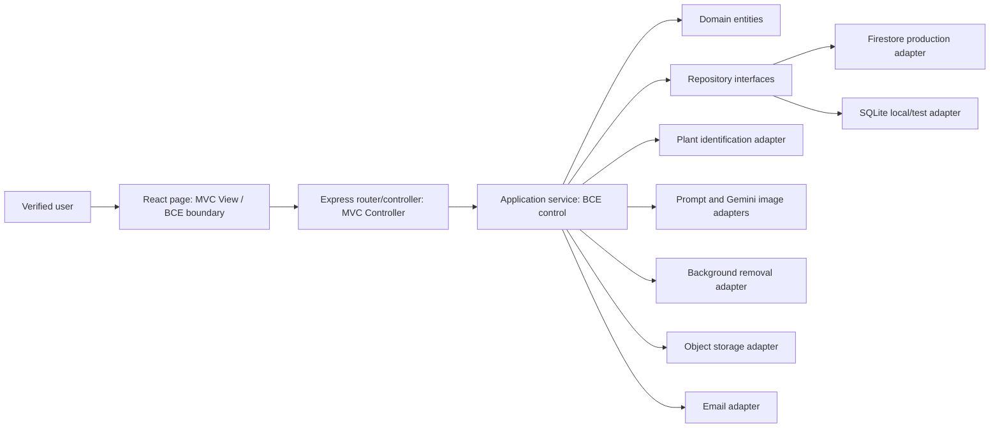
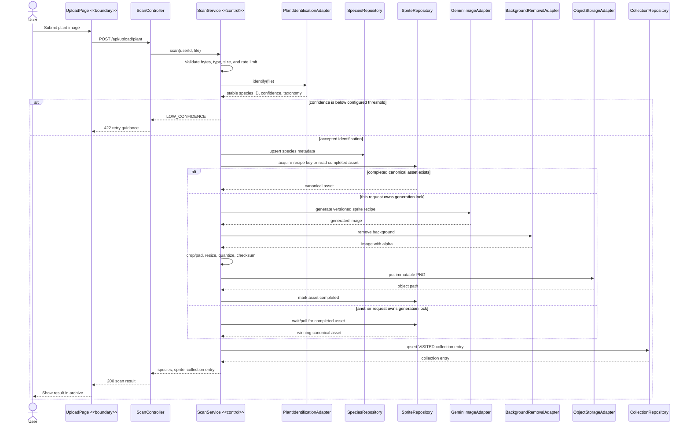

# Sprout Checkoff 3 Backend, Cloud, and Testing Design

**Date:** 2026-07-20
**Status:** Approved design
**Primary owner:** Zhi Feng (backend, cloud infrastructure, and testing)
**Baseline inspected:** remote `main` at commit `8e1077d`

## 1. Purpose

This design defines the Checkoff 3 vertical slice and the target architecture needed to support it. It reconciles the current web repository, the Android reference application, the latest feature and storage notes, the course testing material, and the PM3 rubric.

The goal is not to port the Android app line by line. The web implementation reuses proven gameplay concepts and prompt knowledge while adding server-side orchestration, canonical asset storage, deterministic tests, and cross-platform persistence.

## 2. Checkoff 3 Scope

### Integrated vertical slice

The primary demonstrated workflow is:

1. A verified user uploads a plant image.
2. The backend validates the file and identifies the species.
3. The backend looks up the canonical sprite recipe for that species.
4. On a cache hit, the existing sprite is reused.
5. On a cache miss, the backend generates and post-processes one sprite.
6. The sprite is stored in object storage and referenced from the database.
7. The user's collection is upserted with `VISITED` provenance.
8. The archive displays the species, sprite, provenance, and collection metadata.

Auth and Contact Us are regression-tested supporting flows. PVE may be demonstrated as an isolated feature if it is not fully integrated by the video freeze. PVP remains planned final architecture and must not be presented as implemented.

### Explicit non-goals for this slice

- Real-time PVP and matchmaking.
- User-unique AI art for every scan.
- Public leaderboard ranking based on unrestricted XP.
- Automatic proof that a mobile camera image is a real outdoor encounter.
- A duplicate custom signup-verification token system.
- A direct Android port of local JSON persistence or activity-level game logic.

## 3. Requirement Changes Since Checkoff 2

These are deliberate changes and should be reported as such for the PM3 requirement-change marks.

| Area | Previous description | Checkoff 3 decision |
|---|---|---|
| Sprite identity | A unique temporary sprite for each upload | One versioned canonical sprite per species and recipe |
| Web collection | Temporary web-only avatar | Persistent collection entry with immutable `VISITED` provenance |
| Mobile collection | Separate/local state | Shared account and collection model; mobile may promote `VISITED` to `CAUGHT` |
| Image generation | Gemma prompt plus FLUX image generation | Prompt service plus configured Gemini image-generation adapter |
| Post-processing | No implemented design lock | remove.bg, square normalization, 56x56 resize, FLORENTINE24 quantization |
| PVE opponent | Clone or scale from the player's collection | Fixed, versioned NPC preset with server-authoritative seeded RNG |
| Auth documentation | Backend email/password login and backend-issued JWT | Firebase client login and Firebase ID token verified by Express |
| UC6 relationship | Upload described only as an extension of PVE | Upload is an independent base use case; PVE selects a collected plant |

## 4. System Architecture



### MVC and BCE vocabulary

| System part | MVC | BCE stereotype |
|---|---|---|
| React page/component that accepts input and renders results | View | `<<boundary>>` |
| Express router/controller | Controller | inbound `<<boundary>>` / controller |
| Scan, auth, ticket, or battle application service | Model orchestration | `<<control>>` |
| Species, collection entry, battle session, or ticket | Model | `<<entity>>` |
| Repository | Model persistence boundary | `<<repository>>` |
| Firebase, plant ID, Gemini, remove.bg, storage, or SMTP adapter | External integration | outbound `<<boundary>>` |

The database is internal to the Sprout system, not an actor. External actors communicate through adapters. Every sequence diagram must return a result or acknowledgement to the initiating user.

## 5. Canonical Data Model

### Species

- `speciesId`: stable provider taxon/species identifier and primary identity.
- `scientificName`, `commonName`, taxonomy, facts, and rarity metadata.
- `canonicalSpriteAssetId`: reference to the current approved asset.
- Base battle stats and default moveset may be versioned seed data.

### SpriteAsset

- `spriteAssetId`, `speciesId`, and immutable object-storage path.
- `promptVersion`, `modelVersion`, `paletteVersion`, and recipe hash.
- `checksum`, generation provider, status, and timestamps.
- Unique key: `speciesId + promptVersion + modelVersion + paletteVersion`.

### UserSpeciesCollection

- Unique key: `(userId, speciesId)`.
- `status`: `VISITED` or `CAUGHT`.
- `nickname`, `pveXp`, `pveWins`, `pveLosses`, `currentWinStreak`, `bestWinStreak`.
- `firstSeenAt`, `lastSeenAt`, and optional private source-photo reference.

Repeated web uploads update `lastSeenAt`; they do not create duplicate collection entries. Web uploads cannot assign `CAUGHT`. A later trusted mobile encounter may promote `VISITED` to `CAUGHT`; status never moves backwards.

### ScanEvent

- `scanId`, `userId`, upload hash, provider, confidence, and timestamp.
- Identified `speciesId`, outcome, and stable error code when unsuccessful.
- Supports debugging, test evidence, rate limiting, and idempotency without duplicating the collection.

### BattleSession

- User, selected collection entry, versioned NPC preset, temporary HP, and state.
- RNG seed, turn number, action log, status, and completion marker.
- Reward-applied marker prevents duplicate XP on retries.

### QueryTicket

- Reference number, sender details, category, message, and status.
- Separate submitter-confirmation and admin-notification delivery statuses.
- Ticket persistence is authoritative; email delivery cannot erase or duplicate the ticket.

## 6. Object Storage

Firebase Storage is the production object-store target because Firebase Auth and Firestore are already part of the system. The storage adapter keeps local development and tests independent from cloud credentials.

Paths:

```text
canonical-sprites/{speciesId}/{recipeHash}.png
users/{userId}/plant-photos/{scanId}.{ext}
```

Canonical sprites are shared, immutable, and cacheable. User photos are private and access-controlled. Firestore stores paths, checksums, and metadata, never image blobs or base64 data.

If Firebase Storage billing or credentials are unavailable at the Checkoff 3 freeze, the demo uses seeded canonical assets through the same storage interface. The Firebase adapter and its contract tests remain evidence of the production design.

## 7. Upload and Sprite Pipeline

The existing route name remains `POST /api/upload/plant`.



### Post-processing order

1. Generate the source image.
2. Remove the background.
3. Crop or pad to a square canvas.
4. Resize to 56x56 pixels.
5. Quantize every non-transparent RGB pixel to the nearest FLORENTINE24 color.
6. Preserve alpha values.
7. Encode PNG, calculate checksum, and store.

The algorithm version is `florentine24-v1`. Quantization occurs after background removal so background pixels do not contaminate edge colors. The exact 24 swatches are held in versioned application data and tested as a closed set.

### Stable error contract

`INVALID_IMAGE`, `IMAGE_TOO_LARGE`, `LOW_CONFIDENCE`, `RATE_LIMITED`, `IDENTIFICATION_UNAVAILABLE`, `GENERATION_FAILED`, `POSTPROCESS_FAILED`, and `STORAGE_FAILED`.

Provider payloads, stack traces, credentials, and raw model errors are never returned to clients. Tests and the backup demo use deterministic provider fakes.

## 8. Authentication and Email

Firebase is the authentication authority. Sprout's backend verifies Firebase ID tokens and stores application-profile data. It does not issue a second custom login JWT.

### Signup and verification

1. `POST /api/auth/signup` validates email, password, and a trimmed display name of 1-50 letters, numbers, spaces, hyphens, or underscores.
2. Firebase Admin creates the unverified identity and Sprout creates the profile.
3. Firebase Admin generates a verification action link whose continue URL returns to Sprout `/verify-email`.
4. The email adapter delivers that link using SMTP in deployed environments.
5. The Sprout verification page applies Firebase's action code, refreshes the ID token, and calls `/api/auth/me` to synchronize `isVerified`.
6. A rate-limited resend action generates a fresh Firebase link. The target is no more than three resend requests per 15 minutes per account/IP.

There is no custom Sprout verification-token table or signup OTP. Firebase's action code is the verification mechanism. If SMTP delivery fails after identity creation, the account remains pending and signup returns `201` with `verificationEmailSent:false` plus a resend action; a retry must not create a duplicate account.

### Login

The React client calls Firebase `signInWithEmailAndPassword`, obtains an ID token, and sends it to Express for protected calls. The protected workspace is blocked until `emailVerified` is true. On the first verified request, `/api/auth/me` reconciles the local profile and returns archive/game metadata.

### Password reset

The current custom six-digit OTP flow remains for Checkoff 3. OTPs use `crypto.randomInt`, are bcrypt-hashed at rest, expire after 15 minutes, and are invalidated after success. Request responses remain generic for known and unknown emails. Five invalid attempts invalidate the issued OTP and require a new request. Password history prevents recent reuse.

### Query notifications

The ticket is committed before notification attempts. Submitter confirmation and Sprout-admin notification are attempted independently so one email failure does not suppress the other. Delivery status and an error summary are persisted for retry/evidence. The API still returns the reference number when ticket persistence succeeds.

Local tests use `EMAIL_MODE=console` or a fake adapter. The deployed backend uses `EMAIL_MODE=smtp`; secrets are deployment environment variables only. Current `render.yaml` console mode is an implementation gap, not production-ready behavior.

## 9. PVE Design

PVE uses one plant from the user's collection against a fixed, versioned NPC preset. It does not clone the player's garden.

```text
PLAYER_ACTION -> BOT_ACTION -> RESOLVE_ROUND -> CHECK_RESULT
      ^                                      |
      |---------------- active --------------|
                                             +-> WON / LOST
```

- The server owns battle state, turn order, damage, valid actions, and rewards.
- Each action includes the expected turn number; duplicate or stale requests cannot apply damage twice.
- The bot chooses randomly from valid moves using a stored RNG seed. Seed and turn are recorded so tests can reproduce the exact battle.
- The Android `P1_MOVE -> P2_MOVE -> PROCESSING -> END` idea and move data may be adapted, but local activity state and cloned opponent logic are not copied.

Rewards are deliberately modest and idempotent:

- Win: selected plant gains 20 PVE XP and one PVE win.
- Loss: selected plant gains 5 PVE XP and one PVE loss.
- Abandon: no XP.
- Battle HP is temporary and restored after the session.
- `bestWinStreak` updates on a completed win.

XP does not alter battle stats in Checkoff 3. A public leaderboard is deferred because unrestricted raw XP is farmable; a later version can rank seasonal wins with difficulty and daily limits.

## 10. Testing Strategy

The project follows an iterative/agile lifecycle. Each Checkoff 3 increment adds progression tests for the new vertical slice and regression tests for already-demonstrated auth and ticket behavior.

### Unit tests

- Image boundary validation: empty, malformed, wrong magic bytes, accepted formats, and exact size boundary.
- Quantizer: output dimensions, palette closure, alpha preservation, and deterministic checksum.
- Canonical generation lock: first writer wins and concurrent losers reuse the completed asset.
- Collection: one row per user/species, repeated upload updates `lastSeenAt`, and only mobile can promote to `CAUGHT`.
- Auth: Firebase verification resend, verified route guard, OTP expiry/attempt limit/reuse history.
- Tickets: persistence succeeds independently of either notification result.
- PVE: legal transitions, seeded RNG, minimum damage, HP floor, stale turn rejection, and one-time reward.
- Frontend: upload states, archive provenance, verified-route guard, and battle controls.

### Integration tests

Primary strategy: **call-graph bottom-up**. Repository and adapter contracts are verified first, then services with mocked outgoing edges, then HTTP routes. This follows the runtime call relationships represented by sequence diagrams and minimizes expensive full-stack debugging.

Selective **pairwise call-graph** tests cover every critical provider edge: identification, Gemini generation, background removal, object storage, Firebase Auth, and SMTP. These tests verify request/response translation, timeout mapping, and stable Sprout errors without calling paid services in the normal suite.

Core flows:

1. Upload route -> identification fake -> canonical sprite -> collection -> archive.
2. Concurrent same-species uploads -> one generation -> one shared asset.
3. PVE route -> state transitions -> completion -> one XP update.
4. Signup -> verification action -> verified backend profile -> protected route.
5. Reset request -> OTP -> password update -> login with new password.
6. Ticket submit -> durable record -> independent email outcomes.

### System tests

System cases are derived from the use-case documents, not invented from component structure. The main Checkoff 3 case is UC6 upload through archive display. UC1-UC3 and UC8 are regression cases. UC5 is included if the isolated PVE slice is ready. Each test table records use-case ID, linked sequence message, preconditions, input, technique, steps, expected result, actual result, status, owner, and evidence.

### Current baseline and test debt

- Server typecheck passes.
- Client lint passes with three Fast Refresh warnings.
- Server tests currently report 29 passing and 2 reset-password timeouts at Jest's default five seconds.
- The reset success path passes with a 60-second timeout and takes about 13 seconds because bcrypt cost 12 is intentionally expensive and the helper performs redundant comparisons.
- The fix must retain production bcrypt cost while making tests deterministic and appropriately configured.
- The frontend currently has no configured unit-test framework; adding one is required for the rubric's frontend unit evidence.

## 11. Diagram Standard

Every PM3 diagram is labeled either `As Implemented for Checkoff 3` or `Planned Final Architecture`.

- Use-case diagram: current UC1-UC8 status and external actors; UC6 is independent from UC5.
- Domain/class diagram: typed attributes, operations, multiplicities, and domain vocabulary only.
- BCE/MVC mapping: use the stereotypes defined in Section 4 consistently.
- Sequence diagrams: one activation convention; complete request/response loop; timeouts and failures as `alt` branches.
- Database and object storage stay inside the system boundary.
- Email Server never sends directly to the primary actor in the system sequence; Sprout reports delivery state.
- PVE and PVP diagrams must say `Planned` if their server flows are not present at the video freeze.

The evidence chain for every demonstrated feature is:

```text
Use case -> sequence message -> code module -> test case -> demo evidence
```

## 12. Checkoff 3 Acceptance Gates

The integrated slice is ready when all of the following are true:

- A verified user can upload an accepted image and receive a persisted `VISITED` collection result.
- Two users or concurrent requests for the same species reuse one canonical recipe asset.
- The final PNG is 56x56, transparent where expected, and contains only FLORENTINE24 RGB values for non-transparent pixels.
- Provider failures map to stable errors and leave no falsely completed asset.
- Canonical sprites and private photos use distinct storage paths and access rules.
- Real deployed signup verification and reset OTP emails are demonstrated without exposing secrets.
- Verification can complete in Sprout and can be resent without duplicate account creation.
- A Contact Us ticket persists even when email fails, and admin notification is independently attempted.
- Required backend and frontend unit tests run in proper frameworks.
- Integration strategy and system cases are documented in the rubric table format.
- Current, standardized use-case, class/domain, BCE/MVC, and sequence diagrams match the implemented demo.
- Every feature claim is labeled implemented, isolated, or planned, with owner and evidence.

## 13. Risks and Controls

| Risk | Control |
|---|---|
| AI token, quota, or provider outage | Adapter interfaces, deterministic fakes, seeded fallback assets |
| Duplicate generation under concurrency | Unique recipe key plus generation lock and winner reuse |
| Firebase Storage billing unavailable | Seeded local assets through the same storage contract |
| Email delivery failure | Recoverable resend; ticket and notification states separated |
| Test runtime from bcrypt | Production cost retained; focused test configuration and non-redundant setup |
| Diagram/code drift | Freeze diagrams after implementation and trace each message to code/tests |
| Overclaiming PVE/PVP | Explicit implemented/isolated/planned labels |
| Palette or generated-art rights uncertainty | Verify FLORENTINE24 permission/attribution and document human art direction without making legal claims |

## 14. Ownership Evidence for Zhi Feng

Zhi Feng owns or co-owns the scan orchestrator, object-storage adapter and rules, canonical sprite persistence, PVE state/reward persistence, backend unit and integration tests, test-strategy tables, deployment configuration evidence, and the traceability links for those modules. Evidence should include exact commit links, test output, deployed environment screenshots with secrets hidden, and the relevant report/video timestamps.
