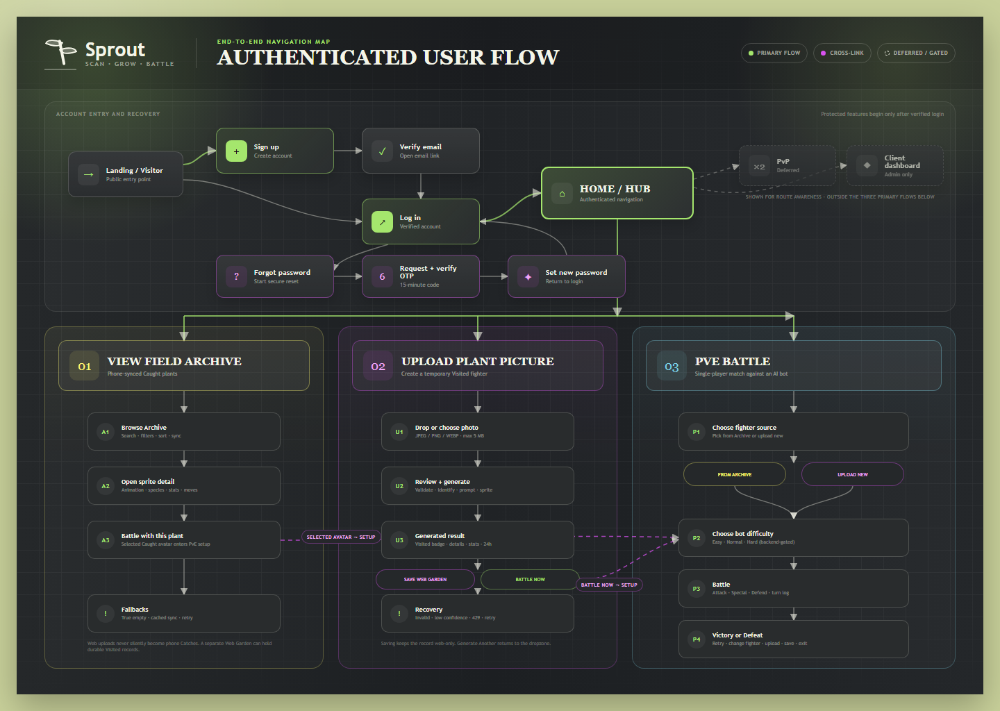

# Sprout Archive, Upload, and PvE frontend handoff

This handoff turns one end-to-end user-flow diagram and 14 screen PNG mockups into implementation contracts for account entry, the authenticated Archive, Upload Plant Picture, and PvE Battle flows. It is intentionally explicit about what the current code and REST API can support today and what still requires a backend/product decision.



## 1. Authority, scope, and references

### Visual authority

For these screens, [`DESIGN.md`](../../../sprout-web-app/md/DESIGN.md) and the current [`App.css`](../../../sprout-web-app/client/src/App.css) are authoritative. Continue the existing dark botanical stage rather than the older pale “Forest Sage” treatment in `UI Design System.md`:

- sage page surround `#c8d09a`;
- charcoal stage `#24262a` and deep stage `#1c1f22`;
- cream text `#f4f5e8` and lime emphasis `#a5e66d`;
- moss borders `#94af57`, purple primary-action detail `#d852f0`, and clay accents;
- slab/editorial serif headings, rounded humanist sans body text, pill actions, tactile cards, and soft botanical glows;
- current rem-based scale, `92rem` shell, `1050px` and `720px` layout breaks, and the existing focus/reduced-motion rules.

The mockups use Pokémon Showdown only as interaction-layout inspiration: a compact battle stage, diagonal combatants, nearby HP plates, a turn/log area, and a bottom command deck. References inspected were the [official Pokémon Showdown site](https://pokemonshowdown.com/), [live client](https://play.pokemonshowdown.com/), and the official client's [`battle.css`](https://github.com/smogon/pokemon-showdown-client/blob/master/play.pokemonshowdown.com/style/battle.css). The official client is AGPLv3. Do not copy its CSS, Pokémon artwork, icons, names, battlefield assets, or exact trade dress. Recreate the useful information hierarchy with Sprout's original botanical visuals and `DESIGN.md` tokens.

### Product and implementation references

- [`Sprout_Features.md`](../../../Sprout_Features.md): Caught/Visited language, collection, battle direction, progression, and pixel-art guidance.
- [`Sprout_Storage_IP.md`](../../../Sprout_Storage_IP.md): canonical-per-species art, per-user specimen data, object-storage URLs, and scalable persistence.
- [`UC4 Browse Avatar Archival`](../../02%20Requirements/UC4%20Browse%20Avatar%20Archival.md), [`UC5 PVE Battle`](../../02%20Requirements/UC5%20PVE%20Battle.md), and [`UC6 Upload Plant Picture`](../../02%20Requirements/UC6%20Upload%20Plant%20Picture.md): required flows and failure paths.
- [`API Contract`](../API%20Contract.md), [`Database Schema`](../Database%20Schema.md), and [`GenAI Sprite Pipeline`](../GenAI%20Sprite%20Pipeline.md): planned REST behavior and persisted fields.
- Current code audit: `App.tsx`, `ArchivePage.tsx`, `BattlePage.tsx`, `sproutApi.ts`, `server/app.ts`, and avatar routes/controllers as of 2026-07-21.

### Non-goals

These mockups do not add PvP, potions, switching, status ailments, an independently simulated four-move system, or Pokémon-branded content. Current PvE mechanics remain `attack`, `special`, and `defend`. Named botanical moves may present those three actions, but must not imply extra mechanics the server does not calculate.

## 2. Product-language and persistence policy

Use provenance language consistently. Never use “Caught” as a generic synonym for “owned.”

| User-facing state | Data rule | Where shown | Meaning |
| --- | --- | --- | --- |
| **Caught** | `source === "mobile"` | Default Archive tab and archive picker | Found through the phone camera in the field. This is a trust signal, not a tamper-proof claim. |
| **Visited · Temporary** | `source === "web" && isTemporary === true` and `expiresAt` is in the future | Upload result and current PvE flow | Created from a web upload. Playable in PvE until its 24-hour expiry. It is not a mobile catch and is not PvP eligible. |
| **Visited · Web Garden** | Proposed: `source === "web" && isTemporary === false`, plus a durable `visibility: "web_only"`/equivalent policy | Separate Web Garden tab | Saved to the user's web account. It remains Visited, does not become Caught, must be excluded from the mobile Caught archive and PvP. |
| **Expired** | `source === "web" && isTemporary === true && expiresAt <= now` | Recovery state | No longer selectable. Offer generation of a new sprite; do not silently resurrect it. |

The primary Archive opens on **Caught on phone** because UC4 and the user flow define it as the mobile-synchronised collection. A proposed **Web Garden** segment may live in the same page shell, but it is a clearly separate scope. Do not mix web uploads into Caught counts, mobile-discovery achievements, or leaderboard totals.

“Save to database” is implementation language and must not appear in player-facing UI. Use **Save to Web Garden** with this supporting copy:

> Keep this Visited plant in your web account. It will not become a mobile Caught discovery or be eligible for PvP.

Saving to Web Garden is a proposed API extension, not implemented behavior. Until its endpoint and retention policy ship, hide the control behind a feature flag or show it disabled with “Web Garden saving is coming soon”; never show a success toast without a confirmed server response.

The storage strategy recommends one canonical, curated sprite per species (with an optional small fixed variant set), not a new unique art asset per scan. Avoid “one-of-a-kind sprite” copy. Personal identity belongs in the user's photo, nickname, date, XP, stats, moves, and fixed variant assignment. The current database has not yet completed that catalogue/specimen split.

## 3. Mockup inventory and route map

The overview diagram and all 14 screen mockups are in this folder. The desktop PNGs are composition references; responsive behavior is specified later and must not be inferred by simply scaling the desktop canvas.

| # | Mockup | Route / state | Contract |
| --- | --- | --- | --- |
| 00 | [Authenticated user-flow overview](./00-user-flow-overview.png) | Landing → auth/recovery → authenticated hub → feature branches | Signup, verification, login, forgot-password/OTP reset, primary post-login options, cross-links into PvE, and deferred/role-gated routes. |
| 01 | [Archive overview](./01-archive-overview.png) | `/archive` · ready | Default phone-Caught archive, search/filter/sort, synced cards. |
| 02 | [Archive detail](./02-archive-detail.png) | `/archive/:avatarId` | Animated sprite presentation, species information, stats, provenance, and PvE CTA. |
| 03 | [Archive empty and sync states](./03-archive-empty-sync.png) | `/archive` · true empty / sync recovery | No mobile catches yet; mobile-exploration and web-upload next steps, with distinct cached-sync/error treatment. |
| 04 | [Upload dropzone](./04-upload-dropzone.png) | `/upload` · idle | Large drag/drop target and exact format, size, and quota rules. |
| 05 | [Upload preview](./05-upload-preview.png) | `/upload` · selected | Local photo preview, validation, replace/remove, Generate action. |
| 06 | [Upload generating](./06-upload-generating.png) | `/upload` · submitting | Indeterminate, staged pipeline feedback for a request that can take up to 60 seconds. |
| 07 | [Upload recovery](./07-upload-recovery.png) | `/upload` · error | Combined invalid-file, low-confidence, quota, network, and pipeline recovery plate. |
| 08 | [Upload result](./08-upload-result.png) | `/upload/result/:tempAvatarId` | Visited temporary sprite, species details/stats, battle/save/generate actions. |
| 09 | [PvE source select](./09-pve-source-select.png) | `/battle/pve` | Choose Upload Plant Picture or Pick from Archive. |
| 10 | [PvE archive picker](./10-pve-archive-picker.png) | `/battle/pve/select` | Searchable compact phone-side roster and selected-plant preview. |
| 11 | [PvE setup](./11-pve-setup.png) | `/battle/pve/setup?avatarId=…` | Confirm combatant, choose proposed difficulty, start session. |
| 12 | [PvE battle](./12-pve-battle.png) | `/battle/pve/:sessionId` | Diagonal battle stage, HP, turn, elapsed timer, action deck, and log. |
| 13 | [PvE victory](./13-pve-victory.png) | `/battle/pve/:sessionId/result` · won | Result summary and context-sensitive next actions. |
| 14 | [PvE defeat](./14-pve-defeat.png) | `/battle/pve/:sessionId/result` · lost | Retry/reconfigure flow without dead ends. |

Keep the existing `/battle` URL as a redirect to `/battle/pve`. Add `/upload` as a protected standalone route. The PvE upload branch must reuse the same Upload feature with `?intent=battle`; it must not fork a second upload implementation. On successful generation, “Battle with this plant” navigates to setup using the returned `tempAvatarId`.

Do not rely on `location.state` as the only source of an avatar or battle-session ID. It disappears on refresh and direct navigation. Put stable IDs in the URL, then rehydrate owned records from the API. A local `File` can remain only in in-memory upload state; it cannot be restored after reload.

## 4. Screen contracts

### 01 — Archive overview

**Page copy**

- Eyebrow: `Plant Archive`
- Heading: `Your field discoveries`
- Supporting line: `Every plant caught with your phone, synced to this account.`
- Search placeholder: `Search species, family or nickname`
- Scope controls: `Caught on phone` (default) and `Web Garden` (feature-flagged until persistence exists)
- Family filter: `All families`
- Sort choices: `Newest first`, `Name A–Z`, `Highest HP`
- Result text: `{total} plants`

**Layout and data**

The heading and sync status sit above one dense toolbar. Below, use an auto-filling card grid and paginated `Load more`, preserving the existing API default of 20 items. Each card is a real link to `/archive/:avatarId` and contains:

- `spriteUrl` with an original-species alt description;
- `speciesName`, optional nickname only when the API supplies it, and `speciesFamily`;
- discovery date from `discoveredAt` formatted in the user's locale;
- derived `Caught` or `Visited` badge plus temporary/expiry state where applicable;
- compact HP value from `stats.hp`.

Do not fabricate nickname, rarity, level, locality, common/scientific-name pairs, or move data. If absent, omit the row rather than rendering demo text. Broken sprite URLs use an original Sprout placeholder and keep the species name readable.

Search and filters are reflected in `URLSearchParams` so refresh/back/forward preserve the view. Debounce text input by 250–300 ms. Do not claim whole-archive search while only filtering the current 20-item page; ship server queries first or explicitly load the full bounded result set.

If the sync request fails and a previous successful response exists, retain it and show `Showing saved results — sync is temporarily unavailable.` with Retry. If there is no cached response, render an error panel rather than the empty collection screen. A filter that yields no matches uses `No plants match these filters.` and `Clear filters`, not the true-empty state.

### 02 — Archive detail

**Page copy and actions**

- Breadcrumb: `Archive / {speciesName}`
- Primary action: `Battle with this plant`
- Secondary action: `Back to archive`
- Section labels: `Species notes`, `Taxonomy`, `Battle stats`, `Moves`

Use a two-column composition: a generous dark sprite stage on the left and the information panel on the right. Scale canonical pixel art at an integer multiple where possible and set `image-rendering: pixelated`. A subtle CSS idle bob/shadow makes a static `spriteUrl` feel alive; a true animated WebP/APNG/spritesheet requires a future asset contract and must not be assumed.

Always show species name, family fallback `Family not recorded`, discovery date, provenance, and HP/ATK/DEF/SPD. Read taxonomy, habitat, conservation status, educational fact, confidence, locality, and move data only through typed metadata adapters. Use `Species notes are still being prepared.` for missing educational copy. Never dump raw metadata JSON into the UI.

`Battle with this plant` routes to PvE setup with an owned `avatarId`. If the item expired between list and detail, replace the CTA with `This temporary visit has expired` and `Generate a new sprite`.

### 03 — Archive empty

This screen is only for `total === 0` in the **Caught on phone** scope after a successful request.

- Heading: `Your field guide is waiting`
- Body: `Catch a plant with the Sprout mobile camera and it will appear here on your next sync.`
- Primary CTA: `Explore with the mobile app`
- Secondary CTA: `Upload a plant to visit it on web`
- Policy note: `Web uploads are marked Visited and do not count as phone Catches.`

If there are saved web items, show a tertiary `View Web Garden ({count})` action. The web-upload CTA routes to `/upload`; it is not described as filling the phone archive.

The same PNG also documents sync recovery without conflating it with emptiness:

- cached records plus fetch failure: banner `Showing saved results — sync is temporarily unavailable.` with `Retry sync`;
- fetch failure with no cache: heading `We couldn't sync your Archive`, body `Check your connection and try again.`, primary `Retry`, secondary `Upload a plant for PvE`;
- successful request with active filters and zero matches: `No plants match these filters.` with `Clear filters`.

### 04 — Upload dropzone

**Page copy**

- Eyebrow: `Upload Plant Picture`
- Heading: `Turn a plant photo into a battle sprite`
- Drop target: `Drag a plant photo here`
- Alternate action: `or choose a file`
- Constraint line: `JPEG, PNG or WEBP · maximum 5 MB`
- Quota line: `Limit: 5 generations per hour`
- Privacy/provenance line: `Web uploads are marked Visited, not Caught.`
- Primary action: `Generate sprite` (disabled until one valid file is selected)

The entire dashed drop surface is a `<label>` for a visually present file input, so keyboard and touch users get the same path. Use `accept="image/jpeg,image/png,image/webp,.jpg,.jpeg,.png,.webp"`, but treat `accept` only as a picker hint. Client validation must reject zero-byte files, unsupported declared types/extensions, and `file.size > 5 * 1024 * 1024`. The server remains authoritative and validates magic bytes.

Drag-over changes border/fill and says `Drop to preview`. Do not auto-submit on drop. A small right-side result panel can show the empty placeholder `Your generated sprite will appear here` on desktop; stack it below the uploader on narrow screens.

### 05 — Upload preview

Render the selected image with `URL.createObjectURL(file)` and revoke the URL when the file changes or the component unmounts. Show filename as plain text, human-readable byte size, and detected browser MIME hint. Never inject the filename as HTML.

- Primary action: `Generate sprite`
- Secondary actions: `Choose another photo` and `Remove`
- Guidance: `For the best match, use one well-lit plant with leaves or flowers in focus.`

Disable Generate during validation/submission and guard the handler against double clicks. A selected file remains local until the user explicitly generates. If the client rejects it, stay in this screen and announce the exact invalid-file message used by the backend:

> Invalid file. Upload a JPEG, PNG, or WEBP image under 5 MB.

Do not promise that EXIF/location data or the source photo is stored or deleted until the backend's photo-retention policy is defined. The current `AvatarRecord` has no `userPhotoUrl` field.

### 06 — Upload generating

Show one indeterminate progress track and this ordered stage list:

1. `Identifying plant…`
2. `Generating sprite prompt…`
3. `Creating pixel sprite…`
4. `Deriving battle stats…`

Supporting copy: `This can take up to 60 seconds. Keep this tab open.` After 60 seconds, change it to `This is taking longer than usual. You can keep waiting or try again.` Do not display a fabricated percentage.

The planned `POST /api/upload/plant` is one long request, so the client cannot know when an internal stage truly completes. Until the backend exposes a job status/SSE stream, the labels are contextual waiting messages: do not place success ticks beside a stage based only on elapsed time. Complete all stages only after the 200 response. Use an `AbortController` for navigation/client cancellation, while acknowledging that aborting the browser request may not stop already-running server work.

### 07 — Upload recovery

One recovery component handles all errors but changes title, message, and available action from a typed error code.

| Condition | Exact primary message | Primary recovery |
| --- | --- | --- |
| Client or HTTP 400 | `Invalid file. Upload a JPEG, PNG, or WEBP image under 5 MB.` | `Choose another photo` |
| HTTP 422 | `Cannot identify plant with sufficient confidence. Try retaking the photo in better lighting.` | `Choose another photo` |
| HTTP 429 | `You've used 5 generations this hour. Try again {retryTime}.` | Disabled `Try again` until `Retry-After`, plus `Back to archive` |
| HTTP 503 / timeout | `We couldn't finish this sprite. No partial avatar was saved.` | `Try again` |
| Offline/network | `Connection lost. Check your connection and try again.` | `Try again` |
| Temp record HTTP 404/410 | `This temporary visit has expired.` | `Generate a new sprite` |

Keep the selected file in memory for retry after 503/network errors. Require a new file after invalid type or low confidence. Put technical correlation IDs in a collapsible `Technical details` region when provided; never expose API keys, prompts, stack traces, or raw third-party responses.

### 08 — Upload result

Use the same `SpriteStage`, species-information adapter, and `StatGrid` as Archive detail so the two experiences cannot drift.

- Heading: `Your Visited plant is ready`
- Badges: `Visited` and `Temporary · expires {relative time}`
- Primary action: `Battle with this plant`
- Proposed account action: `Save to Web Garden`
- Secondary actions: `Generate another` and `View Archive`

Show the generated/canonical sprite, species name, family/taxonomy when returned, confidence rounded for display, short description/fact when returned, and deterministic HP/ATK/DEF/SPD. The source-photo thumbnail may remain beside it only for the current in-memory session; do not assume it can be fetched later.

`Battle with this plant` sends `tempAvatarId` into setup. `Save to Web Garden` calls the proposed idempotent save endpoint and changes to `Saved to Web Garden` only after 200. On 409/410 because the item expired, keep the result readable but offer `Generate a new sprite`. The temporary 24-hour expiry applies even if the user leaves this screen.

### 09 — PvE source select

- Eyebrow: `PvE Battle`
- Heading: `Choose your combatant`
- Card 1: `Pick from Archive` / `Use a plant caught with your phone.`
- Card 2: `Upload Plant Picture` / `Generate a temporary Visited plant for this battle.`

Both choice cards are large links, not nested clickable controls. Archive routes to `/battle/pve/select?scope=caught`; Upload routes to `/upload?intent=battle&returnTo=/battle/pve/setup`. If a valid recent temp avatar exists, a third compact `Continue with {speciesName}` row may appear, but it must verify ownership and expiry with the backend before use.

### 10 — PvE archive picker

This is a denser reuse of Archive data, not a copy of the full Archive page. Default to `source=mobile` so the widget visibly represents phone-side Caught plants.

- Heading: `Pick a plant from your Archive`
- Search placeholder: `Search your Caught plants`
- Selected action: `Use {speciesName}`
- Alternate action: `Upload a plant instead`

Cards act as a single-select radio group and show sprite, species name, HP, ATK, and Caught badge. The selected plant gets the detailed preview/stats panel and a persistent confirmation action. Double-clicking a card must not start a battle accidentally.

If no Caught plants exist, reuse the true-empty explanation and emphasize `Upload a plant for PvE`. A feature-flagged `Web Garden` scope may be offered later, but it must remain Visited and PvE-only.

### 11 — PvE setup

Show the selected sprite and stats on the left; on the right, show difficulty choices as one labelled radio group:

- `Easy` — `A gentler opponent while you learn.`
- `Normal` — `Balanced for your plant's stats.` (default)
- `Hard` — `A stronger opponent for a tougher match.`

Recommended backend semantics are NPC stat multipliers `0.85`, `1.0`, and `1.15`, while retaining the required deterministic damage calculation and NPC action heuristic at every level. Difficulty is not in the current contract, so keep it behind `VITE_ENABLE_PVE_DIFFICULTY`; without server support, show a single `Normal` setting rather than pretending the selection changed gameplay.

- Primary action: `Start battle`
- Secondary actions: `Choose another plant` and, for a temp avatar, `Generate another`
- Start request body: exactly one of `avatarId` or `tempAvatarId`, plus proposed `difficulty` only when supported.

Disable Start until an owned, unexpired avatar is resolved. During session creation, change the button to `Preparing opponent…`, prevent duplicate requests, and navigate to `/battle/pve/{sessionId}` only after the server confirms the session.

### 12 — PvE battle

The battle shell has three regions on desktop: the battlefield, a compact chronological battle log, and a centre-bottom command deck. The opponent is upper-right facing toward the centre; the player's plant is lower-left facing toward the centre. Each combatant's HP plate sits near—but never on top of—the sprite.

**Always-visible information**

- player and opponent name;
- current and maximum HP, with green/amber/red fill plus numeric text;
- `Turn {turnNumber}` and `Your turn` / `Opponent is choosing…` / `Resolving turn…`;
- an **elapsed match timer** (`mm:ss`) derived from `startedAt`, not a punitive countdown;
- latest battle narration and access to the full turn log.

The current API has no timeout/deadline rule. Do not make a client-only countdown cause damage, defend, forfeiture, or an automatic move. If a timed-turn mode is later approved, the server must return `turnDeadlineAt` and authoritatively resolve expiry.

**Command deck**

For the current P0 mechanics, render three botanical move buttons mapped to the exact API action enum:

| Display fallback | API action | Helper copy |
| --- | --- | --- |
| `Vine Jab` | `attack` | `Reliable damage` |
| `Solar Bloom` | `special` | `1.5× base damage` |
| `Guard Root` | `defend` | `Halve the next incoming hit` |

Prefer server-supplied move names. If no typed move data exists, the action name (`Attack`, `Special`, `Defend`) is safer than inventing species-specific moves. A fourth slot remains absent/locked until a server-owned `moves[]` contract defines its action and calculation. Potions and switching are not shown.

On action click, disable the whole deck, announce `Resolving {moveName}…`, and `POST /api/battle/pve/action`. Do not optimistically change HP. Apply the returned state, play short attack/hit animations in log order, append exactly the returned one or two turn entries, then restore input only if `status === "active" && turn === "user"`. A failed action keeps the last confirmed state and offers Retry. A reload calls `GET /api/battle/pve/:sessionId` and resumes; a 400/404 uses `This battle is no longer available.` and returns safely to source select.

An in-battle `Leave battle` control must not imply surrender while no forfeit endpoint exists. For MVP, confirm `Leave this screen? You can resume this active battle from its link.` A real forfeiture needs a separate authenticated server action.

### 13 — PvE victory

Reuse the battlefield in a settled state with a readable result panel; do not replace all context with confetti.

- Heading: `Victory!`
- Body: `{speciesName} outlasted {opponentName}.`
- Summary: turns, elapsed time, final HP, and server-returned reward/XP only when present.
- Primary: `Battle again`
- Secondary: `Choose another plant`, `Generate new sprite`, and `Exit to Archive`
- Conditional proposed action: `Save to Web Garden` only for an unsaved, unexpired web temp avatar.

`Battle again` creates a new session with the same combatant and difficulty; it must not reuse the ended session ID. Do not hard-code XP because the current battle response/repository has no reward contract.

### 14 — PvE defeat

- Heading: `Defeat — your plant can grow from this`
- Body: `{opponentName} won in {turnCount} turns.`
- Primary: `Retry battle`
- Secondary: `Adjust difficulty`, `Choose another plant`, `Generate new sprite`, and `Exit to Archive`
- Conditional proposed action: `Save to Web Garden` under the same temp-avatar policy as Victory.

Retry starts a new session. `Adjust difficulty` returns to setup with the combatant preserved. If the temp avatar expired during the match, disable retry/save and explain `This temporary visit expired. Generate a new sprite to battle again.`

## 5. Routes and component ownership

Recommended route tree:

```tsx
<Route element={<ProtectedRoute />}>
  <Route path="/archive" element={<ArchivePage />} />
  <Route path="/archive/:avatarId" element={<ArchiveDetailPage />} />
  <Route path="/upload" element={<UploadPage />} />
  <Route path="/upload/result/:tempAvatarId" element={<UploadResultPage />} />
  <Route path="/battle/pve" element={<PveSourcePage />} />
  <Route path="/battle/pve/select" element={<PveArchivePickerPage />} />
  <Route path="/battle/pve/setup" element={<PveSetupPage />} />
  <Route path="/battle/pve/:sessionId" element={<PveBattlePage />} />
  <Route path="/battle/pve/:sessionId/result" element={<PveResultPage />} />
</Route>
<Route path="/battle" element={<Navigate to="/battle/pve" replace />} />
```

Adapt this to the current `ProtectedRoute` wrapper signature if it is not converted to an outlet. Suggested component ownership:

```text
AppShell
├── Archive
│   ├── ArchiveToolbar
│   ├── AvatarGrid
│   │   └── AvatarCard
│   ├── ArchiveEmptyState
│   └── ArchiveDetail
│       ├── SpriteStage
│       ├── ProvenanceBadges
│       ├── SpeciesFacts
│       ├── StatGrid
│       └── MoveList
├── Upload
│   ├── UploadDropzone
│   ├── PhotoPreview
│   ├── PipelineProgress
│   ├── UploadRecovery
│   └── UploadResult (reuses SpriteStage/Facts/Stats)
├── PvE
│   ├── CombatantSourceCards
│   ├── CombatantPicker (reuses AvatarCard adapter)
│   ├── DifficultySelector
│   ├── BattleField
│   │   ├── FighterSprite
│   │   ├── HealthPlate
│   │   └── TurnStatus
│   ├── MoveDeck
│   ├── BattleLog
│   └── BattleResult
└── Shared
    ├── AsyncStatePanel
    ├── StatusBadge
    ├── ConfirmDialog
    └── AppButton
```

Use feature-domain folders (`features/archive`, `features/upload`, `features/battle`) and keep raw API shapes in `services`/`types`. Build a typed adapter between `AvatarRecord` and presentational props instead of making shared UI read arbitrary `metadata` keys.

The current dependency set does not contain a query/cache library. A reducer plus focused fetch hooks and Axios cancellation is enough for the first implementation. If TanStack Query is later added, treat that as a deliberate dependency change, not assumed infrastructure.

## 6. State machines

### Archive

```text
idle -> loading -> ready
                -> empty
                -> error(no cache)
                -> ready-with-sync-warning(cached)
ready -- query/page changes --> loading-preserving-old-results
```

Abort stale requests when query parameters change. Only the newest request may update results.

### Upload

```text
idle
  -> selected
  -> client-invalid -> selected/idle
selected
  -> submitting.identifying
  -> submitting.prompting
  -> submitting.generating
  -> success(tempAvatarId, expiresAt)
  -> recoverable-error(400|422|429|503|network)
success -> saving-web-garden -> saved | save-error
success -> battle-setup | idle(generate another)
```

Internal staged substates are display context until the server exposes genuine progress. The actual network outcome remains pending/success/error.

### PvE

```text
source
  -> archive-picker -> setup
  -> upload -> upload-result -> setup
setup -> starting -> active.user-turn
active.user-turn -> resolving -> active.user-turn
                            -> won
                            -> lost
                            -> recoverable-error
active/result -- reload --> rehydrating via GET session
won/lost -> new session retry | setup | source | archive
```

Server state is authoritative. Never calculate or persist damage only in React state.

## 7. Data contracts and API mapping

### Current avatar shape

The implemented frontend/server types currently provide:

```ts
interface AvatarRecord {
  id: string;
  userId: string;
  speciesName: string;
  speciesFamily: string | null;
  spriteUrl: string;
  discoveredAt: string;
  source: 'mobile' | 'web';
  isTemporary: boolean;
  expiresAt: string | null;
  stats: { hp: number; attack: number; defense: number; speed: number };
  metadata: Record<string, unknown> | null;
}
```

Provenance is derived from `source`; temporary/saved is derived from `isTemporary` and `expiresAt`. The richer storage proposal (catalogue/specimen, nickname, level, XP, moves, variant, capture photo) is not yet represented. Add fields through versioned typed contracts rather than parsing assumptions throughout components.

The battle UI must preserve these server-owned UC5 invariants:

- `attack` and `special` deal at least 1 damage; `special` is `floor(1.5 × baseDamage)`;
- `defend` multiplies the incoming NPC damage by `0.5` for that resolution;
- damage calculation is pure/deterministic for the same combatants and action, and HP is clamped at 0;
- the required NPC heuristic chooses special above 70% HP, defend below 30% HP, and attack otherwise;
- each resolved user turn returns exactly one or two ordered `BattleTurnLog` entries;
- NPC HP 0 produces `won`; user HP 0 produces `lost`; the server records `endedAt`;
- invalid, foreign, or expired sessions produce `Invalid or expired battle session.` and never leak another user's state.

### Screen-to-endpoint map and current gaps

Current code reality matters: `server/app.ts` mounts auth, query, and avatar routers only. Archive endpoints exist, but current Archive UI is still static. Upload and battle endpoints appear in design contracts but are not mounted/implemented in the current tree.

| UI need | Contract / proposed call | Current status | Required handling |
| --- | --- | --- | --- |
| Archive page | `GET /api/avatar?page=&pageSize=` | Implemented; owned records, page size capped at 100 | Wire UI, auth token, loading/error/cache states. |
| Archive detail | `GET /api/avatar/:avatarId` | Implemented; ownership checked | Treat 404 as unavailable, never reveal foreign record existence. |
| Whole-archive search/filter/sort | Proposed `GET /api/avatar?q=&source=&persistence=&family=&sort=&page=&pageSize=` | **Gap**; current API only page/pageSize | Do not filter only one page while claiming global results. Add validated server queries and total. |
| Upload | Planned `POST /api/upload/plant` multipart field `file` | **Gap** in current app | JPEG/PNG/WEBP ≤5 MB, server magic bytes, 5/user/hour; 200/400/422/429/503. |
| Real upload progress | Proposed job polling or event stream | **Gap** | Keep UI indeterminate; do not fake completed stages. |
| Temp result reload | `GET /api/avatar/:tempAvatarId` if temp records use the same owned repository | Needs integration verification | Return 404/410 after expiry; route must survive refresh. |
| Save to Web Garden | Proposed `POST /api/avatar/:tempAvatarId/save` body `{ destination: "web_garden" }` | **Gap / policy extension** | Ownership, web-source, unexpired, idempotent; return durable Visited record. Never promote to Caught. |
| Start PvE | Planned `POST /api/battle/pve/start` with `{avatarId}` or `{tempAvatarId}` | **Gap** in current app | Validate ownership/expiry; return session state with `turn: "user"`. |
| Difficulty | Proposed optional `difficulty: "easy" | "normal" | "hard"` on start | **Gap** | Hide selector until server applies/echoes it. Recommended stat scaling only. |
| Resolve move | Planned `POST /api/battle/pve/action` with `{sessionId, action}` | **Gap** | Actions exactly attack/special/defend; disable double submit; server-authoritative HP/log. |
| Resume battle | Planned `GET /api/battle/pve/:sessionId` | **Gap** | Rehydrate on refresh; ownership and active/ended state. |
| Turn number / named moves | Proposed response fields `turnNumber`, `availableMoves[]` | **Gap** | Derive cautiously from confirmed log only; fallback to action labels. |
| Timer | Elapsed timer from server `startedAt`; proposed `turnDeadlineAt` only for future countdown | Partial schema has `startedAt`; response contract unspecified | No gameplay consequence from client time. |
| Reward/XP | Proposed result `rewards` | **Gap** | Omit reward row when absent; never hard-code XP. |
| Forfeit | Proposed authenticated session action | **Gap** | Leaving is navigation, not a recorded loss, until endpoint exists. |

Recommended save semantics:

```http
POST /api/avatar/{ownedTempAvatarId}/save
Content-Type: application/json

{ "destination": "web_garden" }
```

```json
{
  "avatar": {
    "id": "…",
    "source": "web",
    "isTemporary": false,
    "expiresAt": null,
    "visibility": "web_only"
  }
}
```

The operation should be idempotent, return the already-saved record on repeat, reject foreign IDs without disclosure, and return 409/410 for expired temporary records. Server-side PvP eligibility must require mobile/Caught provenance; the frontend badge is not a security boundary.

Recommended optional fields for an implementation-ready battle response:

```ts
type BattleDifficulty = 'easy' | 'normal' | 'hard';
type BattleAction = 'attack' | 'special' | 'defend';

interface AvailableMove {
  id: string;
  name: string;
  action: BattleAction;
  description: string;
  disabledReason?: string;
}

interface PveSessionView {
  sessionId: string;
  status: 'active' | 'won' | 'lost';
  turn: 'user' | 'npc';
  turnNumber: number;
  difficulty: BattleDifficulty;
  startedAt: string;
  endedAt: string | null;
  user: { avatar: AvatarRecord; currentHp: number; maxHp: number };
  npc: { name: string; spriteUrl: string; currentHp: number; maxHp: number };
  availableMoves: AvailableMove[];
  log: BattleTurnLog[];
  rewards?: { xp?: number };
}
```

If these fields are not approved, keep the UI adapters narrower; the mockup must not force undocumented game logic into the client.

## 8. CSS tokens and starter layout

Extend existing tokens semantically; do not replace them or paste Pokémon Showdown CSS.

```css
:root {
  /* Existing App.css tokens remain the source values. */
  --surface-page: var(--color-bg);
  --surface-stage: var(--color-stage);
  --surface-stage-deep: var(--color-stage-deep);
  --surface-panel: rgba(255, 255, 255, 0.045);
  --surface-panel-strong: rgba(11, 13, 15, 0.52);
  --border-botanical: rgba(148, 175, 87, 0.85);
  --border-soft: rgba(255, 255, 255, 0.16);
  --text-muted: rgba(244, 245, 232, 0.76);
  --state-success: #65d36d;
  --state-warning: #e8c547;
  --state-danger: #ff6b57;
  --state-error-text: #ff9d8a;
  --focus-ring: var(--color-primary);
  --battle-stage-ratio: 16 / 9;
}

.sprout-panel {
  border: 0.11rem solid var(--border-botanical);
  border-radius: var(--radius-md);
  background:
    linear-gradient(180deg, rgba(148, 175, 87, 0.16), rgba(18, 20, 22, 0.16)),
    var(--surface-panel);
}

.pixel-sprite {
  display: block;
  max-width: 100%;
  image-rendering: pixelated;
  image-rendering: crisp-edges;
  filter: drop-shadow(0 1rem 1.2rem rgba(0, 0, 0, 0.36));
}

.battle-shell {
  display: grid;
  grid-template-columns: minmax(0, 1fr) minmax(17rem, 0.34fr);
  grid-template-areas:
    "field log"
    "commands log";
  gap: var(--space-md);
}

.battle-field {
  position: relative;
  grid-area: field;
  min-height: 27rem;
  overflow: hidden;
  aspect-ratio: var(--battle-stage-ratio);
  border: 0.11rem solid var(--border-botanical);
  border-radius: var(--radius-md);
  background:
    radial-gradient(circle at 72% 22%, rgba(165, 230, 109, 0.16), transparent 28%),
    radial-gradient(circle at 25% 78%, rgba(216, 82, 240, 0.11), transparent 24%),
    linear-gradient(180deg, #2b342e 0 58%, #20251f 58% 100%);
}

.fighter {
  position: absolute;
  display: grid;
  width: min(42%, 20rem);
  justify-items: center;
}

.fighter--opponent { inset: 8% 6% auto auto; }
.fighter--player { inset: auto auto 7% 6%; }

.health-plate {
  width: min(100%, 18rem);
  padding: 0.7rem 0.85rem;
  border: 0.08rem solid var(--border-soft);
  border-radius: 0.8rem;
  background: var(--surface-panel-strong);
  color: var(--color-cream);
}

.command-deck {
  display: grid;
  grid-area: commands;
  grid-template-columns: repeat(2, minmax(0, 1fr));
  gap: 0.75rem;
}

.move-button {
  min-height: 4.5rem;
  padding: 0.8rem 1rem;
  border: 0.1rem solid var(--border-soft);
  border-radius: 0.85rem;
  background: rgba(255, 255, 255, 0.055);
  color: var(--color-cream);
  text-align: left;
}

.move-button:hover:not(:disabled),
.move-button[aria-pressed="true"] {
  border-color: var(--color-primary);
  background: rgba(165, 230, 109, 0.09);
}

.move-button:disabled { cursor: not-allowed; opacity: 0.52; }
.battle-log { grid-area: log; min-height: 0; overflow: auto; }

@keyframes sprite-idle {
  from { transform: translateY(0); }
  to { transform: translateY(-0.3rem); }
}

.sprite-stage .pixel-sprite,
.fighter .pixel-sprite {
  animation: sprite-idle 1.8s ease-in-out infinite alternate;
}

@media (max-width: 1050px) {
  .battle-shell {
    grid-template-columns: 1fr;
    grid-template-areas: "field" "commands" "log";
  }

  .battle-log { max-height: 15rem; }
}

@media (max-width: 720px) {
  .battle-field { min-height: 22rem; aspect-ratio: auto; }
  .fighter { width: 48%; }
  .fighter--opponent { inset: 5% 2% auto auto; }
  .fighter--player { inset: auto auto 5% 2%; }
  .command-deck { position: sticky; bottom: 0; z-index: 4; }
  .move-button { min-height: 3.5rem; }
}

@media (prefers-reduced-motion: reduce) {
  .sprite-stage .pixel-sprite,
  .fighter .pixel-sprite { animation: none; }
}
```

Keep DOM order logical even though fighters are visually positioned. Opponent information should precede player information, followed by current narration, commands, and full log. CSS absolute positioning must not scramble screen-reader order.

## 9. Responsive behavior

### Desktop (`>1050px`)

- Archive: toolbar in one or two rows; grid uses `repeat(auto-fill, minmax(12rem, 1fr))`; detail and upload are approximately 45/55 two-column splits.
- PvE: battlefield plus right log; command deck stays directly below the field. The stage may use a 16:9 ratio but must fit inside the existing `92rem` app shell.
- Keep sprites and information plates within the field; never cover nav or overflow the app stage.

### Tablet (`721–1050px`)

- Follow the current `App.css` one-column shell behavior.
- Archive detail puts sprite and essential identity first, then facts/stats.
- Upload puts preview/result before long supporting text.
- Battle log moves below the command deck; diagonal combatants remain within the field.

### Mobile (`320–720px`)

- The file dropzone becomes a large tap target with `Choose a photo`; drag copy remains secondary.
- Archive grid uses two columns where space allows and one at very narrow widths. Never truncate the provenance badge.
- Filters open in a labelled modal/drawer with Apply and Clear; focus returns to the trigger.
- Battle command deck is a two-column sticky panel after the battlefield. Full log is collapsed behind `Battle log ({count})` but the latest message remains visible.
- Minimum interactive target is 44×44 CSS px. Avoid horizontal scrolling at 320px.
- Health values remain numeric even when bars shorten; timer and turn stay visible.

## 10. Accessibility and motion

- Use one page `h1`, then semantic `h2` section headings. Do not use uppercase text as a substitute for heading structure.
- The upload input has a visible label and instructions connected with `aria-describedby`; drag/drop is an enhancement, not the only input path.
- Archive selector cards use links; PvE single-select cards use native radio inputs or a correctly implemented radiogroup. Do not place buttons inside buttons.
- Every sprite has contextual alt text such as `Melastoma plant battle sprite`; decorative glow, shadow, and terrain layers are hidden from accessibility APIs.
- Health bars expose `role="progressbar"`, `aria-valuemin="0"`, current HP, max HP, and a label containing the combatant name. Color is reinforced with numbers and state text.
- Use one small `aria-live="polite"` node for new battle narration and one for upload status. Do not make the full scrolling log live, or every render will reannounce history.
- On action submission, focus stays on the chosen move until the result arrives; on battle completion, move focus to the result heading. Dialogs trap focus and return it to their trigger.
- All controls retain the existing lime `:focus-visible` ring. Verify contrast for muted text, warning amber, and health colors on the dark panel.
- Idle bob: about 4 px over 1.8 seconds. Attack lunge: 160–200 ms. Hit shake/flash: 180–240 ms. Result settle: no longer than 350 ms. Animate only transforms/opacity and never loop attack effects.
- Under `prefers-reduced-motion: reduce`, remove bob, lunge, shake, confetti, auto-scrolling, and parallax. State changes remain immediate and readable.
- If an animated image format cannot be paused, provide a static poster when reduced motion is requested. CSS animation of a static sprite is the safe MVP.

## 11. Error, expiry, and concurrency rules

- Distinguish loading, true empty, no filter matches, unauthorised, not found/foreign, offline cached, and server failure. They need different recovery actions.
- API 401 follows the existing auth interceptor/sign-out path. API 403 keeps the signed-in user and explains email verification if applicable.
- Treat owned and foreign missing avatar IDs identically in UI (`Plant not found`) so ownership is not disclosed.
- Re-check `expiresAt` before enabling PvE setup, start, retry, or save. The server remains authoritative if client clocks differ.
- Keep a single in-flight upload, save, start, or battle-action request. Disable duplicate controls and ignore stale responses after route changes.
- Never persist raw `File`, base64 image data, third-party prompts, or API responses in `localStorage`. Stable owned IDs/session IDs may be stored in `sessionStorage` only when resume UX needs them.
- Object storage/CDN holds sprites and any approved user photos; database records hold URLs. Do not add blobs/base64 to Firestore/SQLite records.
- Render all backend copy as text. Do not use `dangerouslySetInnerHTML` for species facts, filenames, battle narration, or errors.

## 12. Test plan and acceptance gates

### Unit tests

- provenance adapter: mobile → Caught; web temp → Visited/Temporary; saved web → Visited/Web Garden; expired temp → Expired;
- file validation at 0 bytes, exactly 5 MB, 5 MB + 1 byte, JPEG/PNG/WEBP, misleading extension/MIME (server rejection path);
- upload and battle reducers for every legal transition and stale response;
- deterministic display mapping from `attack|special|defend` to move controls;
- HP percentage clamping at 0 and max without changing server values;
- expiry-relative copy and elapsed timer formatting;
- query-parameter parse/serialize and reset behavior.

### API/component integration tests

- archive page 1/page 2, ownership-safe 404, true empty, no matches, cached sync warning, and broken sprite fallback;
- upload 200, 400, 422, 429 with `Retry-After`, 503 rollback copy, offline retry, and request cancellation;
- result refresh by temp ID, 24-hour expiry, save idempotency, expired save, and a saved item remaining Visited;
- source select → archive picker or shared upload → setup;
- battle start with exactly one of `avatarId|tempAvatarId`, action double-click prevention, ordered logs, resume via GET, win, loss, invalid/expired session, and new session on retry;
- difficulty hidden when unsupported and correctly echoed/applied when enabled;
- elapsed timer has no gameplay side effect; future countdown is tested against server time/deadline rather than browser-only time.

### Browser, accessibility, and visual tests

- keyboard-only completion of archive detail, upload, combatant selection, all battle actions, and results;
- automated accessibility scan plus manual screen-reader checks for status announcements, health labels, dialogs, and result focus;
- 320, 375, 720, 1024, and 1440 px widths at 200% zoom; no clipped controls or horizontal page scroll;
- reduced-motion screenshots and behavior;
- visual regression baselines against the 14 screen PNGs, plus a documentation check that the overview flow stays consistent with implemented routes; compare hierarchy/spacing/tokens rather than requiring bitmap equality for generated sprites;
- Chrome/Edge, Firefox, and Safari smoke tests, including drag/drop and image preview cleanup.

### Definition of done

- No static `plantAvatars` fixture is used on protected production Archive/PvE paths.
- Every mockup state is reachable from real routing/state, including direct refresh where an ID exists.
- The exact JPEG/PNG/WEBP, 5 MB, 5/hour, up-to-60-second, and 24-hour constraints are visible at the appropriate moment and enforced by the backend.
- Caught and Visited are never conflated; saved web items remain visibly web-only and PvE-only.
- Search/filter is either server-complete or clearly not shipped—never silently limited to the current page.
- Difficulty, save, reward, true move sets, countdown consequences, and forfeit are feature-flagged until their server contracts exist.
- The battle screen uses Sprout's design tokens and original botanical assets while preserving the requested compact Showdown-inspired hierarchy.
- All actions have loading, success, error, keyboard, touch, and reduced-motion behavior.

## 13. Recommended implementation order

1. Extract shared `SpriteStage`, `StatusBadge`, `StatGrid`, buttons, async panels, and typed avatar adapters from the current static pages.
2. Wire Archive list/detail to the implemented owned-avatar endpoints; add loading/empty/error/cached states.
3. Agree and implement archive query parameters before enabling global search/filter controls.
4. Add the protected Upload route, client validation, multipart service, staged wait state, recovery, and result rehydration.
5. Finalise the Web Garden policy/migration and idempotent save endpoint, then enable its controls.
6. Implement the battle router/service and server-owned session state; wire source, picker, setup, battle, and result.
7. Add difficulty, named moves, rewards, countdown, or forfeit only after each response/request contract and test rule is approved.
8. Finish responsive, accessibility, motion, and visual-regression passes against the 14 PNGs.
